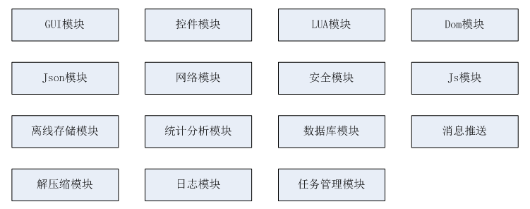
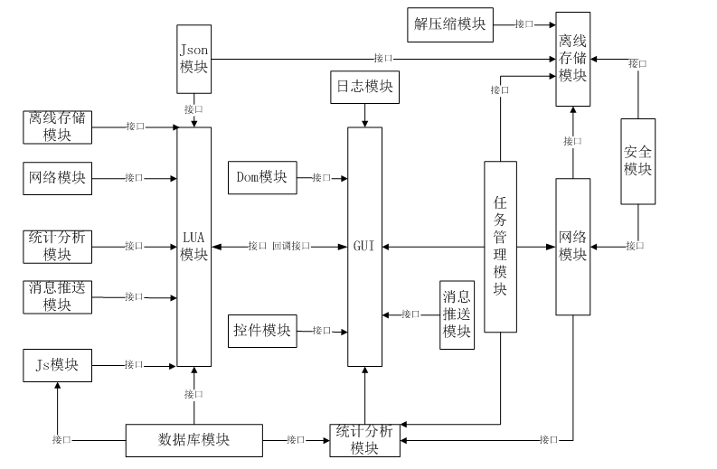
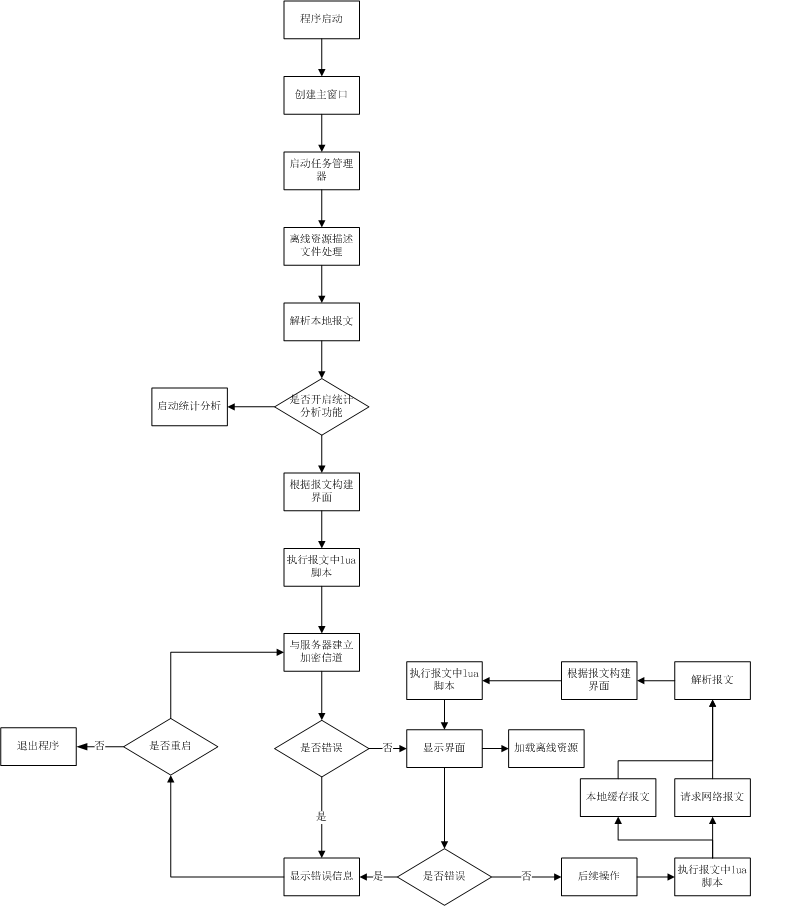
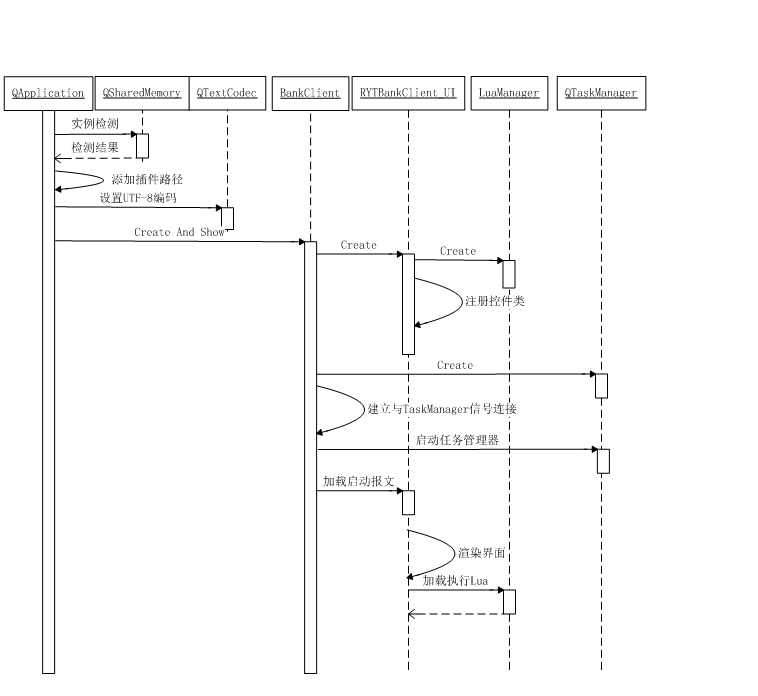
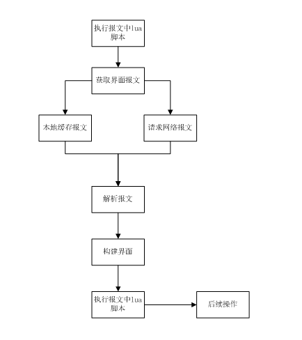
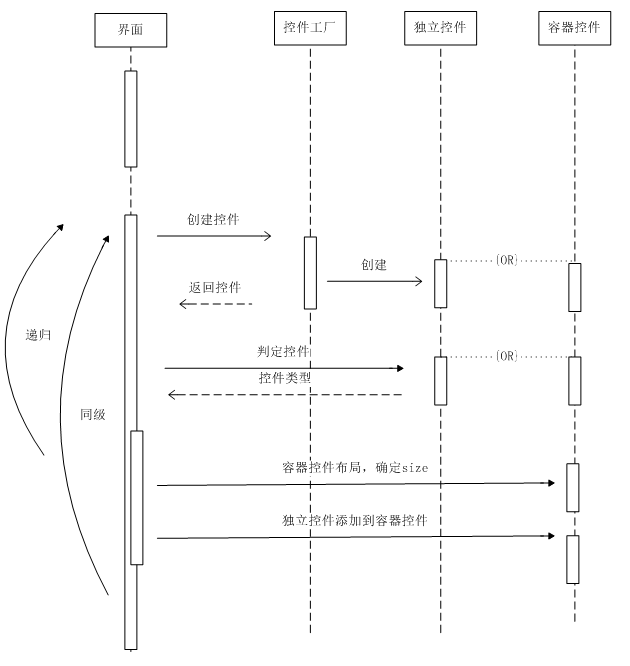
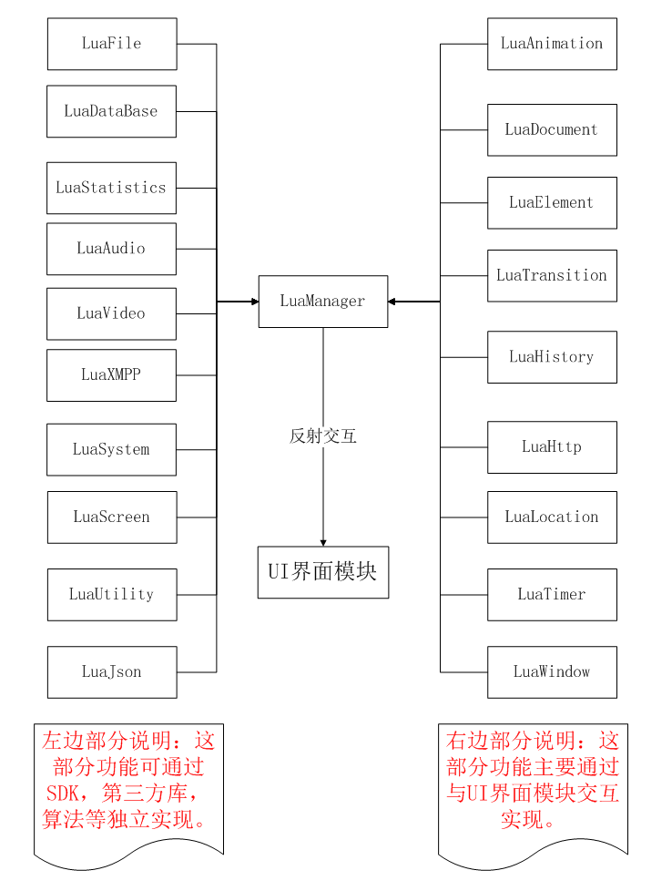
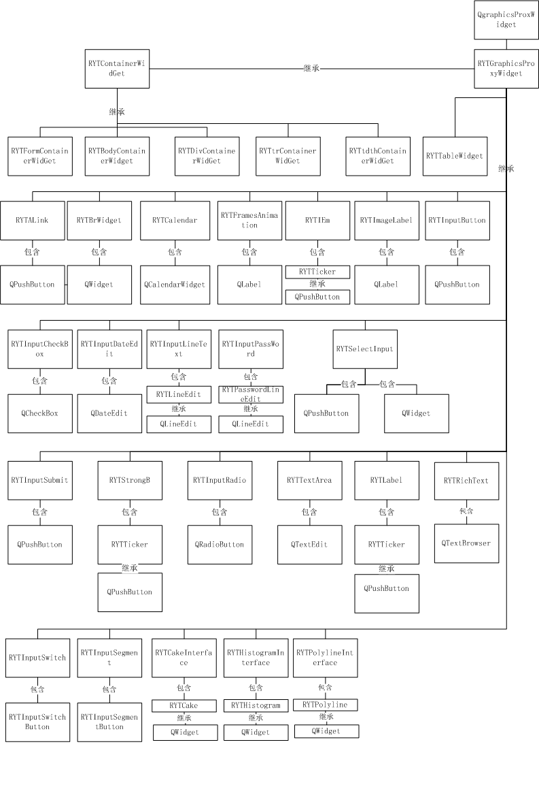

# QT总体设计

## 1 设计说明

### 1.1 背景
客户端要求UI界面依据报文中控件标签节点和样式表展开，由报文中lua脚本响应、驱动客户端的界面和业务逻辑。 
### 读者对象
本文档从模块划分的角度介绍QT客户端框架结构。满足QT客户端开发人员快速了解框架结构的需求。
## 2 总体设计

### 2.1 模块划分

####GUI模块
 - 数据初始化：配置文件解析，实例化其他功能模块并建立信号槽链接。
####控件模块
 - 实现控件工厂单例：存储控件元数据类型，根据类名创建控件对象。
 - 对基础控件及定制控件封装。
 - 界面控件布局。
####Lua模块
 - 封装lua驱动的C++接口，与UI交互，驱动客户端的业务逻辑。
####Dom模块
 - 解析保存报文，及class.xml文件。 
	解析保存报文中script标签。 
	解析保存报文中style标签。 
 	解析保存报文中body标签。
####Json模块
 - 解析保存、组装json格式数据。 
	主要负责解析保存离线资源的描述信息。
####网络模块
 - 建立与服务器的数据请求。
####安全模块
 - 安全引擎包括加密信道、加密库两模块。 
	加密库:封装加解密接口，实现数据的加解密接口。
####JS模块
 - 为webview控件提供扩展功能接口。
####离线存储模块
 - 主要实现对资源文件和用户数据的本地持久化存储，以及和EWP后台之间的数据同步机制。
####统计分析模块
 - 实现客户端用户数据行为的收集，发送。
####数据库模块
 - 实现数据库存储，执行sql语句。
####消息推送模块
 - 实现基于xmpp协议的消息推送。
####解压缩包
 - 解压缩包
####日志模块
 - 开发调试使用，打印相关报文，调试日志。
####任务管理模块
 - 创建线程添加任务，管理进程中的线程。

### 2.2 模块结构

说明：以GUI模块为主，组装其他功能模块，实现功能调用及回调。

### 2.3 时序流程场景
#### 2.3.1 程序启动
#####流程图

#####时序图

1. 程序启动：加载库，进行初始化设置
2. 解析本地报文
3. 创建界面
4. 执行lua脚本
5. 建立加密信道
6. 离线资源下载

#### 2.3.2 页面跳转流程图

1. 获取页面xml报文
2. 解析xml报文,并初始化样式,生成控件
3. 页面布局,并跳转页面
4. 加载lua脚本并执行，实现与UI界面的交互

#### 2.3.3 控件创建布局时序图

1. UI根据父控件及报文构建子控件 
2. UI判断容器节点是否构建完成，是步骤6，否继续步骤3，如果根节点完成构建则跳出该流程 
3. UI将节点传递给控件工厂，创建控件 
4. UI判断创建控件是否为容器控件，是跳到步骤5，否跳到步骤2 
5. 将容器控件及其报文节点作为父控件和报文递归到步骤1 
6. 布局容器中子控件，调整容器控件大小。跳转到步骤2

#### 2.3.4 Lua功能结构设计图

1. 程序启动后,创建lua状态机，打开lua标准库，并注册我们的c++函数到lua中.
2. 加载lua脚本到lua状态机，并执行。
3. 响应和驱动UI界面操作。

### 2.3.5 控件类图

1. 控件框架基于Qt的图形视图框架，继承基类：QGraphicsProxyWidget 
2. 支持对控件的动画操作 
3. 控件分为基础控件，定制控件，容器控件 
4. 容器类控件内嵌布局算法。