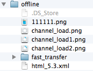

# EMP Android 5.1 至 5.2 升级说明
<!-- toc -->

## 简述

本文旨在说明EMP Android平台5.1版本升级至5.2版本所需的必要改动，对于新版本的功能介绍、API 规范、配置说明等内容该文档内不会详细描述。

## 配置文件改动

1. 取消assets/Config.txt和assets/Constant.txt配置文件，原文件中所有配置项都移植到`com.rytong.emp.tool.EMPConfig`类中。通过主Activity类`com.rytong.emp.android.EMPActivity`中的`onAdjustEMPConfig(EMPConfig)`方法中添加配置: 
```
public void onAdjustEMPConfig(EMPConfig empConfig) {  
	empConfig.setBasicScreen(new Rect(0, 0, 320, 480));  
	empConfig.setServerUri("http://192.168.xx.xxx:4000");  
	empConfig.setServerUriNoPort("http://192.168.xx.xxx");  
    empConfig.setPrintLog(true);  
	empConfig.setAlertPrompt(true);  
	empConfig.setUpdateOfflineRes(true);  
	empConfig.setDevelopmentMode(true);  
	empConfig.setOfflinePromptOn(true);  
}
```
2. 取消assets/widget.xml配置文件，控件都通过GUI库类`com.rytong.emp.gui.GUIRepository`注册。产品内已经添加了基本控件的注册，扩展控件可通过调用主Acitivity类`EMPActivity`类中的`onAddGUIView()`方法注册：
```
public void onAddGUIView() {  
	GUIRepository.addGUIView("specialview", SpecialView.class);  
}
```

## 离线资源

### 增加离线资源协议版本1的支持

1. 通过`EMPConfig`类中的方法`empConfig.setOfflineVersion(int)`配置离线资源协议版本号.目前值为`0`或`1`;
2. 支持socket。

### 预置资源方案修改

1. 预置资源都保存在assets/offline文件夹下，并且需要将zip包资源都解压到当前目录中。目录结构如下:  
  
`offline` 为预置资源根目录；`fast_transfer`为插件包目录；其他为普通资源文件。
2. 为提高系统运行速度，预置资源不再做预处理，offlines文件夹下的资源文件不会再拷贝一份到离线专有保存目录下。因此资源文件的访问顺序修改为:plug-in-resources（插件资源） > offline-resources（离线资源） > offlines > write-resources（file:write写入的资源） > 安装包资源。

## 解析方法

5.2版本将报文解析方法有sax解析改为dom解析。原有`AtomParser`类移除，解析过程由`ParserTask`类处理。根据解析后生成的dom树，进行控件初始化和布局操作，以及后续针对控件的其它操作。

## 控件初始化

5.2版本对控件初始化和布局的流程做了较大修改，原有版本的许多类和方法在5.2中都已取消或更改。

1. 取消`Component`和`ComponentCopy`类以及相关接口。
3. 5.2版控件类必须实现`com.rytong.emp.gui.GUIView`接口，其中`onBindElement(Element)`方法负责将控件View同dom树中的对应节点绑定，在此方法中可以根据节点内容设置控件的一些属性及样式；`onBuildLayout()`方法负责获取该控件保存的布局类，后续针对该控件的布局操作，由该布局类处理。布局修改可参考**布局逻辑**章节。

## 布局逻辑

1. 布局方法取消控件类内的`mouldH()`方法。布局具体算法统一抽出由`com.rytong.emp.dom.css.Layout`类及其子类实现。
2. 布局过程跟解析过程分离。解析过程结束后，在`Compose`类中遍历解析得到的dom树各节点，对各节点控件进行初始化，并调用各节点控件保存的布局类（`onBuildLayout`方法），对整个页面进行布局排版。

对现有项目中控件的升级可参考文档[Android对EMP5.1的支持](../../ert_develop/deepin_client_dev/android/Android_Forward_Support_Guide.html)，5.2控件的扩展方式可参考控件扩展文档[Android5.2扩展控件](../../ert_develop/deepin_client_dev/android/Android_Control_Extending_Guide.html)。

## Lua处理

5.2对lua脚本的处理不再采用luajava库，而是产品自己实现的一套lua处理方法。该方法中，lua接口在java层中的实现方法不变，而lua层的处理过程在C代码中实现，并通过jni技术与java层连接。

lua的扩展方式可参考控件扩展文档[Android5.2扩展Lua](../../ert_develop/deepin_client_dev/android/Android_Lua_Extending_Guide.html)。  
