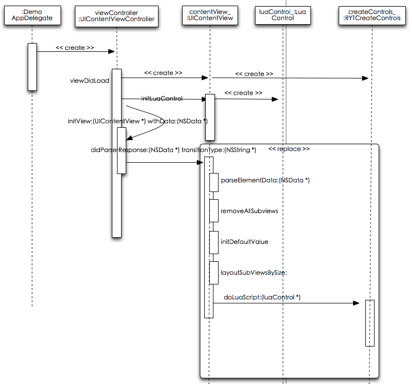
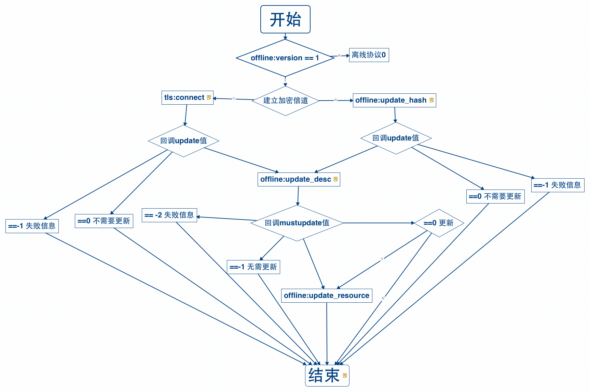
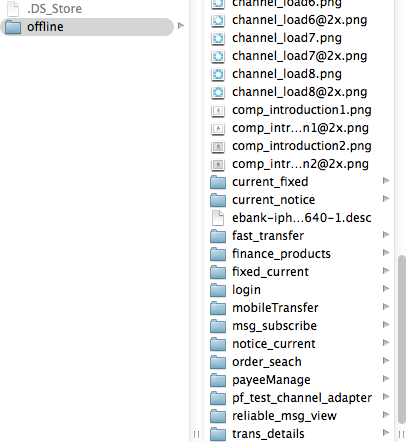
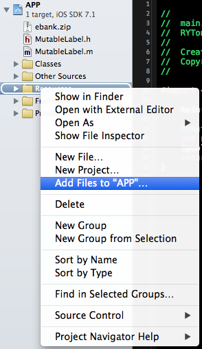
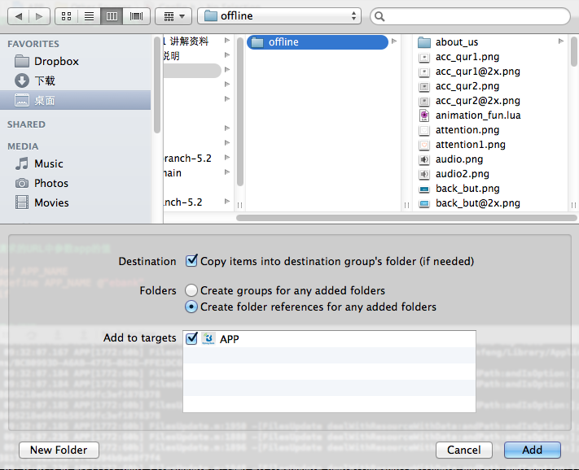
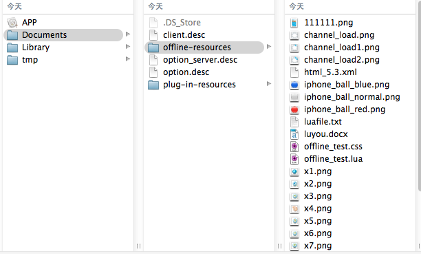

# EMP IOS 5.1 至 5.2 升级说明
<!-- toc -->

## 简述

本文旨在说明 EMP ios平台 5.1 升级至 5.2 版本所需的必要改动，对于新版本的功能介绍、API 规范、配置说明等内容该文档内不会详细描述。

## 配置文件改动

1. 增加宏定义`NUMBER_OF_FAILEDRESOURCE_REQUST`,离线资源下载流程中,定义资源下载失败后,重复下载的次数.
2. 增加宏定义`UPDATE_VERSION`,离线资源协议版本号.目前值为`0`或`1`;

## 布局逻辑
5.1的布局接口
`- (CGSize)sizeThatFits:(CGSize)size` 负责计算控件的大小  
`- (void)layoutSubviews` 负责控件的布局及显示

在5.2中,将不再调用`- (void)layoutSubviews`方法.
`- (CGSize)sizeThatFits:(CGSize)size`仅在非容器类控件中调用.如lable等.

增加`- (CGSize) layoutSubViewsBySize:(CGSize)availableSize`方法,针对容器类控件调用此方法. 负责控件的布局及大小的计算.

控件的扩展方式参考5.2的控件扩展文档.  
**emp5.2布局流程图如下：**



## 网络请求
1. 增加网络请求类`RYTHttpConnection`,`HttpTaskManager`.
2. 删除ASI网络库中对加密信道的处理.
3. 网络请求不再使用ASIHttpRequest作为网络请求接口,将ASI网络库封装并提供RYTHttpConnection,HttpTaskManager类替代ASIHTTPRequest.  
需要将类似下面的网络请求实现

```
ASIHTTPRequest *request = [ASIHTTPRequest requestWithURL:[NSURL URLWithString:_url]];
request.tag = REQUEST_BACKGROUND_NORMAL_TAG;
request.delegate = self;
request.encrypt_ = YES;
request.postBody = [NSMutableData dataWithData:[_body dataUsingEncoding:NSUTF8StringEncoding]];
[request setRequestMethod:@"POST"];
[request startAsynchronous];
```
修改为

```
RYTHttpConnection *connection = [[HttpTaskManager sharedHttpTaskManager] 
httpConnectionWithUrl:[NSURL URLWithString:_url] 
        requestHeader:nil 
                 body:[_body dataUsingEncoding:NSUTF8StringEncoding] 
        requestMethod:@"POST" 
              encrypt:YES 
             delegate:self];        
connection.tag = REQUEST_BACKGROUND_NORMAL_TAG;
[[HttpTaskManager sharedHttpTaskManager] startAsynchronousHttpRequest:connection];
```


## 离线资源
由于在`EMP5.2`版本对离线协议进行了一次优化，部分规范和设计进行了调整和修改，因此引入了离线资源版本号来标识新旧版本。EMP5.2之前的旧离线协议版本号定义为**0**，EMP5.2及以后的新版本号定义为**1**。
在此文档中，我们主要讲述升级后，即最新离线协议版本**1**的使用。

### 配置文件修改
在离线协议1版本中，我们需要修改以下配置文件
#### luaClass.xml
在`luaClass.xml`文件中，添加以下代码  

```
   <object class="LuaTLS" open="openTLS"></object>
```
注：`LuaTLS`是离线协议新版本中新增的一个Lua库，其中包含**tls:connect**方法。具体描述参见下文。

####  config.h
在`config.h`文件中，需要增加以下宏配置

```
/**
 * 下载失败资源重连次数；
 * 在离线下载过程中,由于网络或其他方面原因会造成下载失败的情况；
 * NUMBER_OF_FAILEDRESOURCE_REQUST定义了下载失败后,资源重复下载的次数。
 */
#define NUMBER_OF_FAILEDRESOURCE_REQUST 3
/**
 * 当前离线协议的版本。
 */
#define UPDATE_VERSION @"1"
```
注：由于历史版本问题，如果`config.h`文件中含有以下已经废弃的宏代码，请**删除**

```
#define HTTPProtocl
/**
 * 当前离线协议的版本 ，此宏HTTP和TCP使用。
 */
#ifndef HTTPProtocl
    #define TCPProtocl
/**
  * 客户端更新接口使用TCP协议是默认端口号
 */
    #define TCPProtoclPort @"4060"
#endif
```

### 新增接口及使用
#### 新增接口
在离线协议新版本中，我们对LuaOffline中的接口进行了重新梳理，具体请参见[`客户端设计`](../../inner_docs/OfflineResource/offline_resource_design_client.md)
#### main.xml示例
`main.xml`文件由项目人员编码，在此我们仅给出示例代码，供参考

```
<?xml version="1.0" encoding="UTF-8" ?>
<content>
    <head>
        <style>
            .body {width:320px;background-image:url(loading_ryt.png);}
            .loaddiv{width:66px;height:66px;top:266px;left:117px;background-image:url(loading_bj.png);}
        </style>
        <script type="text/x-lua" src="RYTL.lua"></script>
        <script type="text/x-lua">
            <![CDATA[
                function loading()
                local frames_tab = {
                "loading_circle8.png","loading_circle1.png","loading_circle2.png",
                "loading_circle3.png","loading_circle4.png","loading_circle5.png",
                "loading_circle6.png","loading_circle7.png","loading_circle8.png",
                "loading_circle1.png","loading_circle2.png","loading_circle3.png",
                "loading_circle4.png","loading_circle5.png","loading_circle6.png",
                "loading_circle7.png"
                };
                local animaFramObj = animation:newFrames(frames_tab);
                --动画对象显示区域
                --当x=0以及y=0时动画显示父控件左上角
                --当x=10时横向偏移10像素
                --当y=10时纵向偏移10像素
                local wz_tab = {x=0,y=0,width=66,height=66};
                animation:setFrame(animaFramObj,wz_tab);
                local div_ctrl = document:getElementsByName("loaddiv");
                --为此对象设置动画父控件。
                animation:add(animaFramObj,div_ctrl[1]);
                --动画持续时间
                animation:setDuration(animaFramObj,2);
                --重复播放次数
                local rep_count = -1;
                animation:setRepeatCount(animaFramObj,rep_count);
                --执行动画
                animation:play(animaFramObj);
                end;
                
                loading();
                
                -- tls 接口返回的页面报文
                local content;
                
                -- window:alert 回调方法：
                -- 若mustupdate = 0 ，用户点击确定按钮开始下载必选资源
                function alert_callback(btnIndex)
                if btnIndex == 0 then
                -- 用户点击[确定]按钮
                offline:update_resource();
                end
                -- 页面替换
                location:replace(content);
                end
                
                -- offline:update_desc 回调方法：
                -- 根据mustupdate 值给出提示信息，并替换页面
                function updateDesc_callback(mustUpdate)
                if mustUpdate == 0 then
                window:alert("您有新的离线资源需要下载，是否更新？", "确定", "取消", alert_callback);
                elseif mustUpdate == 1 then
                window:alert("有离线资源正在更新","确定",alert_callback);
                else
                -- 页面替换
                location:replace(content);
                end
                end
                
                --tls 回调方法： 若有必选资源更新时，走offline:update_desc接口；否则页面替换
                function tls_callback(params)
                content = params["content"];
                local update = params["update"];
                if update == 1 or update == 2 or update == 3 then
                -- 有必选可选资源更新时
                offline:update_desc(updateDesc_callback);
                else
                -- 页面替换
                location:replace(content);
                end
                end
                
                local version = offline:version();
                if version == 0 then
                local emp = {};
                utility:tls(emp);
                elseif version >= 1 then
                tls:connect(tls_callback);
                end
                
            ]]>
        </script>
    </head>
    <body name='body' class='body'>
        <div class='loaddiv' name='loaddiv' border='0' >
        </div>
    </body>
</content>
```

注：在上述代码中，首先判断离线资源的版本号，在离线协议1中我们调用`tls:connect(tls_callback)`;再其回调中判定`update`字段的值，如果为0，代表无需更新，否则调用`offline:update_desc(updateDesc_callback)`请求具体的离线资源升级信息。在其回调`updateDesc_callback`中可以取得`mustUpdate`字段的值，根据值的不同分别进行不同的后续操作。

可参见如下流程图：
   


###预置资源方案修改
#### 关于预置资源包的使用

根据<https://developer.apple.com/icloud/documentation/data-storage/index.html>中的描述
>Only documents and other data that is user-generated, or that cannot otherwise be recreated by your application, should be stored in the <Application_Home>/Documents directory and will be automatically backed up by iCloud.


我们得知，只有那些用户生成的文档和其他数据或者是那些不能被你的应用所重建的数据应当保存在<Application_Home>/Documents 目录内。这些数据文件将会自动的通过iCloud备份。而那些在Document 目录内保存任意/少量/大量数据的应用正在审核中被拒。为此，为保证APP顺利通过审核，我们也改变了预置资源的处理流程。现简述如下：


#### 处理预置资源包，其格式如下：
   
  
  其中：
  
  * `offline`文件夹为预置资源包的名称
  * 普通资源文件直接存放于`offline`文件夹
  * 插件资源包文件需解压后存放于`offline`文件夹
  * 以`.desc`为扩展名的文件为预置资源的描述文件


#### 添加预置资源包，其方法如下：
点击鼠标右键，选择Add File to 选项
   
  
后配置如下：

* 勾选**Destination**选项
* **Folders**选项选择_Create folder references for any added folders_
   
 
建议此步骤完成后，清空Xcode`DerivedData`,并`reset`模拟器。消除文件索引缓存可能造成的影响。
  
点击`确认`按钮

### 关于非预置离线资源保存及使用的事项说明
#### 关于非预置离线资源保存的事项说明
离线资源保存形式如下图：
   
  
 其中：
 
 * client.desc为已下载的必选资源的描述文件，包括预置资源包中的必选资源文件
 
 * option.desc为已下载的可选资源包的描述文件，包括预置资源包中的可选资源包的描述文件
 
 * option_server.desc为服务器返回的全部可选资源插件包的描述文件
 
 * offline-resources 为除预置包外下载的普通资源文件的存放文件夹
 
 * plug-in-resources 为除预置包外下载的插件资源包文件的存放文件夹

#### 关于离线资源使用的事项说明
* 资源文件的访问顺序:plug-in-resources > offline-resources > offline > write-resources > 安装包其他资源。如果查找成功，经校检合格后方可使用。


## 其他
__RYTControl__  
基类中的childrenElements将不再主动初始化. 控件需要自己实现childrenElements的初始化操作.

__TBXML.h__  
`+ (TBXMLElement *)copyXMLElement:(TBXMLElement *)aXMLElement copyControl:(BOOL)copyControl;` 将不再使用.
替换成`+ (TBXMLElement *)copyXMLElement:(TBXMLElement *)aXMLElement`;
功能与原来的方法完全一样.

__FilesUpdate.h__  
`- (void)downSingleResourceSuccess;`   
修改为`-(void)downSingleResourceSuccess:(NSString *)fileName`;  
`- (void)downSingleResourceFail:(NSString *)message;`   
修改为 `-(void)downSingleResourceFailWith:(NSString *)fileName message :(NSString *)message`;
修改后的下载功能可以支持多个资源同时下载.
