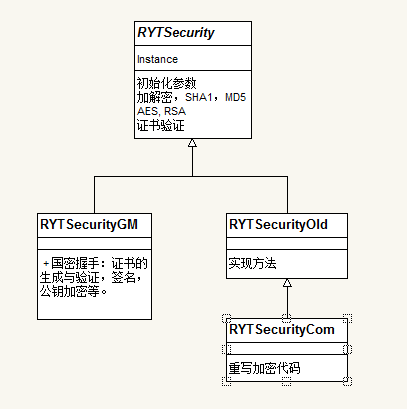

#
WP加密类介绍
<!-- toc -->

## 概述
由于项目开发过程中引入了国密（5.2），预置资源加密（5.3）等功能，因此对加密类进行了重新的封装，统一调用，并大大增强了扩展性。下面就对整个加密模是如何重构的，并且在5.2和5.3中的相同点与不同点，以及旧项目的兼容性进行介绍。

##加密修改

###5.2与5.3加密模块相同点介绍

之前代码中加密方法调用混乱，耦合性较高，现在将加密统一配置在`DataBaseLib`项目的`RYTSecurity`类中，此类是抽象类，其中包含了：①加密解密，②SHA1，MD5的生成与比较，③AES加密等，实现类有三分别为：

1. `RYTSecurityOld`:用于兼容旧项目。
2. `RYTSecurityCom`:根据规范代码重构的加密对象，用于新项目。
3. `RYTSecurityGM`:国密专用。

其中`RYTSecurityGM`，`RYTSecurityOld`直接继承于抽象类`RYTSecurity`,而`RYTSecurityCom`继承`RYTSecurityOld`，并重写了加解密部分的方法，关系视图为：

本次代码调整，移动了部分类的位置，例如：移动了`TLSLib`库的MD5到DataBaseLib项目下，并且`AESCipher.cs`的底层也同样调用RYTSecurity的实现类中的方法等等，如果之前项目中用到的加密方法找不到了，直接在`RYTSecurity.Instance`下查找即可。

下面为5.2中 RYTSecurity 的所有接口,5.3中做了部分修改，下面将提到：

		//加解密
		public string Encrypt(string input);

        public string Encrypt(byte[] input);

        public byte[] EncryptAndReturnBytes(byte[] input);

        public string Decrypt(string input);

        public string Decrypt(byte[] input);

        public byte[] DecryptAndReturnBytes(byte[] input);

        public byte[] Encrypt(byte[] input, byte[] key, byte[] iv);

        public byte[] Decrypt(byte[] input, byte[] key, byte[] iv);
		
		//SHA1  MD5
        public byte[] DoSha1(byte[] data);

        public bool CompareSHA1(Byte[] bytes, string baseValue);

        public string ComputeSHA1(byte[] bytes);

        public byte[] HmacSha1(Byte[] key, Byte[] data);

        public byte[] DoMd5(byte[] data);

        public byte[] HmacMd5(Byte[] key, Byte[] data);

        //Aes

        /// 

        /// 

        /// <param name = "data">被加密的明文</param>
        /// <param name = "key">密钥</param>
        /// <param name = "iv">向量</param>
        /// <returns>密文</returns>
        public Byte[] DoAesEncrypt(Byte[] data, Byte[] key, Byte[] iv);

        /// 

        /// 

        /// <param name = "data">密文</param>
        /// <param name = "key">密钥</param>
        /// <param name = "iv">向量</param>
        /// <returns>明文</returns>
        public Byte[] DoAesDecrypt(Byte[] data, Byte[] key, Byte[] iv);

		// RSA 用于TLS流程
        public abstract void GenericPubCer(Action<byte[][]> callBack);

        public abstract byte[] TLSSign(byte[] signData, byte[] pri_key);

        // 509 服务器证书验证 1为验证成功
        public abstract int PubCerVerify(byte[] rootCa, byte[] serverCerByts);

        // 从证书 获取公钥(指针)(失败时返回-1，成功返回指针地址) 
        public static int GeneratePubKeyFromCer(byte[] cerData)

		// 用公钥（指针）对数据加密
        public static byte[] PubCerEncryp(byte[] clientKey, int pubKey)

1. 以上就是所有的加密接口，在走非国密流程时，其中最上面的6个方法的签名虽然与调整前`RYTPhoneSecurity`中的一样，但是，由于之前的加密代码不符合规范，现使用的加密方法都已经替换为AES加密，只在解密时做了下兼容处理。
2. 在做校验使用的 Sha1 和 Md5 的几个方法中，虽然国密和非国密使用的名称都一样，但是在使用国密代码时，其实都是调用国密支持的杂凑算法，并且结果长度为32字节。

**5.2与5.3区别**

5.3新增加了预置资源加密，并要求扩展自定义加解密方法，并且对于不同的数据，要求用不同的加解密密钥。为此，在加解密抽象方法中添加了一个int类型的type参数，来判断进行加解密的数据类型，如：
	
	public override byte[] EncryptAndReturnBytes(byte[] input, int type = 0)
	public override byte[] DecryptAndReturnBytes(byte[] input, int type = 0)
	...
旧版本`RYTSecurityOld`中：type=1用于Tls 数据加解密（除 SessionID），其他都用默认加密方式，考虑到兼容性，暂时无法支持扩展。

新项目（`RYTSecurityCom`）与国密（`RYTSecurityGM`）的加解密对象type值代表的加密数据类型分别为：

- 0: 更新的离线资源  
- 1: 预置离线资源 
- 2: 数据库资源  
- 3: write接口写入的资源

**使用及扩展**

在项目中，可能需要定制加密计划，如果是新项目，则根据是否为国密，继承`RYTSecurityGM`或`RYTSecurityCom`，并重写下面两个方法即可，应为其他几个加解密均调用者两个方法：

	public override byte[] EncryptAndReturnBytes(byte[] input, int type = 0)
	public override byte[] DecryptAndReturnBytes(byte[] input, int type = 0)

当然如果只想覆盖4种数据类型中的一种，也是可以的，但是必须加解密同时实现，如：

	public override byte[] EncryptAndReturnBytes(byte[] input, int type = 0)
	{
		if(type == 0)
		{
			..... // 加密同步的离线资源的新逻辑
		}
		else
		{
			base.EncryptAndReturnBytes(input, type); // 其他数据继续调用父类
		}
	}

	public override byte[] DecryptAndReturnBytes(byte[] input, int type = 0)
	{
		if(type == 0)
		{
			..... // 解密同步的离线资源的新逻辑
		}
		else
		{
			base.DecryptAndReturnBytes(input, type); // 其他数据继续调用父类
		}
	}

 在程序初始化的时候根据项目配置`ConfigManager.bErtCrypto`为false或true，在`MainPage.cs`中实例化子类`RYTSecurityCom`，`RYTSecurityGM`或自定义的新加密类即可。
