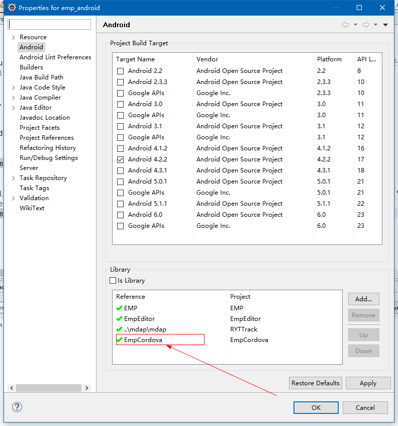

##empcordova库使用说明

###empcordova库使用配置
1. 在主工程中引入`empcordova`库。

2. 复制`empcordova`库下`assets`目录下的`www`目录到主工程的`assets`目录下。
3. 在主工程`MainActivity`的`onAddGUIView()`的方法中添加`GUIRepository.addGUIView(Entity.NODE_DIV, "webview", EMPCordovaWebView.class);`来代替系统webview。
###html和js代码编写
1. 编写html代码的时候，需要引入`cordova.js`, 如:``，然后再导入其他js文件。
2. 当js代码中有需要调用插件API的时候，需要在`onDeviceReady`的回调中处理自己的业务逻辑。如:
	
    	/**当cordova容器初始化完成时调用*/
    	document.addEventListener('deviceready', onDeviceReady, false);
    	var onDeviceReady = function(){
    		//在这写你的代码
    	}
    
###empcordova库插件安装使用说明
1. 插件机制是cordova的核心，通过插件可以与native代码交互，适用于一些需要native代码工作的场合。目前cordova官方已经提供了上千个插件，目前`empcordova`库中提供了以下插件:

	- Networkinfomation
	- Camera       
	- Contact          
	- Device       
	- File         
	- GPS          
	- Http        
	- Location
	- Sms
2. 插件的安装:	
	- 	安装cordova工具  `npm install -g cordova`
	- 	创建cordova工程 `cordova create MyApp`
	- 	添加支持的平台 `cordova platform add android`.
	- 	添加插件 `cordova plugin add ...` 具体命令用`cordova plugin help`。插件的查找[地址](http://cordova.apache.org/plugins/)。
	- 	将所有插件添加完后，找到新建工程中的“config.xml”、“cordova_plugins.js” ，将这俩文件的新增内容合并到项目的同名文件中。
	- 	在新建工程中找到新添加插件的js文件，放到项目的`.js`插件包中（`www/plugins`），确保`cordova_plugins.js`中连接脚本的路径正确（"file": "plugins/cordova-plugin-emphttp/www/EMPHttp.js"）。
	- 	将`MyApp\platform\android\src\`目录下的代码连同包复制到自己的项目下。
3. 插件的扩展， 当现有的插件无法满足项目需求的时候，这时就需要扩展自己的插件，下面以`EMPLocation`为例说明插件的扩展方式。 

（1）在`src`目录下新建包`com.rytong.emp.cordova.location`， 编写`EMPLocation.java` 
**EMPLocation.java**
<pre>
/**
* 实现用js脚本替换页面报文的功能，类似lua的方法location:replace()。
*/
public class EMPLocation extends CordovaPlugin{

	public static final String TAG = "EMPLocation";
	
	private EMPRender mEmpRender;
	/**
	 * Constructor
	 */
	public EMPLocation() {
	}
	
	@Override
	protected void pluginInitialize() {
		mEmpRender = ((EMPCordovaActivity)webView.getContext()).getEMPRender();
	}
	
	@Override
	public boolean execute(String action, JSONArray args, CallbackContext callbackContext) throws JSONException {
		final CallbackContext callback = callbackContext;
		if("replace".equals(action)){
			final String url = args.getString(0);//指定页面地址
			final String parmeters = args.get(1) == null ? "" : args.getString(1);
			EMPThreadPool.Task task = new EMPThreadPool.Task(0) {

				String content = "";
				NetRequest mNetRequest = null;

				@Override
				public void doRun() throws Exception {
					if (Utils.isEmpty(url)) {
						throw new Exception("网络请求输入的url地址为空");
					}
					
					if (url.startsWith("local:")) {
						String fileName = url.substring(6);
						Object[] tmpContent = AndroidResources.Offline.getContent(fileName);
						if (tmpContent != null && tmpContent[1] != null) {
							try {
								content = new String((byte[]) tmpContent[1], "UTF-8");
							} catch (Exception e) {
								throw new Exception("资源获取失败");
							}
						} else {
							throw new Exception("资源获取失败");
						}
					} else {
						mNetRequest = new NetRequest();
						NetRequest.post(mNetRequest, url, parmeters, null, this);
						content = mNetRequest.mContent;
					}
				}

				public void onSuccess() {
					mEmpRender.load(content);
					mNetRequest = null;
				}

				public void onFailure() {
					
					JSONObject jsonObj = new JSONObject();
					try {
						jsonObj.put("state", "1");
						jsonObj.put("errorMsg", getErrorMessage());
					} catch (JSONException e) {
						//nothing to do
					}
					callback.error(jsonObj);
					mNetRequest = null;
				}
			};
			mEmpRender.runTask(task);
			return true;
		}else if("replaceContent".equals(action)){
			final String content = args.getString(0); //报文内容
			mEmpRender.runTask(new EMPThreadPool.Task(0) {
				@Override
				public void doRun() throws Exception {
					mEmpRender.load(content, new Compose.OnPageListener() {

						@Override
						public void onPageFinished(int errorCode, String errorMsg) {
							if (errorCode < 0) {
								callback.error(errorMsg);
							}
						}
					});
				}
			});
			return true;
		}
		return false;
	}
}

</pre>
需要注意的是，扩展插件的java类必须继承`CordovaPlugin.java`， 它是所有cordova插件的父类。重写`execute()`方法， 这个方法是js调用native代码的入口。然后按需重写对应父类的方法。具体cordova API 可以查看[官方文档](http://cordova.apache.org/docs/en/latest/guide/overview/)。 
(2) 在`assets\www\plugins`目录下新建`cordova-plugin-emplocation`目录， 在其中新建一个`www`文件夹， 新建`EMPLocation.js`文件。 
**EMPLocation.js**
<pre>
cordova.define("cordova-plugin-emplocation", function(require, exports, module) { 
	
	var exec = require("cordova/exec");	
	var EMPLocation = function(){
		
	}
	
	EMPLocation.prototype.replace = function(url, errorCallback, parameters){
		
		var error = function(result){
			if(result != null){
				//返回值是一个json格式对象。形如{"state":"1", "errorMsg":"xxxxx"}
				var state = result.state || "1",
				errorMsg = result.errorMsg;
				errorCallback(state, errorMsg);
			}
		}
		exec(null, error, "EMPLocation", "replace", [url, parameters]);
	}
	
	EMPLocation.prototype.replaceContent = function(content, errorCallback){

		exec(null, errorCallback, "EMPLocation", "replaceContent", [content]);
	}
	
	module.exports = new EMPLocation();
});
</pre>
注意：关于cordova的js模块定义和使用的方式可以查看[这篇文章](http://www.oschina.net/question/2296277_232018)。 
（3） 在`cordova_plugins.js`中注册定义的js模块。 
**cordova_plugins.js**
<pre>
{
	"file": "plugins/cordova-plugin-emplocation/www/EMPLocation.js",
	"id": "cordova-plugin-emplocation",
	"pluginId": "cordova-plugin-emplocation",
	"clobbers": [
	    "empLocation"
	]
}
</pre> 
(4) 使用刚才编写的js。 
**index.html**
<pre>
empLocation.replace("local:UnitTest/BaseControllerTest/label/label_combine.xml", 
	function(state, errorMsg){
		alert(state);
		alert(errorMsg);
		if(state == "1"){
			console.log("出现错误：======" + errorMsg);
		}
	}, null);
   	var content = "<?xml version='1.0' encoding='UTF-8' ?><content><body><label>123123123123123</label></body></content>";
	empLocation.replaceContent(content, function(errorMsg){
	alert(errorMsg);
});
</pre>

---

注：cordova本身限制远程js调用插件代码，为满足需求，在代码中去掉这个限制。安全性有待商榷。

---
date | note | modifier
--- | --- | ---
16.1.25 | 初稿 | liu.xiaofei
