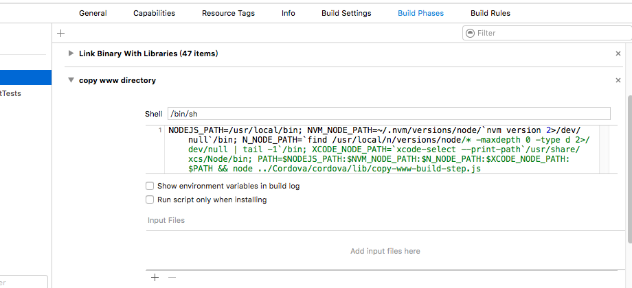

##cordova静态库使用说明

###配置说明

1、添加文件：

(1) “config.xml” 到项目中，添加时选择 Create folder references
	
(2) 添加“cordova”文件夹到项目中，选择 Create groups

(3) 需要支持本地的html时，要添加 cordova.js、cordova_plugins.js、plugins文件夹(.js插件包) 到项目中添加时选择 Create folder references

2、添加库和链接脚本：

(1) 在项目的 Buile Phases 的 Link Binary With Libraries 中添加 libCordova.a 静态库	
(2) 点击Buile Phases 的 “+”，选择 New Run Srcipt Phase ，配置如下。"copy-www-build-step.js" 文件的路径要按实际的路径配置。
	

3、配置class.xml 和 classSDK.xml 类的对应关系

	<object class="EMPWebViewControl" init="initWithParam" tag="div" type="webview">
        <param key="Frame">10.0,10.0,300.0,30.0</param>
        <param key="Focus">NO</param>
        <param key="Hidden">NO</param>
        <param key="Enable">YES</param>
	</object>
	
这里的 class="EMPWebViewControl" 不可修改，其他可按需修改，和使用时对应即可。

4、加载js插件

	添加cordova.js文件的链接
	

5、js中的使用

由于插件的加载需要时间，所以调用接口的时间应该在所有插件加载完成之后，及添加以下代码

	document.addEventListener("deviceready", onDeviceReady, false);
	function onDeviceReady() {
   		console.log(device.cordova);
   	 	// 添加代码
	}
	
	
6、添加webview的urlCache网络缓存

在第一次使用 EMPWebViewControl 的时候，导入“<Cordova/EMPWebViewControl.h>”头文件，
添加下面的代码，会和

	[EMPWebViewURLCache usedEMPWebViewURLCache];
	
	
###新增插件方法
	
####命令行法：
	
	1. 安装cordova工具  `npm install -g cordova`
	2. 创建cordova工程 `cordova create MyApp`
	3. 添加支持的平台 `cordova platform add ios`.
	4. 添加插件 `cordova plugin add 。。。` 具体命令见插件的描述
[http://cordova.apache.org/plugins/](http://cordova.apache.org/plugins/) 插件的查找地址

	5、将所有插件添加完后，找到新建工程中的“config.xml”、“cordova_plugins.js” ，将这俩文件的新增内容合并到项目的同名文件中。
	6、在新建工程中找到新添加插件的js文件，放到项目的.js插件包中（www/plugins），确保“cordova_plugins.js”中连接脚本的路径正确（"file": "plugins/cordova-plugin-emphttp/www/EMPHttp.js"）。
	7、把下载到的插件的相关oc文件添加到项目中。
	
####自定义插件：
网上有很多相关的教程

[插件开发实例](http://www.cocoachina.com/webapp/20150828/13221.html)、[官网说明](http://cordova.apache.org/docs/en/latest/guide/hybrid/plugins/index.html)

日期 | 作者 | 版本号 | 描述
--- | --- | --- | ---
16.1.27 | 药新东 | v1.0 | 初稿 
