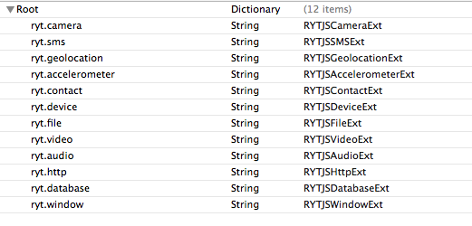

# JavaScript API扩展文档
本文档内容针对emp5.1版本

同Lua接口一样，emp一共了相应的JS的功能接口。同样支持对现有接口的扩展。相比于Lua的接口扩展，JS要简单的多。你只需要稍微的了解一些javaScript的执行便能实现JS接口的扩展。当然OC的知识是必不可少的。

## JS API的实现原理
JS 的实现原理请参阅《IOS JS 架构》，这里不做详细介绍。

## JS 接口扩展

扩展之前需要了解一些基本的内容。

RYTJSExtensions.plist， 此文件是JS接口实现类的配置文档。

如上图：ryt.camera 所在列为接口功能库名，对应的右侧RYTJSCameraExt为对应的实现类。

EMPJSBridge.exec(callback,'libName','command',params);
callback 为接口执行后的回调函数。
libname  定义的函数库名字，如 ryt.camera;
command  接口函数名，如camera的open接口;
params   参数表;

以音频接口功能为例，

1. 定义音频功能接口。音频库名定义为audio，功能函数load，play。
2. 在RYTJSExtensions.plist增加相应配置信息，`{ryt.audio : RYTJSAudioExt}`。
3. 音频对象是可以加载多个了，因此我们需要在js中定义audio对象类。

        var Audio = function(src,callback) {  
        this.id = utils.createUUID();  
        mediaObjects[this.id] = this;  
        this.src = src;  
        EMPJSBridge.exec(callback, "ryt.audio", "load", [this.src,this.id]);  
        }
        var audio = new Audio(src, callback);
 `"ryt.audio"` 为在RYTJSExtensions.plist文件中定义的配置信息。
 `load` 为提供的加载接口函数名。
 `[this.src,this.id]` 为初始化函数的参数。  
 
4. 实现Audio的`play`接口。与步骤3中的load方法类似。

        Audio.prototype.play = function(numberOfLoops,callback) {  
           try {  
           EMPJSBridge.exec(callback, "ryt.audio", "play", [this.id,numberOfLoops]);  
          }catch (e){  
        alert(e);  
          }  
        };  
    
5. 实现对应的OC方法。  
    约定OC方法格式为 `- (void)command:(NSArray *)arguments withDict:(NSDictionary *)options`；
    `command`: 具体接口名,如audio功能库中的load,play等.  
    `arguments`: 接口需要的参数，如`EMPJSBridge.exec(callback, "ryt.audio", "load", [this.src,this.id]); `中的`[this.src,this.id]`。  
    以`load`方法为例，
  
        self.jsCallbackId_ = [arguments objectAtIndex:0];//第一个参数为回调函数索引。
        NSString *src = [arguments objectAtIndex:1];// 从第二个开始为自定义的参数。
        NSString *videoId = [arguments objectAtIndex:2];  
    
    `options`: key-value形式的参数。
    
    
还有另外类型的函数，比如file.write()函数，这种函数不需要与JS对象，我们可以用类函数来实现。
与上面不同的仅仅是js的注册方式不同，OC方法的扩展是完全相同的。

    file.write = function(name,data,callback) {
        try {
            EMPJSBridge.exec(callback, "ryt.file", "write", [name,data]);
        }catch(e){
            alert(e);
        }
    };
  