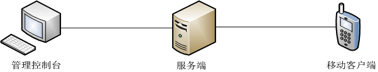

# EMP 企业应用商店
<!-- toc -->

EMP提供了企业私有商店组件，功能类似于App Store、Google Play等公共应用商店，但它主要面向企业内部员工，帮助企业建立私有的移动App分发平台。

如上图所示，企业私有商店由三部分组成：管理控制台、服务端和移动客户端应用（App Store应用程序）。管理员通过管理控制台可以进行

- App的管理，包括App创建、属性编辑、评价管理、权限管理
- 设备管理，包括移动设备查看和标识
- 用户/组的管理，包括创建、删除、编辑用户/组。

企业内部员工可以通过下载企业私有商店客户端应用（App Store）并通过身份认证后下载其权限范围内的App，可以通过App Store中的反馈机制对相应的App进行评分和评论。

## 分布式开发和测试

通过企业私有商店，可以很容易实现企业应用的开发团队、QA团队和测试团队的异地配合，加快应用的开发、测试和试运行周期，有效提升应用测试设备和测试场景的覆盖率，以最终提升应用正式发布时的质量和体验。

## 企业私有应用分发

对于B2E场景中的移动应用，企业可以借助企业私有商店加快应用分发到员工设备上的速度，通过持续优化和版本迭代提升基于移动应用办公的效率。通过设备管理和权限管理，可以获取移动应用使用情况的概览，根据需要进行企业员工的权限控制。
