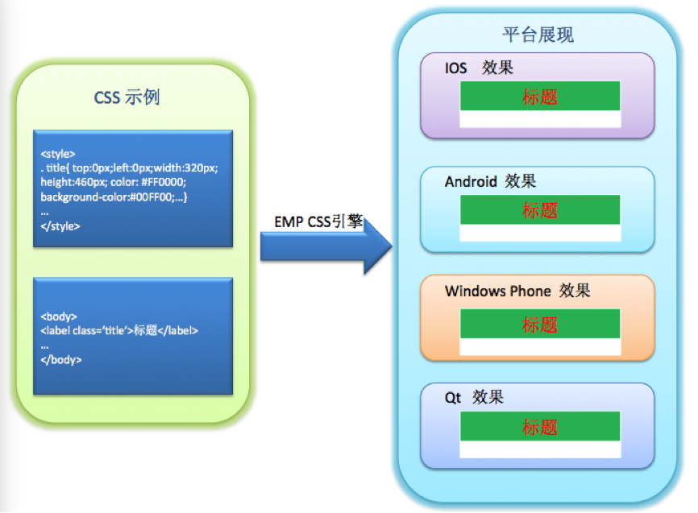
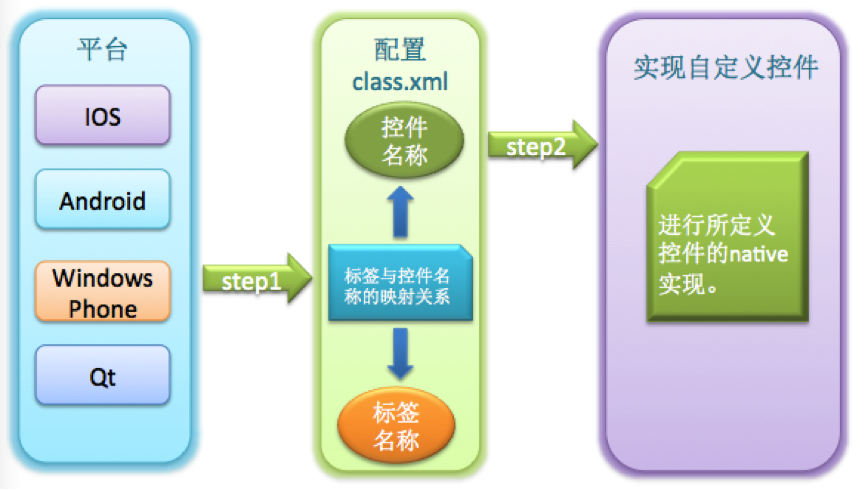
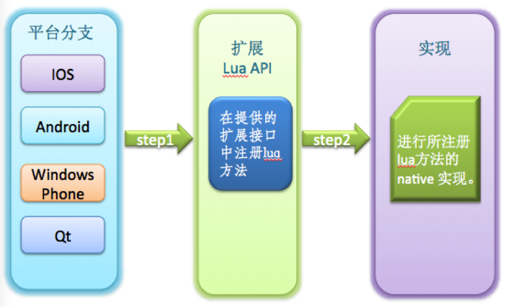

# EMP 客户端 
<!-- toc -->

## Native & Web

当智能终端用户成为企业的必争之地，移动渠道的建设对于企业来说日益重要，Native VS Web也随之成为移动应用开发技术选型的热门话题，两者在App体验和开发成本上的取舍对于企业来说，就像是鱼和熊掌，难以兼得。HTML5的出现给出了未来的方向，但HTML5自身的完善需要一个过程，不同浏览器和设备厂商对它的支持过程则更加漫长。

因此，EMP客户端组件从平台伊始就致力于Native和Web的结合，通过将一部分HTML和CSS子集映射到Native UI的实现，EMP客户端组件实现了一个跨平台的Web规范解析和渲染框架。在此基础上，我们引入了Lua作为脚本引擎来实现Lua API和设备本地语言API的绑定，并定义了Web规范以及Lua API的扩展的方式，使得设备本地的扩展最终能以Web规范的形式体现。从而让基于EMP的移动应用开发人员，可以最大程度的利用Native和Web所带来的好处。

我们在下面的章节介绍通过EMP的客户端组件可以实现的特性。

## HTML & Native UI

EMP客户端组件从标准HTML标签集合中选取了一部分适合在移动终端使用的HTML标签作为EMP的HTML标签子集，并使用不同平台上的Native UI控件来实现这个子集。通过EMP HTML引擎实现从HTML标签转换为Native UI控件：

与此同时，EMP客户端组件针对每一个HTML标签，从标准CSS规范中选取了针对该标签适合在移动终端使用的CSS样式子集。通过EMP CSS引擎让这些CSS样式可以应用到其所支持的HTML标签上。

从而，EMP形成了自有的HTML和CSS规范，它们符合标准的HTML和CSS规范，在各终端平台上拥有EMP为其定义的本地实现和展现。

通过上述的实现，我们可以获取到：

- Native UI的运行速度和展现效果
- 基于HTML和CSS语言的界面开发
- 基于EMP的定制扩展

## Lua AS Script

### Why Lua

Lua是一个小巧的脚本语言， 其设计目的是为了嵌入应用程序中，从而为应用程序提供灵活的扩展和定制功能。

- 可扩展性

Lua使用ANSI C编写而成，几乎在所有操作系统和平台上都可以编译、运行。Lua脚本可以很容易的被C/C++代码调用，也可以反过来调用C/C++的函数，这使得Lua在嵌入和扩展应用程序的场景中得以被广泛应用。不仅仅作为扩展脚本，也可以作为普通的配置文件，代替XML等文件格式，使得程序更容易理解和维护。

- 轻量级

轻量级Lua语言的官方版本只包括一个精简的核心和最基本的库，一个完整的Lua解释器不过200K。在目前所有脚本语言中，Lua无疑是将小巧和快速结合的最完美的一个。

- 其他特性

同时支持面向过程编程和函数式编程（functional programming）；自动内存管理；只提供了一种通用类型的表（table），用它可以实现数组，哈希表，集合，对象；语言内置模式匹配；闭包(closure)；函数也可以看做一个值；提供多线程支持；通过闭包和table可以很方便地支持面向对象编程所需要的一些关键机制，比如数据抽象，虚函数，继承和重载等。

上述特点表明，在跨平台的移动终端上，Lua是作为嵌入式脚本的最佳选择。基于这些考虑，我们选择Lua作为我们默认的脚本引擎，嵌入到页面中的Lua脚本会被EMP客户端组件解析并执行，通过将Lua API和设备API以及EMP Native Lib API的绑定，开发人员可以通过编写Lua脚本实现本地逻辑，让应用使用者获得Native App的运行速度和体验。

### Cross Platform Lua API　

EMP通过Lua提供统一的跨平台API，同时支持iOS、 Android、 Windows Phone、QT平台。通过这些Lua API的定义和实现，开发人员可以通过编写脚本逻辑操作页面元素中的HTML和CSS元素；也可以通过API调用访问设备的本地功能，例如重力感应、摄像头、通信录、音频/视频播放等等。

## 可扩展性

EMP客户端框架预留了UI控件和Lua API的扩展接口。通过这些接口，可方便扩展APP程序。在业务设计时，若基本控件无法满足业务展示的需要时，可以通过扩展接口来增加扩展控件或Lua API以满足业务需求，提供更为灵活的用户交互。

EMP客户端框架使用配置文件的方式扩展UI控件，扩展灵活、方便;在要扩展控件时，开发人员仅仅需要按照指定格式配置class.xml文件同时让扩展控件继承EMP提供的基控件（或者任一基础控件和扩展控件）即可，EMP解析引擎会按照配置文件中的映射关系进行解析和展示。扩展控件编写人员仅仅需要关心自定义控件的实现，而不必关心EMP的核心引擎。扩展示意图见：

EMP客户端框架同样预留了Lua的扩展接口，开发人员需要使用EMP所提供的注册接口先注册自己的Lua方法，然后再使用本地代码实现所注册Lua方法的功能。扩展示意图见：

## 数据和服务获取
### 通讯&安全

EMP客户端和服务端之间支持HTTP、HTTPS和基于HTTP扩展的TLS 协议。　

EMP扩展的TLS协议是基于TLS v1.1修订，在HTTP报文的交互中建立安全通道，信道包含了身份认证、标识、抗抵赖、自主访问控制、强制访问控制、用户数据完整性保护、用户数据保密性保护、数据流控制、可信路径、密码支持、防重放、客户端篡改验证等安全功能。

通过自建立的信道，客户端和服务器之间的通讯可以避免：

- 因设备本地TLS实现规范不统一而导致的加密强度降低；
- 因标准TLS的开放性和开源实现导致的信道安全性降低；
- 因移动运营商WAP网关适配问题到导致的HTTPS信道不稳定。

与此同时，基于自定义的信道，可以做到因企业的需求而灵活扩展。

### EMP服务获取和资源同步

EMP客户端为与EMP Server之间的通讯封装了一些列的Lua接口，使得界面开发人员无需关心底层的通讯实现，更无需关心企业后台的系统组成和业务逻辑，在移动应用的开发中根据业务需要选择调用本地Lua API即可获取到业务所需的数据和服务。

除此之外，EMP在客户端和服务端之间定义了资源同步的协议。根据该协议，服务端可以维护不同客户端平台和分辨率下最新的客户端资源，客户端在联网时可以将这些资源同步到本地，在后续的流程中使用。通过对该协议的实现，客户端可以实现离线业务并及时更新，而移动应用中的大量界面元素（如HTML、CSS和Lua）也可以通过该协议同步到客户端本地，从而有效的减少联网的次数和传输流量。

## 本地安全存储

EMP客户端提供了设备本地安全存储的实现，对于本地存储的数据可根据需要进行加密存储，从而达到保护用户数据和隐私的目的。本地数据密钥由设备特征码（比如IMEI号、生产厂商代码等）、平台名称、预置密钥等经过自定义的算法生成。通过在不同设备使用不同的密钥生成的算法和因子，进一步的降低了用户数据破解和泄露的风险。

EMP客户端同样为开发人员提供了统一的Lua API来获取本地数据安全存储的功能，使得开发人员无需关心各平台上的不同存储实现。

## 对HTML5的支持

EMP客户端扩展了系统的WebView组件和一部分JavaScript方法，可以很好的支持HTML5技术并可以使用设备特性。同时，EMP还提供了一部分JavaScript扩展库和标准的扩展方式，以便于扩展WebView组件中JavaScript的功能。

使用EMP客户端扩展的WebView和JS，我们可以做到：

- 快速接入和呈现基于HTML5开发的页面
- 允许在HTML页面中通过调用EMP JS API使用设备本地功能
- 扩展EMP JS API，使WebView组件可以获取更多设备能力
