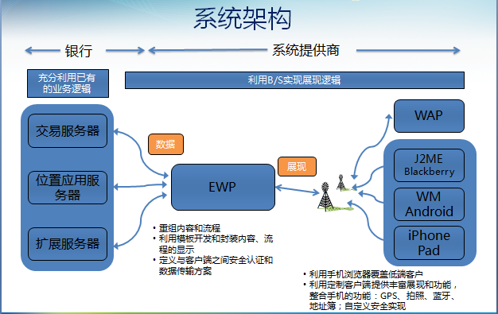
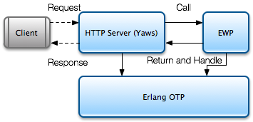

# EMP 如何运转
<!-- toc -->

## EMP整体功能

EMP企业移动应用平台具备聚合服务器功能，采用统一的接口，不仅可以将客户已有系统的业务功能快速“搬移”至手机上，还能够对新功能进行个性化定制。EMP现已集成推送服务、统计分析服务及离线资源服务等多项服务为一体，全面提升用户体验，降低开发成本。如果在原有手机应用系统中添加新的功能模块，将统一由后台驱动所有授权客户端，实现一站式更新。

根据上图描述可知，EWP信息聚合服务器获取第三方数据进行重组、界面开发，客户端组件ERT进行界面解析展现。

## EWP介绍

EWP信息聚合服务器使用Yaws作为Web Server，是一个信息发布、浏览、交互的平台。它允许用户通过手机客户端来访问发行商所提供的各种类型和格式的信息资源。

### EWP和Yaws

Yaws是基于Erlang实现的一个高效、简洁的Web Server框架，类似于Tomcat之于Java。
EWP和Yaws关系图如下：  

### EWP和APP

EWP产品构建在Linux操作系统之上，我们使用Yaws作为我们的Web Server。 EWP Core作为产品的核心组件，提供包括URI映射，用户与Session管理，APP管理，XML引擎，数据库引擎，模板引擎等核心功能。并且，它还定义好了通用业务流程的主体框架，作为可复用的组件，供架构在其上的APP使用。基于EWP Core，我们可以同时发布和管理任意个数的APP。通过这些APP，可以提供各种类型的Web服务。

### APP实现

APP作为项目的定制部分，实现项目相关的业务逻辑。

#### Collection和Channel

EWP为每个业务流程都提供一个标准的channel封装，本封装为集成一个或多个远程内容使用，一般用于定义移动应用的业务流程。
APP可以通过两种方式接入自己的业务逻辑：通过controller实现的自有服务接口，和对于EWP已有channel模式的plugin。
对于后者实现方式，在APP实现中我们将第三方的业务封装为一个个的channel，而将这些channel按照一定的逻辑关系划分为不同的collection，colleciton可以同时包含collection和channel作为其孩子节点。

Collection和Channel的关系如下：

例如，在手机银行项目中，九宫格页面对应的其实是一个Collection集合，它的内容是其所包含的所有Collection节点信息；而每一个Collection节点信息进入后通常是一个二级菜单，它的内容通常是其所包含的Channel节点信息。
而Channel对应通常就是一组业务流程，例如账户查询和行内转账，它们分别被定义为一个Channel。
Collection及Channel通常由APP的配置文件（channel.conf文件）来定义。

#### 数据获取

一般项目实施中，APP展现所取数据来源于第三方，比如银行项目中来源于银行交易服务器，通常为http请求获取数据。

#### 界面开发

最终客户端展现界面来源于APP，所以APP需要将获取数据进行重组填充入界面。