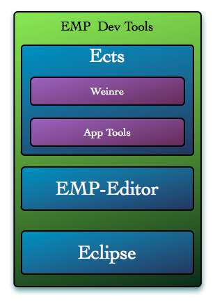
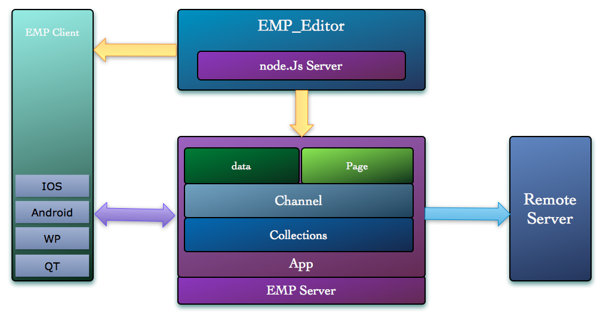

# EMP IDE v 1.0
<!-- toc -->

## 概述

EMP 开发工具是 EMP 应开开发的整合环境，提供包括快速开发、调试、运行、安装等一系列功能。

## 组件描述

EMP 开发工具包括以下组件：

1. Eclipse erlide 插件

2. Emp Editor 调试工具

3. Ects 命令行工具集

     
**(图 1：开发工具组成)**

## Eclipse 插件

Eclipse 作为老牌的开发环境，提供了丰富的功能和拓展性，我们基于 Eclipse 提供了 EMP 开发插件，帮助开发人员高效的开发和配置 EMP 应用。

EMP 插件提供如下功能：

- Erlang 语言编辑器
- EMP 界面语言编辑器（XHTML、 Css、Lua）
- 模板语言 ClearSilver 编辑器
- 各种向导，包括 EMP 工程创建，配置文件创建等
- 配置文件的可视化编辑，Channel 配置和 adapter 配置的可视化配置
- 与客户端直连的调试服务
 
## Emp Editor

为了弥补 Eclipse 这种传统开发工具的一些弱点，我们提供了EMP Editor 实时页面调试调试工具。Emp Editor 是一种运行时编辑器，他被设计为直接同客户端进行交互，以便实时的进行页面内容修改的交互，实现所见即所得的效果。

     
**(图 2：EMP_Editor 交互结构)**

Emp Editor 提供的一些功能：

- 页面实时调试，客户端显示页面内容获取，及本地页面上传显示
- 脚本实时调试，Lua 执行日志查看
- 快速开发模板
- 教程模式，提供 Lua 库的例子和 TIY 功能

## Ects

为了辅助开发，高效的管理开发环境所需要的包及命令，我们提供了 Ects，EMP 命令行工具集。

Ects 提供的功能：

- EWP 平台包管理
- EMP app 编译运行命令集合
- EMP APP 创建向导
- EMP Channel 添加向导
- EMP debugger 工具管理（EMP Editor）
