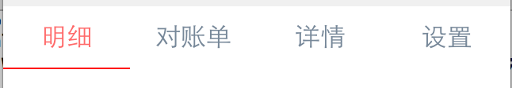

# 基础控件命名规范

## 样式命名规范

基础控件是所有项目都能使用控件列表，使用关键字触发。

我们规定基础控件样式命名前缀为`ert_`,整体样式以样式属性命名。

比如{font-size:14px;color:#FF0000;}则将此样式命名为`ert_f14r`.

在这里我们规定一些常见的简写：

- 字体样式简写
    - f16w:表示字体为16px，颜色为白色。
    - f16b:表示字体为16px，颜色为黑色.  

- 宽度样式简写：
    - w40:表示width40px;

- 高度样式简写：
    - h40:表示height40px;

- right简写
    - r20:表示right20px;

- left简写：
    - l20:表示left20px;

- top简写：
    - t20:表示top20px;

- bottom简写：
    - b20:表示bottom20px;

- background-color:
    - bg_red：能用英文尽量用英文首字母。
    - bg_789：不能则用颜色值简写，比如用`789`表示`#778899`。

## 代码片段编写规范

### tr包含一个td

对于tr类型的基础控件，如果能用一个td实现时，尽量使用一个td实现，这样避免多个tr组成一个table时
出现td个数不一样的问题。

例如：


对于上图中由两个label组成的tr，在以前的写法中习惯写为两个td，
左面td的align属性设置为`left`，右面td的align属性设置为`right`。

这样写没有任何错误也能实现图中效果，如果父控件table中还有其他tr，其他tr中只有一个td，则会导致解析布局错误。

对于上图中效果我们可以利用两个label来组成一个td。
```
<tr class="ert_h50">
    <td >
        <label class="ert_f16b_left">转出卡号</label>
        <label class="ert_f14r_right">2345 3456 4567 5435</label>
    </td>
</tr>
```
其中样式为：
```
.ert_f16b_left{color:#000000;font-size:16px;text-align: left;}
.ert_f14r_right{color:#FF0000;font-size: 14px;text-align: right;}
```

用此tr来组成一个table，代码为：
```
<table class="ert_w310_l10_w" border="0" separator="#E0E0E0">
    <tr class="ert_h50">
      <td >
        <label class="ert_f16b_left">转出卡号</label>
        <label class="ert_f14g_right">2345 3456 4567 5435</label>
      </td>
    </tr>
    <tr class="ert_h50" >
      <td >
        <label class="ert_f16b_left">人民币境内可用余额</label>
        <label class="ert_f14r_right">￥1，000.00</label>
      </td>
    </tr>
    <tr class="ert_h50" >
      <td>
        <label class="ert_f16b_left">人民币境外可用余额</label>
        <label class="ert_f14g_right">￥1，000.00</label>
      </td>
    </tr>
</table>
```

运行效果为：


从运行效果中看到右面label过于靠右，实际效果上是需要有一定间隔，对于这种情况，有两种解决方案：

1. 修改label样式加一个right:10px;样式限制居右为10px；
2. 将table宽度少写10px；这样居右就有间隔。

个人推荐使用第二种解决方案。

### 尽量少使用top，left，width等限制

对于一些界面效果，能使用 text-align 和 valign实现的话就尽量不要使用top值，left值，right值
等来限制控件位置。

比如上例中效果，没有使用label的left和right来布局，而是使用text-align来布局，最后利用table的布局来实现左右边距。

## 添加绑定规则

有些基础控件会有一些特定的点击效果，例如如下效果：



在切换此segment时需要变换字体颜色同时增加底部的线条。

对于这种带有公共性的点击效果可以为基础控件直接绑定此类方法，在界面上添加此控件后，此点击效果会自动绑定上。

规定写法为使用特殊的class名称获取对应控件，然后对控件使用`setOnClickListener`接口增加点击监听，此监听方法

会在控件本身的onclick事件执行之前调用。

此segment的HTML代码为：

```
<div class="ert_segment_bind,ert_seg_div_gw320" border="0" valign="middle">
    <input type="button" class="ert_segment_bind,ert_btn_w80" name="segment5" value="明细" />
    <input type="button" class="ert_segment_bind,ert_w80" name="segment5" value="对账单" />
    <input type="button" class="ert_segment_bind,ert_w80" name="segment5" value="详情" />
    <input type="button" class="ert_segment_bind,ert_w80" name="segment5" value="设置" />
    <label class="ert_line_bind,ert_rline_w80_r" name="seg_short_line"></label>
</div>
```
从代码中可以看出每一个segment的class中有一个特定样式`ert_segment_bind`,父控件div的class中有一个特定样式`ert_segment_bind`,
底部线class有一个特定的样式`ert_rline_bind`。

根据这些样式获取控件同时为控件添加监听方法，具体实现代码为：

```
(function()
    local segment = {};
    local segment_class = "ert_segment_bind";
    local segment_ctrls = document:getElementsByClassName(segment_class);
    local line_class = "ert_line_bind";
    local line_ctrl = document:getElementsByClassName(line_class);
    local start_color = "#778899"; -- 未选中颜色
    local select_color = "#FF6A6A"; -- 选中后颜色

    -- 改变segment控件字体颜色并显影底部线条
    local function set_bg(ctrl)
        -- 获取div控件子控件列表
        local child_ctrls = segment_ctrls[1]:getChildren();
        local index;
        for key,child_ctrl in pairs(child_ctrls) do
            -- 选中segment控件
            if child_ctrl == ctrl then
                ctrl:setStyleByName("color",select_color);
                index = key;
            else
                child_ctrl:setStyleByName("color",start_color);
            end;
        end;
        local left = (index - 1)*80;
        line_ctrl[1]:setStyleByName("left",left .. "px");
        line_ctrl[1]:setStyleByName("color",select_color);
    end;

    function segment.binding_set()
        for k,ctrl in pairs(segment_ctrls) do
            ctrl:setOnClickListener(set_bg);
        end
    end;
    segment.binding_set();
end)();
```

我们规定绑定方法使用匿名函数实现，使用这样的格式能确保所有此函数使用局部变量都在此函数中，
不会散落在整个lua文件中各个角落。

在此匿名方法中局部方法`set_bg`用来实现设置选中segment控件的字体颜色以及设置底部线条left值。
同时`segment.binding_set`方法调用`setOnClickListener`方法对可点击控件添加监听。
