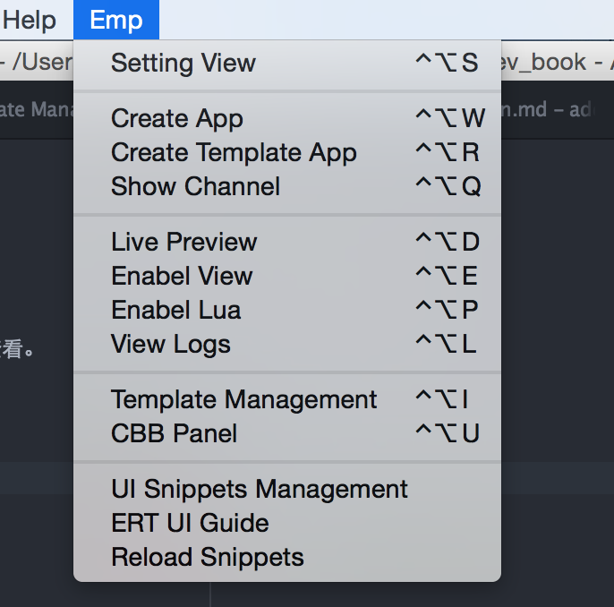

# 添加基础控件

## 基础控件概述

基础控件一般指各个项目都能用到的具有通用性的控件片段。

基础控件使用关键字触发，基础控件说明请在atom的Emp -> ERT UI Guide 中查看。

## 添加基础控件

如下图所示：



点击 UI Snippets Management进入基础控件展示列表界面。


点击 Add UI Snippets 进入添加基础控件界面。


选择模板类别为eui，eui代表产品添加基础控件。

假定我们要加入的基础控件为 文本和图片组成的tr，如下图所示：


输入模板名称 `tr_label_img`。

触发条件`e_tr_label_img`,

模板内容为：
```
<tr class="ert_h50" valign="middle">
   <td>
       <label class="ert_f16b">${1:收款人名册}</label>
       
  </td>
</tr>
```
其中${1:收款人名册}表示光标一开始放在这儿，默认值为收款人名册。


点击ok 添加成功。

在eui基础控件列表中能看到新添加的`tr_label_img`的控件。


在任意一个xhtml文件中输入`e_tr_label_img`看到效果为：


选择`e_tr_label_img`,看到在xhtml文件中添加代码段为:


可以看到光标落在收款人名册上面。

## 修改已有基础控件

打开基础控件列表：


点击Show UI Snippets,进入基础控件模板库列表，选择eui，点击detail，进入基础控件列表界面。

选择要修改的基础控件，假定此次需要修改基础控件为 `e_text`.

点击editor，进入：


直接修改模板内容输入框中内容，点击ok，修改成功。

在xhtml文件中输入`e_text`,得到代码片段为修改后代码片段。

## 同步其他基础控件

打开Emp -> UI Snippets Management，点击Config，进入如下界面：


可以看到UI Snippets即基础控件的配置路径为：`/Users/huangmiaomiao/ui-lib/export_snippets`，这个路径
为本机存储基础控件的路径。

我们将整个ui-lib创建为一个代码库，所有基础控件，项目组公共控件，共通lua函数都放在此代码库下，
当基础控件有更新时，更新一下此代码库，然后点击 Emp -> Reload Snippets 重新加载基础控件即可
得到新的基础控件库。

如果需要将本地添加的基础控件让其他人也能使用，则提交一下ui-lib下的代码即可。

## 推荐做法

一个项目会有很多开发人员，每个人添加自己的基础控件，会出现风格不一致，重复，频繁同步和合并等各种
问题，建议项目上基础控件由一两个相对有经验的开发人员添加，其他开发人员在碰到需要添加的基础控件时
先提出来然后让有权限的人添加。

基础控件最好在需求分析时同步添加完成，并同步培训给所有开发人员，以便提高开发人员使用基础控件效率。
