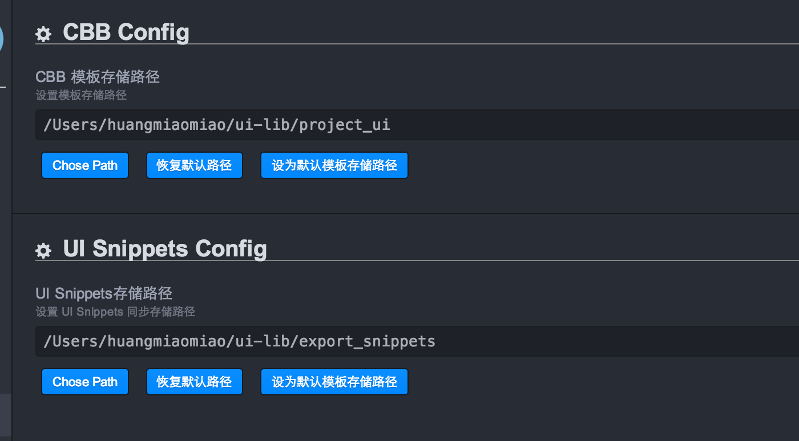
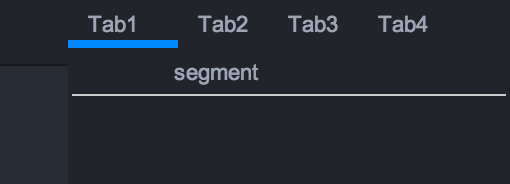

# 添加公共控件

## 公共控件概述

公共控件指每个项目上能提取出的公共部分，主要用于该项目开发时使用。

## 添加公共控件

点击 Emp -> UI Snippets Management 进入Template Management 界面，点击Template可以看到
已经安装的公共控件库。

点击Config进入如下界面：

可以看到`CBB`模板存储路径即公共控件库的配置文件路径为`/Users/huangmiaomiao/ui-lib/project_ui`.

在这个路径下的公共控件库都会加载。

### 添加公共控件库

假定目前项目为交行3.0，将公共控件库命名为cmm3_ui，点击Add New Package, 进入如下界面：

输入公共控件库名称，相关描述，点击ok添加成功。

### 添加公共控件

假定需要加入公共控件的控件效果为：

点击 Add Template 进入添加公共控件界面,此公共控件为模拟segment实现不同tab切换，
命名为cmm3_ui_segment,输入对应名称和描述等。

在模板报文输入项中，推荐点击Create File 输入控件代码。

同模板报文填充方式，CSS样式也使用Create File完成输入。

选择此公共控件显示效果图添加到 Detail Image。

将控件需要的图片添加到资源文件项。

点击ok添加成功。

### 添加CBB

点击Cbb Tool Setting 进入如下界面：

点击 Add new setting 展现如下输入界面：

选择Package Name 和 Type Name。

点击 Save All Changes 保存。

点击Emp -> CBB Panel 进入如下界面：

添加的公共控件在CBB Panel中有展现。

## 修改已有公共控件

如果公共控件已经在很多界面使用，不建议直接修改现有公共控件，推荐添加新的公共控件。

点击Tmplate 进入控件库界面，选择cmm3_ui，点击detail进入控件列表。

点击Editor，进入编辑界面：

编辑成功后点击ok，修改完成。

## 推荐做法

公共控件的好坏直接影响项目交付质量，是项目开始前非常重要环节。公共控件的添加最好由有经验
员工添加，然后进行不断的评审，在评审通过后进行添加。

公共控件的编写需要严格遵守公共控件编码规范。
