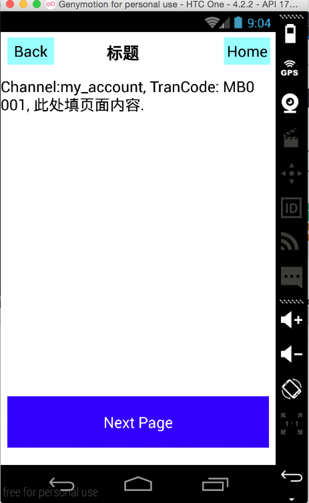
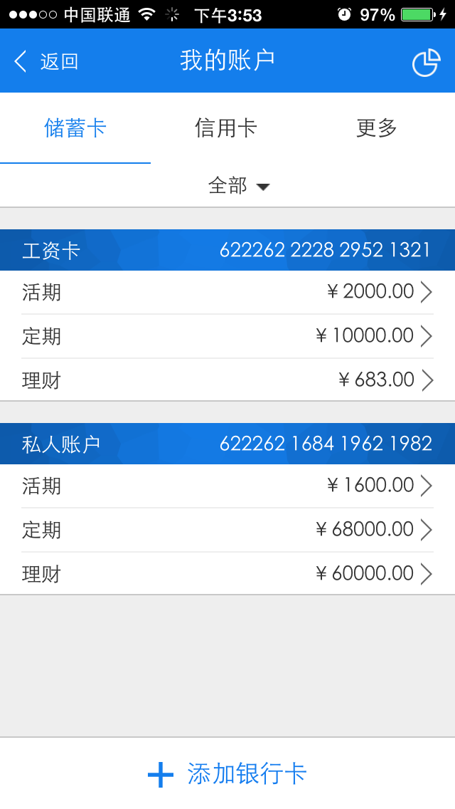

# 前端开发流程手册

## 概述

在当前开发流程中，前端和后台开发分离，本章主要介绍前端即界面开发流程。

## 环境

开发环境在这里简单介绍必须安装的工具。

### 开发工具

开发工具为atom，需要安装emp相关插件，关于atom工具的安装和下载请参照TODO。

### 开发环境

后台EWP环境，有Editor功能的客户端包。

## 创建Project

在正常项目流程中，此步骤应该由项目经理或者技术经理完成。

### 创建Project

打开Atom中Setting View，点击按钮 Create A Emp App，输入App名称(一般要求输入为ebank)点击ok创建Project。

__注意：__
此时APP名称需要与客户端包中APP名称一致，如果不一致会导致客户端连不上后台服务器。

### 启动Project

在打开的Project中，点击Config App 进行configure操作，然后点击 Make App 进行编译操作，在编译
完成后点击Start App启动App，Start App 和./iewp操作一样。

启动日志可以在 View -> Developer -> Toggle Developer Tools 打开的Console中看到。

同时打开Debugger标签下的7003端口服务。

### 进入界面

启动客户端，输入Editor地址和ewp服务器地址，这里以android模拟器为演示例子。

其中Editor端口为7003即我们启动的Server端口。

点击确定进入服务器，看到如下界面。

在atom中看到有一个客户端连接上debugger端口。

如果能看到图2中界面，表示整个环境没有问题。

## 创建channel

我们将一个功能模块称为channel。

在EMP App 中点击Show Channel，在channel management 下点击add按钮添加channel，如下图
所示添加一个my_account的channel。

点击ok正常添加成功后在resouce_dev/common/channels文件夹下看到my_account文件夹。

my_account文件夹下有对应生成的css，images，json，lua，xhtml文件夹。

点击Show Channel，点击Edit 编辑 my_account channel，添加这个channel的步骤：

添加我的账户所需三个步骤，暂定为MB0001，MB0002，MB0003，具体步骤ID为前端开发人员和后台开发人员商议确定。

点击OK添加完成，可以看到json,lua,xhtml,css文件夹下都生成了对应步骤ID的文件。

在运行的第一个界面中输入my_account 和 MB0001 进入我的账户第一个界面。

运行效果如下：

点击Next Page 可以进入下个界面。

## 填充界面

需求中转账第一个界面效果如下图所示。

下面详细介绍如何利用工具编写此界面。

### 添加基础控件

在atom中已经存在的基础控件请参照Emp -> ERT UI Guide 打开页面。

根据此界面效果和基础控件列表，

### 添加公共控件

## 调试

### 查看日志

## 常见lua封装方法

## 跳转界面

### 下个界面获取数据

做成一个大的书目。
