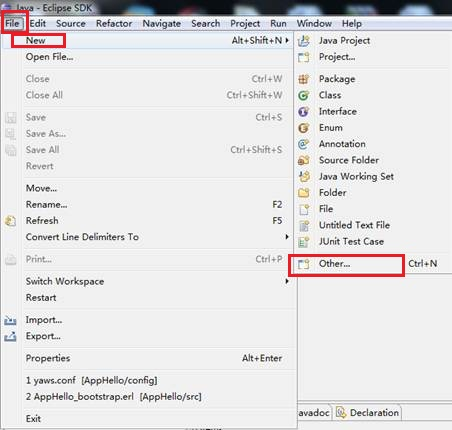
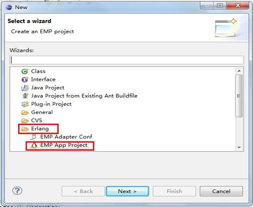
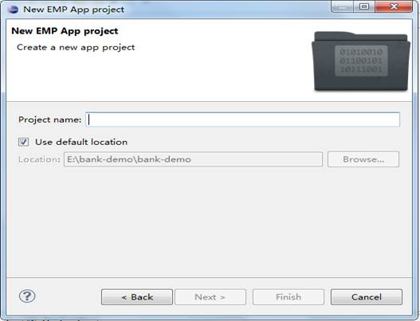
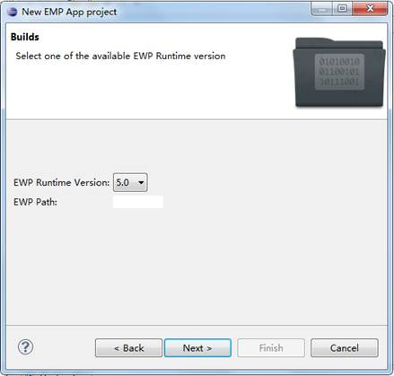
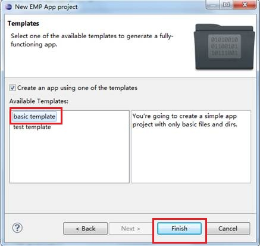
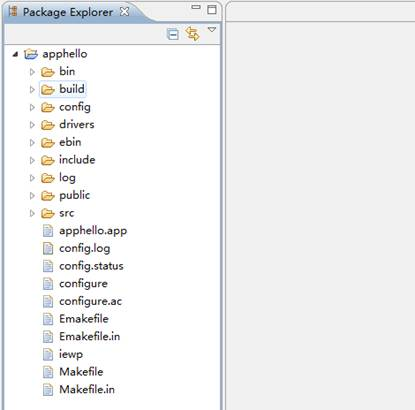
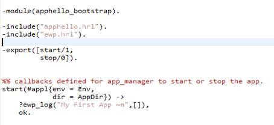
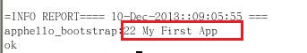
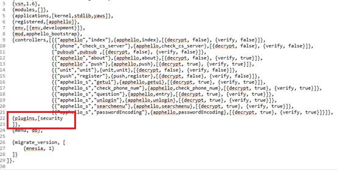
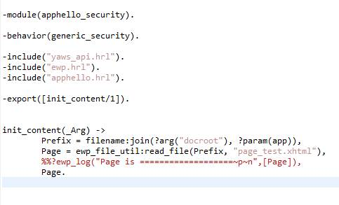

# 创建Server App
<!-- toc -->

# 概述

EWP App创建是EMP Server开发的第一步，其包含：创建.app资源文件、创建App目录结构、编写编译启动脚本、编写启动模块和函数等。其中的一些步骤是繁琐且重复的，我们可以通过EWP IDE很方便的创建一个App而不必关注这些繁琐的步骤。本文将介绍如何使用EWP IDE创建App以及初始化App的基本操作。

# 创建ebank App 

1. 在Eclipse中选择File, New, Other ,如图：  


2. 选择Erlang文件下的EMP App Project，然后点击next按钮  


3. 填写Project Name为apphello，然后点击next按钮  


4. 点击完，出现下图，点击next按钮  


5. 点击之后，出现下图，选择basic template，然后点击finish按钮。  


6. 创建完成后，即可在Package Explorer中看到新建的App  


# App初始化

## 编辑启动函数

很多时候，我们在启动App时需要完成一些初始化的工作（如启动App开发的driver、在ets内存表中缓存少量静态数据等）。通过配置.app文件的mod配置项，我们就可以指定App启动时回调的初始化模块。

初始化模块通常会被命名为AppName\_bootstrap（如本例中的apphello\_bootstrap）。初始化模块需要定义两个回调函数：start/1和stop/0。在App启动时，EWP会将.app文件的相关配置作为参数（本文中可以暂时不用关注该参数的具体数据结构）调用start/1回调函数以完成App初始化。App停止时，stop/0会被EWP调用来完成一些清理工作。

我们通过以下例子来学习如何实现App启动时打印调试信息的功能：

1. 修改apphello\_bootstrap:start/1方法。注意，使用?ewp\_log宏需要引入ewp.hrl文件。  


2. 打开shell终端，进入apphello根目录。执行./configure --with-debug指令，完成后执行make编译，完成后执行./iewp启动App。启动完成后便可以在后台看到我们打印的My First App信息  

 
## 编写初始化页面

EMP Client启动时会与EWP建立加密信道（即握手），成功后会显示程序的初始化页面。EWP已封装了握手流程的具体实现，同时提供了回调接口供App定制自己的初始化页面。该回调接口需要App编写AppName\_security模块并实现init\_content/1回调函数，该函数的输入参数为一种包含本次http请求信息的数据结构（本文中可以暂时不用关注该参数的具体数据结构），返回值为响应报文，类型为字符串。

我们通过以下例子来学习如何定制App初始化页面：

1. 首先修改apphello.app的plugins配置，添加security plugin：  


2. 在src/plugins下创建apphello\_security.erl模块，代码如下图。我们暂时不用关注其实现细节，这三行代码的功能是读取public/www/page\_test.xhtml文件的内容并返回。  


3. 在public/www/文件夹下创建page\_test.xhtml文件，并编写如下内容：  
```
<?xml version="1.0" encoding="UTF-8" ?>
<content>
	<head> 
	 	<style> 
	 		.label1{font-size:24px;color:#FF00FF;left:50px;top:80px;} 
	 	</style> 
	 	<script type="text/x-lua" src="RYTL.lua">
	 	</script> 
	</head> 
	<body name='body'> 
	 	<label class="label1">
	 		HelloWorld!
	 	</label> 
	</body>
</content>
```  
4. 执行ewp:c_app(apphello)重启App服务或者停止App服务（按两次ctrl+c），重新执行make编译，/iewp启动App。使用客户端程序访问App服务即可看到HelloWorld页面。
  


