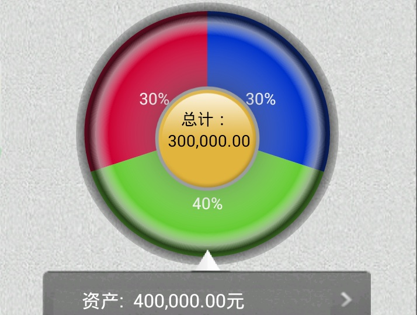

# 饼状图
<!-- toc -->

## 功能说明

```
.cake1{
    color:#FFFFFF;
    background-color:#cc0033;
    top:130px;
    left:60px;
    width:200px;
    height:200px;
}
<!-color表示字体颜色，background-color表示扇形背景颜色-->
.cake2{
    color:#FFFFFF;
    background-color:#66cc33;
    left:60px;
    width:200px;
    height:200px;
}
.cake3{
    color:#FFFFFF;
    background-color:#0033cc;
    left:60px;
    width:200px;
    height:200px;
}
<input name="zfContrast" class="cake2" onclick="cakeclick1()" percent="0.40" selected="true" type="cake" value="40%" />
<input name="zfContrast" class="cake1" onclick="cakeclick2()" percent="0.30" type="cake" value="30%" />
<input name="zfContrast" class="cake3" onclick="cakeclick3()" percent="0.30" type="cake" value="30%" />
```


饼图显示一个数据系列中各项的大小与各项总和的比例。饼图中的数据点显示为整个饼图的百分比。

##属性

__type__  
规定标签元素的类型.  
@value string cake.

__percent__  
规定饼图数据百分比小数.  
@value string 0.00.

__name__  
同一组控件需要设置相同的name.


属性说明：（支持Lua脚本）

| Tag | Attributes | Notes |
| --- | --- | --- |
| `<input>` | `type='cake'` | 值为cake表示饼状图的标签 |
| | `percent='百分比小数'` | 表示当前标签占用整个饼状图的百分比。所有input饼状图percent属性值之和必须1，才能显示一个完整的饼状图 |

支持`checked='checked'`属性。

支持样式：

| Property | Value | Info |
| --- | --- | --- |
| color | #RRGGBB | 例：color:#FF0000 |
| top | 例：10px | |
| width | 例：320px | |
| font-size | Int | 例：font-size:26px; |
| font-weight | normal/bold | bold表示粗体； |
| bottom | 例：10px | |
| height | 例：480px | |
| background-color | #RRGGBB | 不设定此属性，控件默认背景色为透明 |
| background-image | `url(http://…/imag.png)`或`url(imag.png)` | |
| display | none/block; | (none表示隐藏） |
| position | fixed/static | static为默认值。 <br /> 当样式表中position值为fixed时表示应用当前样式的控件位置固定，不会跟随页面滑动而动；<br /> 如果position值为static时，则不做特殊处理。 |
| filter | 例： <br />filter:progid(alpha='0.5' ) | 支持透明度。<br /> `alpha`:整体透明度（如不指定该属性默认为不透明:1） |