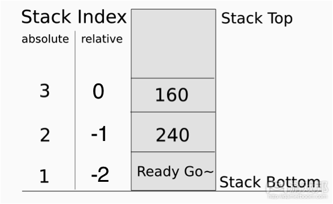
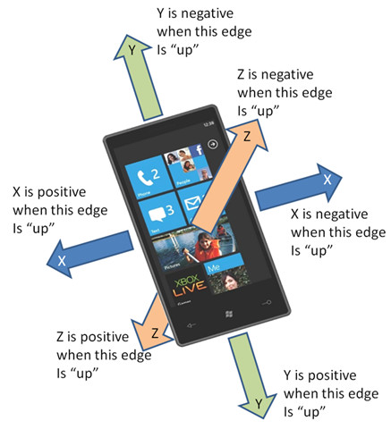

# Function in Library
<!-- toc -->

## Window

### window:alert()
>* **Description**:  
  弹出系统提示框。注：iOS平台，系统版本小于8.3采用UIAlert实现弹窗，在8.3及以上版本采用UIAlertController实现弹窗。而在使用UIAlertController过程中，则出现一个问题，暂时无法修改，使用时尽量规避。问题描述：inputText控件设置onfocus事件为弹窗时，点击弹窗的关闭按钮，会一直循环弹窗。出现问题的原因是UIAlertController弹窗是通过页面跳转实现的，当点击关闭弹窗后，返回当前页面，输入框会重新获取焦点，导致循环弹窗。[参考BUG#11171](https://dev.rytong.me:9998/proj/emp/ticket/11171)
  
* **Syntax:**
```
window:alert(content, button1, button2, ..., callback)
```
* **Parameters:**  
  1. content _(required)_  
    * 类型: String
    * 说明: 提示的内容。  
  2. button1/button2…_(optional)_
    * 类型: String
    * 说明: 提示框显示的按钮,按钮的标题为传入button1/button2参数名.此按钮可为多个，具体显示效果按照每个客户端平台UI特点决定。
  3. callback_(optional)_
    * 类型: Function
    * 说明: 按钮响应回调函数。  
      回调函数的参数是一个index数字值，返回的值是用户点击的按钮的index值，而button对应index值是在alert button参数里面出现的顺序值。例如：window:alert("带取消按钮的提示框","OK","Cancel",Callback)，点击ok按钮index为0，cancel为1，以此类推下去。  
      (注意：callback函数中的参数buttonIndex从0开始计数。)
* **Examples:** 
  ```js
  window:alert("alertbody");
  弹出提示框，仅提供显示信息内容，系统将默认添加"确定"按钮，用来关闭提示框。
  function Callback(buttonIndex)
  –-[[buttonIndex为弹出框上按钮索引值（按照添加的顺序），此回调函数必须定义该参数，这样才能区分开用户点击的是哪个按钮。
  --]]
  ...
  end
  window:alert("alertbody","OK","Cancel",Callback);
  除指定的消息外，显示"OK","Cancel"两个按钮，Callback为回调函数，当用户点击这两个按钮时调用，同时会将点击按钮的索引值传递进该回调函数。  
  (注意: 最好不要在window:alert()中使用未定义的callback函数，这样可能引起程序崩溃。)
  ```
* **Return:**  
  无

### window:open()
>* **Description:**
  1. `**://**`内部浏览器打来页面（注：只能为系统浏览器）;
  2. `file://`使用新窗口打开附件；
* **Syntax:**
  ```
  window:open(URL/file/content)
  ```
* **Parameters:**  
  参数仅有一个，但是支持两种类型:
  1. URL(required)
    * 类型: String
    * 说明: 外部网站地址。
  2. File  
  附件地址，可打开附件(pdf/excel/word/ppt)，如window:open(file://path/xxx/aa.pdf);
* **Return:**  
  无
* **Examples:**
  ```
  function OpenURL()
  window:open("http://www.rytong.com");
  end
  ...
  ...
  <input type='button' onclick='OpenURL()' value='网站地址'/>
  ```

### window:close()
>* **Description:**  
  退出程序
* **Syntax:**
  ```js
  window:close()
  ```
* **Parameters:**  
  无
* **Return:**  
  无
* **Examples:**
  ```js
  function Exit()
  window:close();
  end
  ...
  ...
  <input type='button' onclick='Exit()' value='退出'/>
  ```

### window:showContent()
>* **Description:**  
  在当前页面上层再悬浮显示另一个页面，此页面为模态页面.接受完整页面报文.<br/>
  一般用于显示loading页面或菜单页。与window:hide()配合使用，详见window:hide()。<br />
  __注意：一个tag只对应打开一个页面.如果使用了一个tag打开了一个页面,然后在没hide的情况下，使用这个tag去执行多次showContent,那这些showContent方法不作处理。__
  showContent页面与主页面共享一个lua状态机.lua接口location:replace,location:reload操作主页面.当执行客户端自动页面跳转时,如submit,A action 同样操作主页面. 调用lua接口getElements系列函数查找控件时,主页面控件索引值低.<br/>
  showContent页面使用独立的样式表,但是showContent页面中的控件可以到主页面样式表中查找样式.详细规则如下:
   1. 使用两套样式表,但是showContent界面控件可能需要到主界面样式表中查找样式,而主界面控件不需要到showContent页面查找样式.
   2. showContent页面样式如何确定.<br/>
   以body控件为例, body控件有样式body1,body2, body. 在showContent页面查找样式       body1,body2,body,如果三个样式都找到了,则不再查找主界面样式,如果其中某个样式没有找到,则需要到主界面继续查找该样式. 
   3. 样式优先级<br/>
   查找到的样式以showContent页面的样式为最高优先级.<br/>
   正常的样式优先级顺序为 body2>body1>body. 但是如果其中某个样式在showContent页面中时,其优先级为最高. <br/>
   比如: body2,body1在主页面样式表中找到,而body样式为showContent页面中的样式.则此时样式优先级为body>body2>body1.
   4. 样式表的清理<br/>
   showContent页面样式表在调用hide()后被删除.
 

> * **Syntax:**
  ```js
  window:showContent(content/path, tag, transitionType)
  ```
* **Parameters:**
  1. content_(required)_
    * 类型: _String._
    * 说明:可以接受两种参数：1)待显示的页面报文内容；2)本地报文路径  
  2. tag_(required)_
    * 类型: _Number._
    * 说明: 待显示页面标记,其值大于0
  3. transitionType_(optional)_
    * 类型: _Int._
    * 说明: 页面切换动画类型，具体值详见：TransitionType
* **Return:**  
  无
* **Examples:**
  ```js
  local tag = 1;
  --报文内容
  window:showContent(
  "<?xml version=...><content>...<content>", tag);
  window:hide(tag);
  ...
  -- 本地报文路径
  window:showContent("local:load.xml", tag, transitionType.flipFromLeft);
  window:hide(tag, transitionType.flipFromRight);
  ```

### window:showControl()
>* **Description:**  
  在当前页面上层再悬浮显示另一个页面.与window:hide()配合使用，详见window:hide()。<br />showControl() 弹出的界面为非模态，即用户可以点击当前界面的下层的界面。（5.3版本）
  
      注意：一个tag只对应打开一个页面.如果使用了一个tag打开了一个页面,然后在没hide的情况下，使用这个tag去执行多次showControl,那这些showControl方法不作处理。
* **Syntax:**
  ```js
  window:showControl(object, tag, transitionType)
  ```
* **Parameters:**
  1. object_(required)_
    * 类型: _Userdata._
    * 说明: 当前页面中已有的控件对象
  2. tag_(required)_
    * 类型: _Number_
    * 说明: 待显示页面标记,其值大于0.
  3. transitionType_(optional)_
    * 类型: _Int._
    * 说明: 页面切换动画类型，具体值详见：TransitionType
* **Return:**  
  无
* **Examples:**
  ```js
  local tag = 1;
  local div = document:getElementsByName("info");
  window:showControl(div[1], tag, transitionType.flipFromLeft);
  ```

### window:hide()
>* **Description:**  
  隐藏调用window:showContent()/showControl()方法显示的悬浮页面，所以此方法一定要在showContent()/showControl()之后调用。<br/>
  注：这三个接口中，都存在一个共同的参数tag，tag作用的是用来标记界面，这样才能保证hide隐藏的界面与showContent或showControl显示的界面为同一个。
* **Syntax:**
  ```js
  window:hide(tag, transitionType)
  ```
* **Parameters:**
  1. tag_(required)_
    * 类型: _Number_
    * 说明: 悬浮页面标记,,其值大于0
  2. transitionType_(optional)_
    * 类型: _Number._
    * 说明: 页面切换动画类型，具体值详见：TransitionType
* **Return:**  
  无
* **Examples:**
  ```js
  local tag = 1;
  local div = document:getElementsByName("info");
  window:showControl(div[1], tag);
  window:hide(tag, transitionType.flipFromRight);
  ```

### window:closeKeyboard()
>* **Description:**  
  关闭当前界面上所有软键盘（系统键盘和自定义软键盘）。<br />QT平台不支持
* **Syntax:**
  ```js
  window:closeKeyboard()
  ```
* **Parameters:**  
  无
* **Return:**  
  无
* **Examples:**
  ```js
  window:closeKeyboard();-- 效果就是屏幕上的键盘被关闭
  ```

### window:setPhysicalkeyListener()
>* **Description:**  
  为Android/Windows Phone手机上的物理按键注册监听函数，物理监听只对当前页面有效，当手机上没有物理按键时此方法不起作用.<br />
  Android 能监听“home”和“backspace”按键。<br />
  Windows Phone能监听“backspace”按键。<br />
  IPhone 和QT不支持。
* **Syntax:**
```js
window:setPhysicalkeyListener(physicalkey, function)
```
* **Parameters:**
  1. physicalkey_(required)_
    * 类型:
      - String  
      - Enum: "backspace", "home"
    * 说明: 表示手机上的物理按键：返回键，Home键（只能用于Android），手机上其他物理按键不支持。
  2. function_(required)_
    * 类型: _Function._
    * 说明: 监听函数。
* **Return:**  
  无
* **Examples:**
  ```
  function listener()
  ……
  end
  window:setPhysicalkeyListener("home", listener);
  ```

### window:setOnPhysKeyListener()
>* **Description:**  
  为Android/Windows Phone手机上的物理按键注册按下事件的响应监听函数，当手机上没有物理按键时此方法不起作用.<br />
  __注意：该方法与window:setPhysicalKeyListener()不同的是，该方法监听的对象是物理键按下这个事件，该监听方法不会处理物理键按下的具体操作，即与产品自带的或者通过window:setPhysicalKeyListener()方法设置的物理键监听并不冲突且互不影响。需要在执行完本方法监听的回调后，再执行物理键自身的响应监听。__<br/>
  该监听方法全局有效，且只能设置一个监听，再次调用本函数设置监听时，将覆盖先前通过本函数设置的监听函数。<br/>
  IPhone 和QT不支持。
* **Syntax:**
```
window:setOnPhysKeyListener(callback)
```
* **Parameters:**
  1. callback(required)_
    * 类型:
      - _Function_  
    * 说明: 监听函数。需要在执行完物理键注册的响应事件后，再执行本监听的回调。该监听函数有1个参数，表示返回键类型，取值为"backspace", "home"（只能用于Android）。
* **Return:**  
  无
* **Examples:**
  ```js
  function listener(physicalkey)
  ……
  end
  window:setOnPhysKeyListener(listener);
  ```

## Document

### document:getElementsByProperty()
* **Description:**  
  返回与指定的属性匹配的所有控件对象.当此时加载了showContent页面时,showContent页面中有参数相符的控件也会被返回,并补充到原有列表中.
* **Syntax:**

  ```
  document:getElementsByProperty(property)
  ```
* **Parameters:**
  1. property_(required)_
    * 类型: _Table._
    * 说明: 属性数组，属性必须为我们已定义的该控件支持的属性。
* **Return:**
  * 类型: _Table._
  * 说明: 符合条件的所有控件对象数组。如果不存在这样的对象，则返回一个空的table。因此，在用返回的值时，需要判断其有效性。
* **Examples:**
 
  ```
  local elements = document:getElementsByProperty{name="button",type="submit"};
  ```

### document:getElementsByName()
* **Description:**  
  返回与指定的name属性匹配的所有控件对象.当此时加载了showContent页面时,showContent页面中有参数相符的控件也会被返回,并补充到原有列表中.
* **Syntax:**

  ```
  document:getElementsByName(name)
  ```
* **Parameters:**  
  1. name_(required)_
    * 类型: _String._
    * 说明: `name`属性值
* **Return:**
  * 类型: _Table._
  * 说明: 符合条件的所有控件对象数组。如果不存在这样的对象，则返回一个空的table。因此，在用返回的值时，需要判断其有效性。
  
* **Examples:**

  ```
  local elements = document:getElementsByName("button1");
  ```

### document:getElementsByTagName()
* **Description:**  
  返回符合给定标签名称的所有控件对象.当此时加载了showContent页面时,showContent页面中有参数相符的控件也会被返回,并补充到原有列表中.
* **Syntax:**

  ```
  document:getElementsByTagName(tagname)
  ```
* **Parameters:**
  1. tagname_(required)_
    * 类型: _String._
    * 说明: 标签名称
* **Return:**
  * 类型: _Table._
  * 说明: 符合条件的所有控件对象数组。如果不存在这样的对象，则返回一个空的table。因此，在用返回的值时，需要判断其有效性。
* **Examples:**

  ```
  local elements = document:getElementsByTagName("form");
  ```


### document:createElement()
>* **Description:**  
  根据tagname生成元素，同时为该元素生成属性，属性名与属性值必须成对出现。
* **Syntax:**
  ```js
  document:createElement(tagname,property)
  ```
* **Parameters:**
  1. tagname_(required)_<br />
    * 类型: _String._
    * 说明: 标签名称，如a,input等
  2. Property（optional）<br />
    * Table
    * 此处的table为record风格的（即key-value格式）如：{type=”button”, border =”1”}
    * 此处key和value都是字符串
* **Return:**  
  生成的控件节点。<br />
  备注：在用返回的值时，需要判断其有效性
* **Examples:**
  ```js
  local a = document:createElement("a");
  local a = document:createElement("input", "type", "button");
  ```

### document:getAllEventElements()
>* **Description:**  
  返回所有带event事件并且给event设置了回调方法的控件。  
  需要为控件添加监听事件的接口，通过这个接口来设置监听方法，这样当事件触发时就会回调预置的监听方法，可以在这个回调的方法中编写统计功能。

* **需要添加监听的事件：** 
  1. onclick
  2. onfocus
  3. onblur
  4. onchange
  
在设置监听事件时需要获取控件，在dom接口中提供了getElementsByName和getElementsByTagName这两个方法，但这两个方法都需要遍历整个dom树，在dom树比较大时效率极低，这时统计脚本会对应用的性能产生较大的影响。
为了尽量减少由于统计脚本的加入产生的性能损耗，我们需要提供一个快速获取控件的方法。在一个页面中，具备触发event的控件并不多，而利用event的控件则更少，这样只需要用一个eventArray来记录所有需要触发event的控件(给event设置了回调方法)，获取控件时我们就从这个eventArray查找，这样查找的速度就比较快了，记录操作是在xhtml解析时进行，仅仅记录可以触发event并且给event设置了回调方法的控件。

举例：

	<body>
	    <label>登录页面</label>
        <input type='text' name='n' value='用户名' ></input>
        <input type='password' name='p' value='密码' onfocus='pwfocus()'></input>
        <input type='button' value='登录' onclick='login()' ></input>
	<body>
	
象上面的这段报文，前两个控件由于没有设置enent的回调方法，因此不会添加到eventArray中，而后两个控件存在event的回调方法（分别为pwfocus()和login()），需要添加到eventArray中。
* **Syntax:**

  ```
  document:getAllEventElements()
  ```
* **Parameters:**  
  无
* **Return:**
  * 类型: _Table._
  * 说明: 符合条件的所有控件对象数组。如果不存在这样的对象，则返回一个空的table。因此，在用返回的值时，需要判断其有效性。
  
* **Examples:**

  ```
  local elements = document:getAllEventElements();
  ```
* **See:**    

### document:getEventElementsByListener()
>* **Description:**  
  返回与指定的listener属性匹配的所有控件对象
* **Syntax:**

  ```
  document:getEventElementsByListenr(listener)
  ```
* **Parameters:**  
  1. listener(required)_
    * 类型: _String._
    * 说明: 和通过属性设置的event的植一样。
* **Return:**
  * 类型: _Table._
  * 说明: 符合条件的所有控件对象数组。如果不存在这样的对象，则返回一个空的table。因此，在用返回的值时，需要判断其有效性。
  
* **Examples:**

  ```
  	<body>
	    <label>登录页面</label>
        <input type='text' name='n' value='用户名' ></input>
        <input type='password' name='p' value='密码' onfocus='pwfocus()'></input>
        <input type='button' value='登录' onclick='login()' ></input>
	<body>
  local elements = document:getEventElementsByListenr("login()");
  ```        

### document:getEventElementsByName()
>* **Description:**  
  返回符合给定标签名称的所有控件对象
* **Syntax:**

  ```
  document:getEventElementsByName(tagname)
  ```
* **Parameters:**
  1. name_(required)_
    * 类型: _String._
    * 说明: `name`属性值
* **Return:**
  * 类型: _Table._
  * 说明: 符合条件的所有控件对象数组。如果不存在这样的对象，则返回一个空的table。因此，在用返回的值时，需要判断其有效性。
* **Examples:**

  ```
  	<body>
	    <label>登录页面</label>
        <input type='text' name='n' value='用户名' ></input>
        <input type='password' name='p' value='密码' onfocus='pwfocus()'></input>
        <input type='button' value='登录' onclick='login()' ></input>
	<body>
  local elements = document:getEventElementsByName("p");
  ```
我们也可以添加下面4个方法，这几个方法可以直接给eventArray中的所有控件添加事件监听，这样统计脚本中就不再需要检索控件了，不过缺点是需要在回调的callback中根据sender来区分是那个控件的事件。

### document:setOnClickListener(callback) 
>* **Description:**  
  给当前dom树中所有有onClick事件的控件设置监听.当再次调用本函数设置监听时,将覆盖先前通过本函数设置的监听函数.针对通过element:setOnClickListener设置的监听事件不能被覆盖.
 * **Parameters:**
  1. callback_(required)_
    * 类型: _Function._
    * 说明: 事件监听的回调方法.本方法设置监听方法与控件本身的onclick事件并不冲突且互不影响.本方法需要在执行完监听的回调后，再执行onclick事件。该监听函数有3个参数，分别为：sender(控件)，name（控件的name值），value（控件的value值）。  
    
### document:setOnFocusListener(callback) 
>* **Description:**  
  给当前dom树中所有有onFocus事件的控件设置监听.当再次调用本函数设置监听时,将覆盖先前通过本函数设置的监听函数.针对通过element:setOnFocusListener设置的监听事件不能被覆盖.
 * **Parameters:**
  1. callback_(required)_
    * 类型: _Function._
    * 说明: 事件监听的回调方法.本方法设置监听方法与控件本身的onFocus事件并不冲突且互不影响.本方法需要在执行完监听的回调后，再执行OnFocus事件。该监听函数有3个参数，分别为：sender(控件)，name（控件的name值），value（控件的value值）。 
    
### document:setOnBlurListener(callback) 
>* **Description:**  
  给当前dom树中所有有onBlur事件的控件设置监听.当再次调用本函数设置监听时,将覆盖先前通过本函数设置的监听函数.针对通过element:setOnBlurListener设置的监听事件不能被覆盖.
 * **Parameters:**
  1. callback_(required)_
    * 类型: _Function._
    * 说明: 事件监听的回调方法.本方法设置监听方法与控件本身的onBlur事件并不冲突且互不影响.本方法需要在执行完监听的回调后，再执行onBlur事件。该监听函数有3个参数，分别为：sender(控件)，name（控件的name值），value（控件的value值）。 
    
### document:setOnChangeListener(callback) 
>* **Description:**  
  给当前dom树中所有有onChange事件的控件设置监听.当再次调用本函数设置监听时,将覆盖先前通过本函数设置的监听函数.针对通过element:setOnChangeListener设置的监听事件不能被覆盖.
 * **Parameters:**
  1. callback_(required)_
    * 类型: _Function._
    * 说明: 事件监听的回调方法.本方法设置监听方法与控件本身的onChange事件并不冲突且互不影响.本方法需要在执行监听的回调后，再执行onChange事件。该监听函数有3个参数，分别为：sender(控件)，name（控件的name值），value（控件的value值）。 
* **callback原型**

		function tfFocus(sender, name, value)       
		end
		

## Screen
### screen:width
* **Description:**  
  返回当前设备屏幕宽
* **Syntax:**

  ```
  screen:width()
  ```
* **Parameters:**  
  无
* **Return:**  
  * 类型: _Int._
  * 说明: 返回当前设备屏幕宽。其数值大小与设备类型有关。
* **Examples:**

  ```
  local width = screen:width();
  print(width); -- 320 for iPhone4S
  print(width); -- 480 for sumsang i9100
  print(width); -- 480 for QT(应用程序窗口宽度)
  print(width); -- 480 for htc 8x
  ```

### screen:height
* **Description:**  
  返回当前设备屏幕高
* **Syntax:**

  ```
  screen:height()
  ```
* **Parameters:**  
  无
* **Return:**
  * 类型: _Int._
  * 说明: 返回当前设备屏幕高。其数值大小与设备类型有关。
* **Examples:**

  ```
  local height = screen:height();
  print(height); -- 480 for iPhone4S
  print(height); -- 762 for sumsang i9100
  print(height); -- 800 for QT(应用程序窗口高度)
  print(height); -- 853 for htc 8x
  ```

### screen:dpi
* **Description:**  
  返回当前设备屏幕DPI
* **Syntax:**

  ```
  screen:dpi()
  ```
* **Parameters:**  
  无
* **Return:**
  * 类型: _Int._
  * 说明: 返回当前设备屏幕DPI。其数值大小与设备类型有关。
* **Examples:**

  ```
  local dpi = screen:dpi();
  print(dpi); -- 326 for iPhone4S
  print(dpi); -- 240 for sumsang i9100
  print(dpi); -- 96 for QT(系统分辨率相关)
  print(dpi); -- 341 for htc 8x
  ```

## Location

### location:reload()
>* **Description:**  
  重新刷新当前页面<br/> 
  与浏览器不同的是reload并不会重新解析xhtml.同时通过lua脚本修改后的样式也不会被还原.客户端会应用最终的样式并重新布局. 
* **Syntax:**
  ```js
  location:reload()
  ```
* **Parameters:**  
  无
* **Return:**  
  无
* **Examples:**
  ```js
  button[1]:css{"font-size", 20};
  location:reload();
  ```

### location:replace()
>* **Description:**  
  用提供的报文刷新当前页面
  <br />备注：此函数是用一个新报文来显示页面
* **Syntax:**
  * location:replace(content)
  * location:replace(content, transitionType)
  * location:replace(content, callback,params)
  * location:replace(content, transitionType, callback,params)
* **Parameters:**
  1. content_(required)_
    * 类型: _String._
    * 说明: 待显示报文内容
  2. transitionType_(optional)_
    * 类型: _Int._
    * 说明: 页面切换动画类型，具体值详见：TransitionType
  3. callback_(optional)_
    * 类型: _Function_
    * 说明: 回调函数。
     此回调函数能精确的控制报文生成界面并完全加载的时候，执行回调函数来做通知lua做操作。  
    （注：此回调函数定义时必须有且仅有一个参数，此参数类型为Table，如果parameters参数为空则在其中加入resultCode[String.]，resultBuf[String.].两个字段，如果为空则只有这两个个字段。
    resultCode的value的类型为int类型，其值的意义如下:  
    0	代表没有错误，已经加载完成。  
    -1 代表html的解析出现问题。  
    -2 代表lua的脚本加载出现问题。  
    -3 代表本地资源出现安全问题（包括离线资源等）  
    -4 代表网络加载的资源出现问题。  
    目前只枚举这些错误代码，一旦出现负数就代表错误。  
    目前客户端只支持0（成功）或者任何负数（错误）就可以了, 以上枚举错误码保留以备以后使用。  
    resultBuf的返回对应的错误代码的可读性错误提示。方便提示模板开发和使用用户。
    如果没有错误，resultBuf为空字符串。）
    * 备注：如果该函数没有第三个参数的话，location:replace做同步操作，兼容以前的模板代码。.
    如果该函数有第三个参数的话，location:replace做异步操作通知，待操作完成通知回调函数处理相应的操作。
  4. params_(optional)_
    * 类型: _table_
    * 说明: params为table类型参数，当replace结束后回调使用。 
* **Return:**  
  无
* **Examples:**
  ```js
  Case1:无回调函数
  local content = “<?xml version= ……”;
  location:replace(content, transitionType.flipFromLeft);
  case2:有回调函数
  function callback(result)
  if result.resultCode == 0 then
  –-没有错误的处理逻辑
  else 
  --错误处理
  end;--if result.resultCode == 0 then
  end;
  local content = “<?xml version= ...”;
  location:replace(content,transitionType.flipFromLeft,callback,{});
  ```

## Database
注：  
我们在客户端默认建立数据库文件`database.sql`，同时建立表`databuffer`，以下接口所进行的所有操作都是针对表"databuffer"的操作： 
 
* database:addData()
* database:getData()
* database:deleteData()

而以下接口的操作没有默认的数据库与数据表，需要通过传参的形式指定要操作的对象，详情请见各接口说明及代码示例：

* database:open()
* database:exec()
* database:close()

### database:addData()
* **Description:**  
  向数据库中添加数据（如果当前key已经存在，则更新；如果key不存在，则添加到数据库中）
* **Syntax:*** 

  ``` 
  database:addData(key, value)
  ```
* **Parameters:**
  * key_(required)_
    * 类型: _String._
    * 说明: 添加字段
  * value_(required)_
    * 类型: _String._
    * 说明: 添加数据值
* **Return:**  
  * 类型: _Int._
  * 说明: 添加成功返回`0`，添加失败返回`1`。
* **Examples:**、

  ```
  database:addData("phoneNum", "13888888888");
  ```

### database:getData()
* **Description:**  
  从数据库中获取数据
* **Syntax:**

  ```
  database:getData(key)
  ```
* **Parameters:**
  * key_(required)_
    * 类型: _String._
    * 说明: 检索字段
* **Return:**
  * 类型: _String._
  * 说明: 检索字段的数据值
* **Examples:**

  ```
  database:addData("phoneNum", "13888888888");
  local value = database:getData("phoneNum");
  print(value); -- 13888888888
```
  
### database:deleteData()
* **Description:**  
  删除数据库中已有数据（如果数据库中没有当前key，则无任何操作）
* **Syntax:**

  ```
  database:deleteData(key)
  ```
* **Parameters:**
  * key_(required)_
    * 类型: _String._
    * 说明: 删除字段
* **Return:**  
  * 类型: _Int._
  * 说明: 删除成功返回`0`，删除失败返回`1`。
* **Examples:**

  ```
database:insertData(“phoneNum”, “13888888888”);
database：deleteData(“phoneNum”);
  ```

### database:open()
* **Description:**  
  打开数据库，如果没有则建立一个新的数据库。（只建立数据库，但不建立表）。  
  不推荐在数据库没有close（）时，多次open（）同名数据库的使用方法，否则可能出现数据库资源无法释放的问题。
* **Syntax:**

  ```
  database:open(name)
  ```
* **Parameters:**
  * name_(required)_
    * 类型: _String._
    * 说明: 数据库文件名称,数据库文件名称必须以`.sql`为后缀。
* **Return:**
  * 类型: _Userdata._
  * 说明: 当前数据库对象，失败则返回nil
* **Examples:**

  ```
  local db = database:open("data.sql");
  ```

### database:close()
* **Description:**  
  关闭数据库。  
  数据库使用完成后必须close，否则可能出现数据库资源无法释放的问题。
* **Syntax:**

  ```
  database:close(handle)
  ```
* **Parameters:**
  * handle_(required)_
    * 类型: _Userdata._
    * 说明: 数据库对象
* **Return:**  
  无
* **Examples:**

  ```
  local db = database:open("data.sql");
  database:close(db);
  ```

### database:exec()
* **Description:**  
  在提供的数据库中执行sql语句。  
  sql语句要求符合sqlite规范，详情参见 <http://www.w3cschool.cc/sqlite/sqlite-tutorial.html>
* **Syntax:**

  ```
  database:exec(handle, sql)
  ```
* **Parameters:**
  * handle_(required)_
    * 类型: _Userdata._
    * 说明: 数据库对象
  * sql_(required)_
    * 类型:_String._
    * 说明: SQL语句。注：必须为标准且完整可以执行的SQL语句
* **Return:**
  * 类型: _Table._
  * 说明: 如果是查询语句返回table类型的查询结果（结果为空返回空table），否则返回nil。
* **Examples:**

  ```
  local db = database:open("data.sql");
  database:exec(db, "CREATE TABLE buffer (id integer primary key, key text, value text)");
  database:exec(db,"INSERT INTO buffer (101,'key01','value01)");
  database:exec(db,"SELECT * FROM buffer");
  -- 查询语句返回{id=101,key="key01",value="value01"}
  database:close(db);
  ```

## Kv
 * 对客户端的一种轻量存储库的简单操作，以方便快捷插入，获取和删除数据，根据每个平台的不同来决定每个平台的实现方式，模板人员不需要考虑具体实现，可直接使用。
 
### kv:put()
>* **Description:**  
  插入数据到存储库，如果没有，增加一项，如果存在则更新。
* **Syntax:**   
  ```
  kv:put(key,value)
  ```
* **Parameters:**
  1. key_(required)_
    * 类型: _String._
    * 说明: 检索字段
  2. value_(required)_
    * 类型: lua支持的类型（int，booleans,string ,table）
    * 说明: 数据值
* **Return:**  
  * Booleans:  
  	* true: 成功  
  	* false: 失败
* **Examples:**
  ```
  local isok = kv:put(“phoneNum”, “13888888888”);
  if isok then
  ...
  end
  ```

### kv:get()
>* **Description:**  
  得到指定key对应的value.<br />
如果不存在，返回nil. 如果存在，模板人员需要继续判断其Lua类型，除非已经知道其类型，可直接使用。
* **Syntax:**  
  ```
  kv:get(key)
  ```
* **Parameters:**
  * key_(required)_
    * 类型: _String._
    * 说明: 检索字段
* **Return:**
  * 类型: lua支持的类型（int，booleans,string ,table）。
  * 说明: 数据值
* **Examples:**
  ```
  local isok = kv:get(“phoneNum”);
  if isok then
   ...
  end
  ```

### kv:del()
>* **Description:**  
  删除指定key的数据，如果删除成功，返回true,反之返回false.<br />
  如果指定的key不存在，默认返回true。
* **Syntax:**  
  ```
  kv:del(key)
  ```
* **Parameters:**
  * key_(required)_
    * 类型: _String._
    * 说明: 检索字段
* **Return:**
  * Booleans:  
  	* true: 成功  
  	* false: 失败
* **Examples:**
  ```js
  local isok = kv:del(“phoneNum”);
  if isok then
  ...
  end
  ```
 

## Utility

### utility:tls()
>* **Description:**  
  建立加密通道
* **Syntax:**
  ```js
  utility:tls(parameters, callback)
  ```
* **Parameters:**
  1. parameters_(optional)_
    * 类型: _Table._
    * 说明: 需要在建立加密信道的第一次请求中添加的参数。parameters中的每一个元素必须为key、value键值对，这些参数将添加在建立加密信道的第一次请求的URL中，但是如果parameters有key值与我们信道请求中的原有参数有重复的情况，则该重复的key不添加也不替换，保证信道能够正常建立。
  2. callback_(optional)_
    * 类型: _Function._
    * 说明: 握手完成时调用的回调方法。
* **Return:**  
  无
* **Examples:**
  ```
  utility:tls{appToken="123456"};
  ...
  ```

### utility:trim()
>* **Description:**  
  删除源字符串中首尾空格字符
* **Syntax:**
  ```js
  utility:trim(src)
  ```
* **Parameters:**
  1. src_(required)_
    * 类型: _String._
    * 说明: 源字符串
* **Return:**
  * 类型: _String._
  * 说明: 结果字符串
* **Examples:**
  ```js
  local result = utility:trim("test ");
  print(result); -- "test"
  ...
  ```

### utility:length()
>* **Description:**  
  获取字符串长度
* **Syntax:**
  ```js
  utility:length(src)
  ```
* **Parameters:**
  1. src_(required)_
    - 类型: _String._
    - 说明: 源字符串
* **Return:**
  - 类型: _Int._
  - 说明: 字符串长度
* **Examples:**
  ```js
  local result = utility:length("test");
  print(result); -- 4
  ...
  ```

### utility:base64Encode()
>* **Description:**  
  对源字符串做Base64编码
* **Syntax:**
  ```js
  utility:base64Encode(src)
  ```
* **Parameters:**
  1. src_(required)_
    - 类型: _String._
    - 说明: 源字符串
* **Return:**
  - 类型: _String._
  - 说明: 结果字符串
  - 非法值时返回空字符串，即”” (长度为0，非空格)。
* **Examples:**
  ```js
  local result = utility:base64Encode("Man");
  print(result); -- "TWFu"
  ...
  ```

### utility:base64Decode()
>* **Description:**  
  对源字符串做Base64解码
* **Syntax:**
  ```js
  utility:base64Decode(src)
  ```
* **Parameters:**
  1. src_(required)_
    - 类型: _String._
    - 说明: 源字符串
* **Return:**
  - 类型: _String._
  - 说明: 结果字符串
  - 非法值或无法解码时返回空字符串，即”” (长度为0，非空格)。
* **Examples:**
  ```js
  local result = utility:base64Decode("TWFu");
  print(result); -- "Man"
  ...
  ```

### utility:escapeURI()
>* **Description:**  
  对源字符串做URI 编码
* **Syntax:**
  ```js
  utility:escapeURI(src)
  ```
* **Parameters:**
  1. src_(required)_
    - 类型: _String._
    - 说明: 源字符串
* **Return:**
  - 类型: _String._
  - 说明: 结果字符串
* **Examples:**
  ```js
  local result = utility:escapeURI("http://www.rytong.com?a=A file");
  print(result); -- "http://www.rytong.com?a=A%20file"
  ...
  ```

### utility:unescapeURI()
>* **Description:**  
  对源字符串做URI 解码
* **Syntax:**
  ```
  utility:unescapeURI(src)
  ```
* **Parameters:**
  1. src_(required)_
    - 类型: _String._
    - 说明: 源字符串
* **Return:**
  - 类型: _String._
  - 说明: 结果字符串
* **Examples:**
```js
local result = utility:unescapeURI("http://www.rytong.com?a=A%20file");
print(result); -- "http://www.rytong.com?a=A file"
...
```

### utility:passwordEncryption()
>* **Description:**  
  对密码做一次一密加密（可同时对多个密码进行加密）。<br />
  注意：模式“00，01，a0,a1”的结果必需经过urIEncode，这是为了和以前的项目使用兼容。
* **Syntax:**
  ```js
  utility:passwordEncryption(passwords, modes, callback)
  ```
* **Parameters:**
  1. passwords_(required)_
    - 类型: _Table._
    - 说明: 密码原文（一个或多个），通过不同的key值区分不同的密码。
  2. models_(required)_
    - 类型: _Table._
    - 说明: 加密模式（一个或多个），通过不同的key值区分不同的密码，必须与passwords中的key对应且内容数量必须一致。
  3. callback_(required)_
    - 类型: _Function._
    - 说明: 回调函数。
    - callbackParameter
      - 类型: _Table._
      - 说明: 通过不同的key值区分不同的密文，必须与passwords中的key对应。如果发生错误，则只有一个key：error，value为错误代码。
* **Return:**  
  无
* **Examples:**
  ```js
  function Callback(ciphertext)
  -- ciphertext:{pass1="DRTERHNYR48JB", pass2="OBOOERHJ84863V"}
  local cipher1 = ciphertext["pass1"];
  local cipher2 = ciphertext["pass2"];
  end
  local passwords = {pass1="123", pass2="456"};
  local modes = {pass1="AE1", pass2="A1"};
  utility:passwordEncryption(passwords, modes, Callback);
  ```

## History

### history:add()
>* **Description:**  
  添加页面缓存
  说明:历史库是以栈的方式工作的.此处不针对入栈的content做任何过滤处理。
* **Syntax:**
  ```js
  history:add(content)
  ```
* **Parameters:**
  1. content_(required)_
    - 类型: _String._
    - 说明: 报文内容
* **Return:**  
  无
* **Examples:**
  ```js
  local result = "<?xml version=...";
  history:add(result);
  ...
  ```

### history:get()
>* **Description:**  
  通过缓存index获取缓存中页面内容，并且将此index至栈顶的所有缓存清空，只保留index以下至栈底的缓存内容。
* **Syntax:**
  ```js
  history:get(number)
  ```
* **Parameters:**
  1. number_(required)_
    - 类型: _Int._
    - 说明: 数值小于等于0或者大于等于1；如果数值为负数，则-1表示上一次显示的页面，而0比较特殊，既为页面缓存栈顶，从栈顶到栈底依次为0, -1，-2，-3…，如果脚本在现在当前页面前已经将该页面的报文内容add到缓存中，我们应该注意get(0)返回的就是当前页面内容；如果数值为正数，则1表示第一个显示的页面，即为页面缓存栈底，从栈底到栈顶依次为1，2，3…。（这与Lua对栈的操作方式一致）
      
* **Return:**
  - 类型: _String._
  - 说明: 报文内容
* **Examples:**
  ```js
  local result = history:get(-1);
  print(result); -- "<?xml version=..."
  ...
  ```

### history:clear()
>* **Description:**  
  清除页面缓存
* **Syntax:**
  ```js
  history:clear(number)
  ```
* **Parameters:**  
  1. number_(optional)_
    - 类型: _Int._
    - 说明: 表示清除缓存的数量，从栈顶向下数，应满足number > 0 & number <= history length；如果不满足此条件则默认清空所有页面缓存。
* **Return:**  
  无
* **Examples:**
  ```js
  local result = "<?xml version=...";
  history:add(result);
  ...
  history:clear(); -- 之前加入的缓存将清空
  ```

### history:length()
>* **Description:**  
  获取当前所有页面缓存的数量
* **Syntax:**
  ```js
  history:length()
  ```
* **Parameters:**  
  无
* **Return:**
  - 类型: _Int._
  - 说明: 所有页面缓存的数量
* **Examples:**
  ```js
  history:add("<?xml ...");
  history:add("<?xml ...");
  local length = history:length();
  print(length); -- 2
  ```

## HTTP

### http:postSyn()  
* **Description:**  
  发起同步网络请求  

> 平台差异：目前wp不支持该接口。

* **Syntax:**  
  ```
  http:postSyn(header, url, body)  
  ```
* **Parameters:**  
  1. header_(required)_  
     - 类型: _Table._  
     - 说明: 请求头数组  
  2. url_(required)_  
     - 类型: _String._  
     - 说明: 请求地址  
  3. body_(required)_  
     - 类型: _String._  
     - 说明: 请求报文体  
* **Return:**    
  - 类型: _String._  
  - 说明:  
     - （1）请求正常响应时返回服务器响应报文  
     - （2）请求过程中发生异常时返回nil。  
* **Examples:**  

		  local result = http:poseSyn(nil, "http://www.rytong.info", "name=nil");  
		  if result==nil then
		    ...  --do something here
		  else
		    ...  --do something here
		  end;


### http:postAsyn()  
* **Description:**  
  发起异步网络请求  
* **Syntax:**  
  ```
  http:postAsyn (header, url, body, callback, parameters)  
  ```  
* **Parameters:**   
  1. header_(required)_   
     - 类型: _Table._   
     - 说明: 请求头数组   
  2. url_(required)_   
     - 类型: _String._   
     - 说明: 请求地址   
  3. body_(required)_   
     - 类型: _String._   
     - 说明: 请求报文体   
  4. callback_(optional)_   
     - 类型: _Function._   
     - 说明: 回调函数，当服务器返回响应或请求失败时调用此方法.具体参见 [关于异步网络请求回调函数及其参数的具体说明](#关于异步网络请求回调函数及其参数的具体说明)   
  5. parameters_(optional)_  
     - 类型: _Table._  
     - 说明: 回调函数用户自定义的参数集合，具体参见 [关于异步网络请求回调函数及其参数的具体说明](#关于异步网络请求回调函数及其参数的具体说明)   
* **Return:**  
  - 类型: _Userdata._  
  - 说明: 网络请求对象  
* **Examples:**  

		  function callback(result)
		    local reponseCode = result[responseCode];
		    local reponseBody = result[reponseBody];
		    local reponseHeader = result[reponseHeader];
		    -- 所有Header字段都保存在一个Table中
		    local hStrings="";
		    for key,value in pairs(responseHeader) do
		            hStrings=hStrings..tostring("key="..key..", value="..value).."@";
		    end
		    print(hStrings);  
			--[[
			key=Content-Type,value=application/xml@
			key=X-EmpEncrypted,value=true@
			key=Date,value=Mon,22 Dex 2014 09:14:20 GMT@
			key=Content-Length,value=3379@
			key=Server,value=Yaws 1.95@			
			]]
		    print(reponseCode);  -- 200
		    print(reponseBody);  -- http_postAsyn.xml的报文
		    --用户自己传的参数
		    local name = result["name"];
		    print(name); -- "Robin"
		  end
		
		  local httpRequest = http:postAsyn(nil, "ebank/get_page", "name=UnitTest/FunLib/HTTP/http_postAsyn.xml", callback, {name="Robin"});
  
>#### 关于异步网络请求回调函数及其参数的具体说明  
  1. 无论请求是否成功，都会调用回调函数。  
  2. 回调函数有且仅有一个参数，参数类型为Table，至少包括`responseCode[_String._]`，`responseBody[_String._]`，`responseHeader[_Table._]`三个字段，分别表示响应状态码，返回报文体，和返回头数据。  
  3. responseCode，responseBody，responseHeader三个key作为保留关键字，用户自定义参数时不可使用，只可以在这三个字段的基础上添加其他字段。  
  4. responseCode目前包括（1）[http标准状态码](http://zh.wikipedia.org/zh-cn/HTTP%E7%8A%B6%E6%80%81%E7%A0%81)（2）自定义状态码 `1599`：表示网络超时   
  5. 网络超时时各平台返回的responseBody为客户端自定义超时页面的报文，页面名称为`timeout.xml`，项目中可根据自身需求酌情替换（目前产品的各个客户端的`timeout.xml`有差异）。  
  
###http:post  
* **Description:**  
  发起网络请求（同步或者异步）  
* **Syntax:**  
```
   http:post(url, options)
```
* **Parameters:**  
  1. url_(required)_  
     - 类型: _String._  
     - 说明: 请求地址  
  2. options_(optional)_  
     - 类型: _table._  
     - 说明: 可选参数集合。可处理字段如下：  
          * headers --请求头数组，类型为table  
          * body--请求报文体，类型为string  
          * async--是否同步，类型为boolean  
          * callback --回调函数，类型为function，当且仅当异步请求时处理  
          * parameters --回调函数的用户自定义参数，类型为table，当且仅当异步请求时处理  
          * timeout--网络超时时间,类型为number,单位为s
            
 关于异步请求中回调函数及其参数的具体说明参见 [关于异步网络请求回调函数及其参数的具体说明](#关于异步网络请求回调函数及其参数的具体说明) 

    
* **Return:**  
  - 类型: _Userdata._  
  - 说明: 网络请求对象  
* **Examples:**  

		  function Callback(result)
		    local reponseCode = result[responseCode];
		    local reponseBody = result[reponseBody];
		    local reponseHeader = result[reponseHeader];
		    -- 所有Header字段都保存在一个Table中
		    local hStrings="";
		    for key,value in pairs(responseHeader) do
		            hStrings=hStrings..tostring("key="..key..", value="..value).."@";
		    end
		    print(hStrings);
			--[[
			key=Content-Type,value=application/xml@
			key=X-EmpEncrypted,value=true@
			key=Date,value=Mon,22 Dex 2014 09:14:20 GMT@
			key=Content-Length,value=3379@
			key=Server,value=Yaws 1.95@			
			]] 
		    print(reponseCode); --200
		    print(reponseBody); --postAsyn.xm报文

		  end
		
		  local httpRequest = http:post( "ebank/get_page", {body="name=UnitTest/FunLib/HTTP/http_postAsyn.xml", async=true,callback=Callback, timeout=60});


### http:setListener()  
* **Description:**  
  为网络请求设置监听方法,实时监听网络请求的情况（比如监听文件下载进度）。  
  此监听函数需要与http:postAsyn()配合使用，且调用位置需紧随其后。  
* **Syntax:**  
  ```
  http:setListener (request, listener)
  ```  
* **Parameters:**  
  1. request_(required)_  
     - 类型: _Userdata._  
     - 说明: 网络请求对象  
  2. listener_(required)_  
     - 类型: _Function._  
     - 说明: 监听函数，在监听过程中多次调用。该监听函数有且仅有一个参数，参数类型为Table，包括`responseCode[_String._]`，`isReachable[_String._]`，`progress[_String._]`三个字段，分别表示响应状态码，是否可以连接和进度。  

>**平台差异：**   
iphone:支持所有类型   
android:进度progress只有0和100两个状态  
wp:(1)在下载文件的时候，能得到所有参数（2）其他情况下进度progress只有0和100两个状态  
qt:和wp一样   

* **Return:**  
  无
* **Examples:**

		function Listener(event)
		  local isReachable=event.isReachable;--是否可以连接
		  local progress=event.progress;--进度
		  local responseCode=event.responseCode;--响应状态码   
		  print(isReachable..progress..responseCode);        
		end

		local httpRequest = http:poseAsyn(nil, "http://www.rytong.com", "password=123456", nil, nil);
		http:setListener(httpRequest, Listener);


### http:abort()  
* **Description:**  
  停止我们在Lua脚本中发起的网络请求，如果该请求已经发出去，则不处理，如果还未发出则Cancel。  
* **Syntax:**  
  ```
  http:abort(requests)  
  ```
* **Parameters:**  
  1. requests_(required)_  
     - 类型: _Table._  
     - 说明: 网络请求对象数组。Table中元素均为http:postAsyn()方法调用时返回的网络请求对象。  
* **Return:**  
  无
* **Examples:**  

		  local httpRequest = http:poseAsyn(nil, "http://www.rytong.com", "password=123456", nil, nil);
		  http:abort{httpRequest};


## Timer  

> **关于timer的使用说明**:  
1. timer:startTimer和timer:stopTimer配对使用，任何不再使用的timer都必须及时stop，否则对象无法释放可能造成程序崩溃。  
2. 如果启动的timer仅在当前界面有效，应声明其为local对象，并在离开当前界面的时候，调用timer:stopTimer。

### timer:startTimer()  
* **Description:**  
  生成并启动一个定时器  
* **Syntax:**  
  ```
  timer:startTimer(interval, repeats, run, delay)  
  ```
* **Parameters:**  
  1. interval_(required)_  
     - 类型: _Number._  
     - 说明: 时间间隔（秒）. 非法值按0处理.  
  2. repeats_(required)_  
     - 类型: __Number._
     - 说明: 是否重复；1- 一直重复 0- 不重复. 非法值按0(即不重复)处理.  
  3. run_(required)_  
     - 类型: _Function._  
     - 说明: 计时器循环调用方法  
  4. delay_(optional)_  
     - 类型: _Number._  
     - 说明: 延迟启动的时间（秒），如果没有指定此参数，则立即执行. 非法值按0处理.  
* **Return:**  
  - 类型: _Userdata._  
  - 说明: 定时器对象  
* **Examples:**  

		  function TimerRun()  
		    ...
		    --dosomething here  
		  end
	
		  local timer = timer:startTimer(3,0,TimerRun, 2);  
		  --timer将延迟2秒钟后启动。TimerRun只执行一次。
		  ...
		  timer:stopTimer(timer); 
		  timer = nil; 
		  --启动timer后请务必关闭,并将计时器对象timer置nil。


### timer:stopTimer()  
* **Description:**  
  停止一个定时器  
* **Syntax:**  
  ```
  timer:stopTimer(timerObj)  
  ```
* **Parameters:**  
  1. timerObj_(required)_  
     - 类型: _Userdata._  
     - 说明: 定时器对象  
* **Return:**  
  无
* **Examples:**  
  参见 `timer:startTimer()`  

## GPS

### gps:startUpdateLocation()
* **Description:**  
  开启GPS功能，并更新当前位置 
 
		  注：`iOS8`使用`CoreLocation`定位服务的时候需要在定位之前先调用`requestAlwaysAuthorization`/`requestWhenInUseAuthorization`实例方法，并在Info.plist中添加`NSLocationAlwaysUsageDescription`/`NSLocationWhenInUseUsageDescription`字段，自定义提示信息，否则定位服务无法启动。  
		  示例代码如下： 
		  CLLocationManager *locationManager;
		  locationmanager = [[CLLocationManager alloc] init];
		  [locationmanager requestAlwaysAuthorization];        //NSLocationAlwaysUsageDescription
		  [locationmanager requestWhenInUseAuthorization];     //NSLocationWhenInUseDescription
		  locationmanager.delegate = self;
		  [locationmanager startUpdatingLocation];

	  
* **Syntax:**  
  ```
  gps:startUpdateLocation()  
  ```
* **Parameters:**  
  无
* **Return:**  
  - 类型: _Userdata._  
  - 说明: GPS对象  
* **Examples:**  
   参见 [gps:dispose()](./#gps:dispose())   

### gps:stopUpdateLocation()  
* **Description:**  
  停止更新当前位置坐标，并关闭GPS  
* **Syntax:**  
  ```
  gps:stopUpdateLocation(object)  
  ```
* **Parameters:**  
  1. gpsObject_(required)_  
     - 类型: _Userdata._  
     - 说明: GPS对象  
* **Return:**  
  无
* **Examples:**  
   参见 [gps:dispose()](./#gps:dispose())  

### gps:setListener()  
* **Description:**   
   给gps对象设置监听，实时获取当前位置坐标  
   此监听函数需要与gsp:startUpdateLocation()配合使用，且调用位置需紧随其后。  
* **Syntax:**  
  ```
  gps: setListener (gpsObject,listener)  
  ```
* **Parameters:**  
  1. handle_(required)_  
     - 类型: _Userdata._  
     - 说明: GPS对象  
  2. listener_(required)_  
     - 类型: _Function._  
     - 说明: 监听函数，在监听过程中多次调用。该监听函数有且仅有一个参数，参数类型为Table，包括`latitude[_String._]`，`longitude[_String._]`两个字段，分别表示当前位置的经度和纬度。  
     -   
* **Return:**  
  无
* **Examples:**  
   参见 [gps:dispose()](./#gps:dispose())  

### gps:dispose()  
* **Description:**  
   释放gps对象  
* **Syntax:**  
  ```
  gps:dispose(object)  
  ```
* **Parameters:**
  1. object_(required)_  
     - 类型: _Userdata._  
     - 说明: GPS对象  
* **Return:**  
  无
* **Examples:**  
  
		  function Listener(event)
		    local latitude=event.latitude;--纬度  
		    local longitude=event.longitude;--经度
		    print(latitude)  --40.0549 
		    print(longitude)  --116.3013
		  end;
		  
		  local gpso = gps:startUpdateLocation();  
		  gps:setListener(gpso, Listener);
		  ...
		  gps:stopUpdateLocation(gpso);
		  gps:dispose(gpso);
  
 

## Audio

### audio:load()
* **Description:**  
  加载音频文件（统一音频格式为mp3格式）。
  说明：在加载同一音频文件之前需要调用`audio:dispose()`释放之前的音频对象，否则之前的对象会无法释放。    
* **Syntax:**  
  ```
  audio:load(src)  
  ```
* **Parameters:**  
  1. src_(required)_  
     - 类型: _String._  
     - 说明: 文件路径（如果名称以"/"开头，则需要远程加载服务器上的音频文件，否则加载本地音频文件）  
* **Return:**  
  - 类型: _Userdata._  
  - 说明: 音频文件对象（发生错误则返回nil）  
* **Examples:**  
 
		  local au = audio:load("sound.mp3"); -- 加载本地"sound.mp3"文件  
		  local au = audio:load("/audio/sound.mp3"); -- 加载远程"http://server/audio/sound.mp3"文件  
  

### audio:dispose()  
* **Description:**  
  释放音频文件  
* **Syntax:**  
  ```
  audio:dispose(object)  
  ```
* **Parameters:**  
  1. object_(required)_  
     - 类型: _Userdata._  
     - 说明: 音频文件对象  
* **Return:**  
  无  
* **Examples:**  

		  local au = audio:load("sound.mp3");
		  ...
		  audio:dispose(au); -- 释放音频


### audio:play()  
* **Description:**  
  播放音频文件,与audio:stop()配合使用
* **Syntax:**  
  ```
  audio:play(object, numberOfLoops, callback)  
  ```
* **Parameters:**  
  1. object_(required)_  
     - 类型: _Userdata._  
     - 说明: 音频文件对象  
  2. numberOfLoops_(required)_  
     - 类型: _Int._  
     - 说明: 循环次数(-1表示一直循环播放，>=1表示循环次数)  
  3. callback_(optioned)_  
     - 类型: _Function._  
     - 说明: 播放完成时调用的回调方法。  
* **Return:**  
  无  
* **Examples:**  
   参见 [audio:stop()](./#audio:stop()

### audio:stop()
* **Description:**  
  停止播放音频文件,与audio:play()配合使用（注意此处只是停止播放，但没有释放音频文件内存）
* **Syntax:**
  ```
  audio:stop(audioObject)  
  ```
* **Parameters:**
  1. object_(required)_  
     - 类型: _Userdata._  
     - 说明: 音频文件对象  
* **Return:**  
  无
* **Examples:**

		  local au = audio:load("sound.mp3");  
		  audio:play(au, 1); -- 播放音频  
		  ...
		  audio:stop(au); -- 停止播放  
		  audio:dispose(au); -- 释放音频  


### audio:pause()
* **Description:**  
  暂停播放音频文件,与audio:resume()配合使用
* **Syntax:**
  ```js
  audio:pause(object)
  ```
* **Parameters:**
  1. object_(required)_
     - 类型: _Userdata._
     - 说明: 音频文件对象
* **Return:**  
  无
* **Examples:**  
   参见 [audio:resume()](./#audio:resume())

### audio:resume()
* **Description:**  
  继续播放之前暂停的音频文件,与audio:pause()配合使用
* **Syntax:**
  ```
  audio:resume(audioObject)
  ```
* **Parameters:**
  1. object_(required)_
    - 类型: _Userdata._
    - 说明: 音频文件对象
* **Return:**  
  无
* **Examples:**

		  local au = audio:load("sound.mp3");
		  audio:play(au, 1); -- 播放音频
		  ...
		  audio:pause(au); -- 暂停播放
		  ...
		  audio:resume(au); -- 继续播放
		  ...
		  audio:stop(au);--停止播放
		  audio:dispose(au); -- 释放不用的音频播放器


### audio:getMaxVolume()
* **Description:**  
  获取设备支持的最大音频音量
* **Syntax:**
  ```
  audio:getMaxVolume(audioObject)
  ```
* **Parameters:**
  1. object_(required)_
     - 类型: _Userdata._
     - 说明: 音频文件对象
* **Return:**
  - 类型: _Int._
  - 说明: 最大音量值
* **Examples:**
  
		  local au = audio:load("sound.mp3");
		  local max = audio:getMaxVolume(au);
		  print(max);
  

### audio:getMinVolume()
* **Description:**  
  获取设备支持的最小音频音量
* **Syntax:**
  ```
  audio:getMinVolume(audioObject)
  ```
* **Parameters:**
  1. object_(required)_
     - 类型: _Userdata._
     - 说明: 音频文件对象
* **Return:**
  - 类型: _Int._
  - 说明: 最小音量值
* **Examples:**

		  local au = audio:load("sound.mp3");
		  local min = audio:getMinVolume(au);
		  print(min);


### audio:getVolume()
* **Description:**  
  获取当前正在播放的音频音量  
* 获取到的音量值与设置的音量值不一定相等。设置音量是按照音量百分比设置的，获取时获取的是设备真正的音量大小。  
* **Syntax:**
  ```
  audio:getVolume(audioObject)  
  ```
* **Parameters:**  
  1. object_(required)_  
     - 类型: _Userdata._  
     - 说明: 音频文件对象  
* **Return:**
  - 类型: _Int._  
  - 说明: 当前音量值  
* **Examples:**  

		  local au = audio:load("sound.mp3");
		  local v = audio:getVolume(au);
		  print(v);


### audio:setVolume()
* **Description:**  
  设置当前播放的音频音量百分比，与获取的值不一定相等，获取时获取的是设备真正的音量大小  
关系式：`设备音量值=（maxVolume-minVolume)/100*设置的值`
* **Syntax:**
  ```
  audio:setVolume(object, volume)
  ```  
* **Parameters:**
  1. object_(required)_
     - 类型: _Userdata._
     - 说明: 音频文件对象
  2. volume_(required)_
     - 类型: _Int._
     - 说明: 音量
* **Return:**  
  无
* **Examples:**
  
		  local au = audio:load("sound.mp3");
		  audio:setVolume(au, 80);
  
## Video

### video:load()
* **Description:**  
  加载视频文件（统一视频格式为mp4格式）  
  说明：在加载同一音频文件之前需要调用`video:dispose()`释放之前的音频对象，否则之前的对象会无法释放。  
> **关于视频格式的具体说明**    
  * iPhone平台需要提供640\*960或者640\*920（适配iPhone4S及之前的手机），640\*1136或者640\*1096（iPhone5），bitrate不高于2.5Mbps，framerate不高于30fps；  
  * 对于Android手机为了保证视频在设备上播放时不出现模糊，最好提供三种格式：  
    - 144\*176（Low quality）， bitrate不高于56bps，framerate不高于12fps；  
    - 360\*480（High quality）， bitrate不高于500Kbps，framerate不高于30fps；  
    - 720\*1280（HD，Not available on all devices）， bitrate不高于2Mbps，framerate不高于30fps；
  * Windows Phone平台支持视频分辨率为400\*800~720\*1280，framerate为20~30fps，bitrate为2000~15000Kbps。  

* **Syntax:**  
  ```
  video:load(src)  
  ```
* **Parameters:**  
  1. src_(required)_  
     - 类型: _String._  
     - 说明: 文件路径（如果名称以"/"开头，则需要远程加载服务器上的视频文件，否则加载本地视频文件）  
* **Return:**  
  - 类型: _Userdata._  
  - 说明: 视频文件对象（发生错误则返回nil  ）
* **Examples:**
	
		  local vi = video:load("video.mp4"); -- 加载本地"video.mp4"文件
		  local vi = video:load("/video/video.mp4"); -- 加载远程"http://server/video/video.mp4"文件


### video:dispose()
* **Description:**  
  释放视频文件  
* **Syntax:**  
  ```
  video:dispose(videoObject)
  ```
* **Parameters:**  
  1. object_(required)_  
     - 类型: _Userdata._  
     - 说明: 视频文件对象  
* **Return:**  
  无
* **Examples:**  

		  local vi = video:load("video.mp4")  
		  ...
		  video:dispose(vi); -- 释放视频  


### video:play()
* **Description:**  
  播放视频文件,与video:stop()配合使用  
* **Syntax:**
  ```
  video:play(object, callback, infoTable)
  ```
* **Parameters:**
  1. object_(required)_
     - 类型: _Userdata._
     - 说明: 视频文件对象
  2. callback_(optioned)_
     - 类型: _Function._
     - 说明: 播放完成时调用的回调方法。
  3. infoTable(optioned)
     - 类型: table
     - 说明: 播放窗口位置和宽高。包括x,y,width,height四个字段。
* **Return:**  
  无
* **Examples:**
  参见 `video:stop()`

### video:stop()
* **Description:**  
  停止播放视频文件,与video:play()配合使用
* **Syntax:**
  ```
  video:stop(videoObject)
  ```
* **Parameters:**  
  1. object_(required)_  
     - 类型: _Userdata._  
     - 说明: 视频文件对象  
* **Return:**  
  无
* **Examples:**

		  function callback()
		      --do something
		      --视频停止播放时调用
		  end
		
		  local vi = video:load("video.mp4");
		  video:play(vi,callback, {x=0, y=270, width=320, height=200}); 
		  ---- 播放视频
		  ...
		  video:stop(vi); -- 停止播放
		  ...
		  video:dispose(vi); -- 释放不用的视频播放器


### video:pause()
* **Description:**  
  暂停播放视频文件,与video:resume()配合使用
* **Syntax:**
  ```
  video:pause(videoObject)
  ```
* **Parameters:**
  1. object_(required)_
     - 类型: _Userdata._
     - 说明: 视频文件对象
* **Return:**  
  无
* **Examples:**
  参见 #video:resume()

### video:resume()
* **Description:**  
  继续播放之前暂停的视频文件,与video:pause()配合使用
* **Syntax:**
  ```js
  video:resume(object)
  ```
* **Parameters:**  
  1. object_(required)_  
    - 类型: _Userdata._  
    - 说明: 视频文件对象  
* **Return:**  
  无  
* **Examples:**  

		  local vi = video:load("video.mp4");
		  video:play(vi); -- 播放视频
		  ...
		  video:pause(vi); -- 暂停播放
		  ...
		  video:resume(vi); -- 继续播放
		  ...
		  video:stop(vi); -- 停止播放
		  video:dispose(vi); -- 释放视频
	  

## System

### system:getInfo()  
* **Description:**  
  获取当前手机的一些特定信息  
* **Syntax:**  
  ```  
  system:getInfo(name)  
  ```
* **Parameters:**
  1. name_(required)_  
     - 类型: _String._  
     - 说明: 特定信息名称，可指定为以下名称之一：  
         * "deviceID"：设备唯一ID  
             1) android: `IMEI/MEID`（如果IMEI&MEID均为空则返回`Mac地址`），如`865002021072977`  
             2) ios:`UUID`， 如`68753A44-4D6F-1226-9C60-0050E4C00067`  
             3) windows phone: `DeviceUniqueId`（替换掉了“-”），如`930A771019A94F8A3C838FFAF5CE9DC96C665A1A`  
             4) qt: `Mac地址`，如`64-27-37-F3-2B-85`.  
         * "name"：手机机主名称，没有则返回nil  
         * "model"：手机类型，例：  
             1) android-三星: GT-I9308  
             2) ios-iphone5s: iphone  
             3) windows phone-HTC:  HTC C620E  
             4) qt:  不支持  
         * "environment"：程序运行环境，simulator/device  
         * "platform"：程序运行平台  
             1) android: Android  
             2) ios: iphone os  
             3) windows phone:  Windows Phone 8.0  
             4) qt:  Windows  
         * "version"：手机操作系统版本号  
* **Return:**
  - 类型: _String._
  - 说明: 相关信息
* **Examples:**

		  local platform = system:getInfo("platform");
		  print(platform); -- "Android" for android


### system:openURL()
* **Description:**  
  目前包括以下三种功能 ：  
   * 在移动设备浏览器中打开指定的网址  
   * 跳转到拨打电话界面  
   * 跳转到移动设备中的邮件系统  
* **Syntax:**  
  ```
  system:openURL(url)  
  ```
* **Parameters:**
  1. url_(required)_  
     - 类型: _String._
     - 说明: 对应三种功能，url有以下三种格式：  
          1). 当url以http://或https://开头时表示需要通过手机浏览器显示url内容.  
             例：`http://baidu.com`  
          2). 当url以tel://开头则表示需要向指定号码拨打电话.  
             例：`tel:88888888`  
          3). 当url以mailto://开头则表示向指定地址发送邮件邮件.   
             例：`mailto://example@phplamp.com,example1@phplamp.com?subject=主题&body=内容&cc=cc@gmail.com,cc1@gmail.com&bcc=bcc@gmail.com,bcc1@gmail.com`
             mailto://后面为收件人，多个收件人地址以“,”分隔;<br/>
             subject为邮件主题;<br/>
             body为邮件正文内容;<br/>
             cc为抄送收件人，多个收件人地址以","分隔;<br/>
             bcc为秘密抄送收件人,多个收件人地址以","分隔;<br/>
             其中所有参数都为可选，客户端应进行处理

* **Examples:**  


		  system:openURL("http://www.rytong.com");-- 打开网页
		  ...
		  system:openURL("tel:01058856690"); -- 跳转到拨打电话界面
		  ...
		  system:openURL("mailto:service@rytong.com"); -- 跳转到发送邮件界面
		  system:openURL("mailto://example@phplamp.com,example1@phplamp.com?subject=主题&body=内容&cc=cc@gmail.com,cc1@gmail.com&bcc=bcc@gmail.com,bcc1@gmail.com");  
		  -- 跳转到发送邮件界面
 

### system:isJailBroken()
* **Description:**  
  判断是否越狱
>目前只有android和iphone支持
  
* **Syntax:**
  ```
  system:isJailBroken()
  ```
* **Parameters:**  
  无
* **Return:**  
  - 类型: _Booleans._  
  - 说明: true为越狱，false为非越狱.
* **Examples:**

		  local isBroken = system: isJailBroken ();
		  if isBroken then
		    ...
		  end;


## Accelerometer

### accelerometer:startAccelerometer()
>* **Description:**  
  开启重力感应
* **Syntax:**
  ```
  accelerometer:startAccelerometer()
  ```
* **Parameters:**  
  无
* **Return:**  
  无
* **Examples:**  
  详见：`accelerometer:setListener()`

### accelerometer:stopAccelerometer()
>* **Description:**  
  关闭重力感应
* **Syntax:**
  ```
  accelerometer:stopAccelerometer()
  ```
* **Parameters:**  
  无
* **Return:**  
  无
* **Examples:**  
  详见：`accelerometer:setListener()`

### accelerometer:setAccelerometerInterval()
>* **Description:**  
  设置重力感应回调函数的时间间隔
* **Syntax:**
  ```
  accelerometer:setAccelerometerInterval(interval)
  ```
* **Parameters:**
  1. interval_(required)_
    - 类型: _Number._
    - 说明: 时间间隔,单位s（秒）
* **Return:**  
  无
* **Examples:**  
  详见：`accelerometer:setListener()`

### accelerometer:setListener()
>* **Description:**  
  为设备重力感应设置监听方法
* **Syntax:**
  ```
  accelerometer:setListener(listener)
  ```
* **Parameters:**
  1. listener_(required)_
    - 类型: _Function._
    - 说明: 监听方法，回调中只有event参数，为Table类型，通过accelerometerX，accelerometerY，accelerometerZ三个键来访问三个方向上的重力值，对于感应的方向ios，android，wp三个平台只有安卓的Z轴方向不统一，即：当设备垂直，并将正面对准自己时，向右为X正半轴，向上为Y正半轴，ios，wp垂直朝向自己为Z正半轴，android为负半轴，并且在数值上ios与wp是重力加速度的倍数，而安卓则是重力加速度的数值（9.81m/s^2），如：手机正面朝上水平放置时前两个平台Z=-1，安卓为Z=9.81 。
    - IOS与WP中立感应方向效果图:
  
* **Return:**  
  无
* **Examples:**
  ```
  function Listener(event)
    -- event说明详见：Accelerometer Event
    print(event.accelerometerX);
    print(event.accelerometerY);
    print(event.accelerometerZ);
    if event.accelerometerX == 0.9 then
      accelerometer:stopAccelerometer();
    end
  end
  accelerometer:startAccelerometer();
  accelerometer:setAccelerometerInterval(0.4);
  accelerometer:setListener(Listener);
  ...
  ```

## File

### file:write()
>* **Description:**  
  将一段数据保存在客户端本地（不同平台保存地址自行制定，但要保证文件可自由操作，并且相对安全，除图片外都需加密）
  注：write接口写的文件，必要保存到单独的路径下。与离线资源，插件资源的路径分开。
* **Syntax:**
  ```
  file:write(name, data)
  ```
* **Parameters:**
  1. name_(required)_
    - 类型: _String._
    - 说明: 文件名称（带后缀）
  2. data_(required)_
    - 类型: _String/Userdata._
    - 说明: 文件数据（二进制或字符串）
* **Return:**  
  无
* **Examples:**
  ```
  local content = "<?xml version= ...";
  file:write("home.xml", content); -- 将报文保存在文件"home.xml"中
  ...
  ```

### file:read()
>* **Description:**  
  根据给定的文件名称读取出文件内容。  
  注：客户读取文件的优先级顺序为：插件资源 > 离线下载资源 > file：write写出的资源 > 安装包资源。离线优化（版本1）之后：在读取本地文件之前，先在下载列表中查找，如果有此文件并且有确保更新标志，则先去下载此文件，如果没有，则按原流程读取。
* **Syntax:**
  ```
  file:read(name, type)
  ```
* **Parameters:**
  1. name_(required)_
    - 类型: _String._
    - 说明: 文件名称（带后缀）
  2. type_(required)_
    - 类型: _String._
    - 说明: 文件类型（"text"-文本，"image"-图片，"stream"-流媒体）
* **Return:**
  - 类型: _String/Userdata._
  - 说明: 文件类型为"text"则返回字符串（String），为"image"则返回二进制数据（Userdata类型），文件不存在则返回nil。
* **Examples:**
  ```
  local content1 = "<?xml version= ...";
  file:write("home.xml", content); -- 将报文保存在文件"home.xml"中
  ...
  local content2 = file:read("home.xml", "text");
  print(content2); -- "<?xml version= ..."，与content1内容一致
  ```

### file:remove()
>* **Description:**  
  删除指定的文件  
  remove接口，只能删除file:write写进去的文件，不能删除离线下载和插件资源。
* **Syntax:**
  ```
  file:remove(name)
  ```
* **Parameters:**
  1. name_(required)_
    - 类型: _String._
    - 说明: 文件名称（带后缀）
* **Return:**  
    - 类型: _Boolean._
    - 说明: 文件删除成功或不存在时返回true，删除失败返回false
* **Examples:**
  ```
  local content1 = "<?xml version= ...";
  file:write("home.xml", content); -- 将报文保存在文件"home.xml"中
  ...
  local result = file:remove("home.xml"); -- 将保存在本地的"home.xml"文件删除
  ```

### file:isExist()
>* **Description:**  
  判断给定名称的文件是否存在  
  注：应该优先检查下载路径下（或数据库中,有客户端平台可能保存在数据库中）是否存在我们读取的文件，如果不存在，再查找安装包已有的资源文件中是否存在。（此种情况考虑为当项目上线时可能在安装包中预置了一部分资源文件，而当我们下载了同样的离线资源后，则以下载资源为最高版本）  
  目前客户端的下载路径分三种情况，检测文件的优先级顺序为：插件资源 > 离线下载资源 > file：write写出的资源 > 安装包资源。
* **Syntax:**
  ```
  file:isExist(name)
  ```
* **Parameters:**
  1. name_(required)_
    - 类型: _String._
    - 说明: 文件名称（带后缀）
* **Return:**
  - 类型: _Boolean._
  - 说明: true为文件存在且合法，false为不存在或不合法。文件是否合法：针对下载资源和`file:write`写入的资源，读取时生成的SHA1值与描述文件中的SHA1值是否一致。
* **Examples:**
  ```
  local content1 = "<?xml version= ...";
  file:write("home.xml", content); -- 将报文保存在文件"home.xml"中
  ...
  if file:isExist("home.xml") then
    file:remove("home.xml"); -- 将保存在本地的"home.xml"文件删除
  end
  ```

## JSON

### json:objectFromJSON()
>* **Description:**  
  将json字符串解析为数组结构 lua table
* **Syntax:**
  ```
  json:objectFromJSON(json)
  ```
* **Parameters:**
  1. json_(required)_
    - 类型: _String._
    - 说明: json报文
* **Return:**
  - 类型: _Table._
  - 说明: 解析结果数组,非法值时返回空字符串，即”” (长度为0，非空格)。
* **Examples:**
  ```
  local content =[[{ "one":1 , "two":2, "primes":[2,3,5,7] } ]];
  local objects = json.objectFromJSON(content);
  table.foreach(o,print);
  -- Print:
  one1
  two2
  primes table
  ```

### json:jsonFromObject()
>* **Description:**  
  将table类型的数组结构反向组装成json字符串
* **Syntax:**
  ```
  json:jsonFromObject(object)
  ```
* **Parameters:**
  1. object_(required)_
    - 类型: _Table._
    - 说明: 数组结构,非法值时返回空字符串，即”” (长度为0，非空格)。  
* **Return:**  
  json字符串  
* **Examples:**
  ```
  local objects = {one=1, two=2, primes={2,3,5,7}};
  local content = json.jsonFromObject(objects);
  print(content);
  -- Print:
  [[{ "one":1 , "two":2, "primes":[2,3,5,7] } ]]
  ```

## Gesture

### gesture:setScaleListener()
>* **Description:**  
  为视图设置缩放监听方法。
* **Syntax:**
  ```
  gesture:setScaleListener(control, listener)
  ```
* **Parameters:**
  1. control_(required)_
    - 类型: _Userdata._
    - 说明: 控件或者整个页面
  2. listener_(required)_
    - 类型: _Function._
    - 说明: 监听方法。此监听方法有两个参数：第一个类型为table，table中有元素"scale"，表示相对于开始缩放时控件的缩放倍数。 第二个为control本身。 
    如：
    ```
    function callback(table, sender)
    end;
    ```
* **Return:**  
  无  
* **Examples:**  
  ```
	local Width = control:getStyleByName("width"); 	-- control为要操作的控件
	Width = string.sub (Width, 1, string.len (Width)-2);
	function Listener(argument, control)
    	local NewWidth = argument["scale"] * Width;
      control:setStyleByName ("width",NewWidth.."px");
	end
	gesture:setScaleListener(control, Listener);
  ```

### gesture:setDragListener()

>* **Description:**  
  为视图设置拖动（慢速移动）监听方法。
* **Syntax:**
  ```
  gesture:setDragListener(control, listener)
  ```
* **Parameters:**
  1. control_(required)_
    - 类型: _Userdata._
    - 说明: 控件或者整个页面
  2. listener_(required)_
    - 类型: _Function._
    - 说明: 监听方法。此监听方法有两个参数：第一个类型为table，table中有元素"x"、"y"，表示拖拽时当前控件在x轴与y轴的偏移量。 第二个为control本身。
* **Return:**  
  无
* **Examples:**
  ```
  function Listener(argument, control)
    print(argument[x]);
    print(argument[y]);
    -- 例：40, 80，当响应手势时此监听方法被调用，并且应该被多次调用，随着手势拖拽移动，此方法传递进来两个轴的偏移量。
  end
  gesture:setDragListener(control, Listener);
  ```

### gesture:setSwipeListener()
>* **Description:**  
  为视图设置滑动（快速移动）监听方法。
* **Syntax:**
  ```
  gesture:setSwipeListener(control, listener)
  ```
* **Parameters:**
  1. control_(required)_
    - 类型: _Userdata._
    - 说明: 控件或者整个页面
  2. listener_(required)_
    - 类型: _Function._
    - 说明: 监听方法。此监听方法有两个参数：第一个类型为table，table中有元素"direction"，表示滑动方向。（"direction"有四个值："left"，"right"，"up"，"down"） 。 第二个为control本身。
* **Return:**  
  无
* **Examples:**
  ```
  function Listener(argument, control)
    print(argument[direction]);
    -- 例：left，当响应手势时此监听方法被调用。
  end
  gesture:setSwipeListener(control, Listener);
  ```

### gesture:setRotationListener()
>* **Description:**  
  为视图设置当前旋转的弧度值监听方法。
* **Syntax:**
  ```
  gesture:setRotationListener(control, listener)
  ```
* **Parameters:**
  1. control_(required)_
    - 类型: _Userdata._
    - 说明: 控件或者整个页面
  2. listener_(required)_
    - 类型: _Function._
    - 说明: 监听方法。此监听方法有两个参数，第一个类型为table，table中有元素"rotation"，表示当前控件从一次旋转手势开始，到当前（手指不离开屏幕）的累计弧度值（顺时针为正，逆时针为负）。 第二个为control本身。
* **Return:**  
  无
* **Examples:**
  ```
  function Listener(argument, control)
    print(argument[rotation]);
    -- 例：30.0，当响应手势时此监听方法被调用。
  end
  gesture:setRotationListener(control, Listener);
  ```

### gesture:setTapListener()
>* **Description:**  
  为视图设置点击监听方法（支持单击和双击）。
* **Syntax:**
  ```
  gesture:setTapListener(control, listener)
  ```
* **Parameters:**
  1. control_(required)_
    - 类型: _Userdata._
    - 说明: 控件或者整个页面
  2. listener_(required)_
    - 类型: _Function._
    - 说明: 监听方法。此监听方法有两个参数，第一个类型为table，table中有元素"tag"、"x"、"y"，tag表示单击还是双击，1为单击，2为双击，x、y值表示点击位置，ios为相对控件的像素位置，而android和wp为相对屏幕的位置，且经过报文宽高缩放。 第二个为control本身。
* **Return:**  
  无
* **Examples:**
  ```
  function Listener(argument, control)
    print(argument[tag]);
    print(argument[x]);
    print(argument[y]);
    -- 例：1 160 202，当响应手势时此监听方法被调用。
  end
  gesture:setTapListener(control, Listener);
  ```

### gesture:setLongTapListener()
>* **Description:**  
  为视图设置长按监听方法。
* **Syntax:**
  ```
  gesture:setLongTapListener(control, listener)
  ```
* **Parameters:**
  1. control_(required)_
    - 类型: _Userdata._
    - 说明: 控件或者整个页面
  2. listener_(required)_
    - 类型: _Function._
    - 说明: 监听方法。此监听方法有两个参数，第一个类型为table，table中有元素"x"、"y"，x、y值表示点击位置，ios为相对控件的像素位置，而android和wp为相对屏幕的位置，且经过报文宽高缩放。第二个为control本身。
* **Return:**  
  无
* **Examples:**
  ```
  function Listener(argument, control)
    print(argument[x]);
    print(argument[y]);
    -- 例：160 202，当响应手势时此监听方法被调用。
  end
  gesture:setLongTapListener(control, Listener);
  ```

## corp(应用管理接口)

可用于企业应用商店的管理。

### corp:install(url, callback)

>* **Description:**  
  应用下载安装接口。
* **Parameters:**
  1. url_(required)_
    - 类型: _String._
    - 说明: 应用的下载地址。  
  如绝对路径:https://host/XAP/MyCoolApp.xap;  
  如相对路径:XAP/MyCoolApp.xap;  
  如果以http或https开头,认为是绝对路径.否则认为是相对路径,客户端会以预置的下载服务器地址作为host地址.
  2. callback_(required)_
    - 类型: _Function._
    - 说明: callback(parms)
      * parms["url"]：_String_，当前任务的url。
      * parms["status"]：_int_，0表示“下载/安装中”，1表示“调用结束：安装成功”。2表示“调用结束：安装失败”。
      * （此回掉函数可以被调用多次，1-n次。）。
* **Return:**  
  无
* **Examples:**
  ```
	function callback(t)
		...
	end
	corp:install("https://host/XAP/MyCoolApp.xap;", callback);
  ```

### corp:isInstalled(appid)

>* **Description:**  
  判断某个app是否已安装。
* **Parameters:**
  1. appid_(required)_
    - 类型: _String._
    - 说明: 应用程序的唯一标识符。
      * AD：应用包名，如：com.rytong.emp.test。
      * iOS：应用的Bundle identifier。
      * WP：应用的ProductID，如：0117a878-131a-4ceb-a519-571396102211。
* **Return:**
    - 类型: _Boolean_
    - 说明: 返回true时表示应用已安装，否则返回false。
* **Examples:**
  ```
	local flag = corp:isInstalled(appId);
  ```

### corp:launch(appid)

>* **Description:**  
  打开已安装的App。
* **Parameters:**
  1. appid_(required)_
    - 类型: _String._
    - 说明: 应用程序的唯一标识符。
* **Return:**  
  无
* **Examples:**
  ```
	corsp:launch(appid);
  ```

## Offline

离线资源的相关接口，包括手动触发升级检查接口，单个文件的下载接口。

### 协议0版本支持的Lua接口

本节的Lua接口只支持离线协议版本为0的情况，高离线协议版本不兼容支持。

#### offline:download(callback)

>* **Description:**  
  获取服务器端离线资源的描述。只获取描述并分析，不执行真正的资源下载。根据回调方法进行后续操作。**新版本请使用[offline:update_desc(callback)](#offlineupdatehashcallback)。**
* **Parameters:**
  1. callback_(required)_
    - 说明：监听方法，此监听方法在定义时必须有2个参数:
      * _String（json格式）_，String为请求离线资源接口返回给客户端的内容（其中download字段表示所有需要更新的必选资源描述，option_download字段表示所有可选资源的描述。其中资源如果是zip包，那么还会在当前zip包中多出一个“desc”字段，该“desc”字段中的值表示zip包中所有文件的描述。）
      * _String_，其值为1（代表强制更新）、0（可选更新）、－1（不需更新）。
* **Return:**  
  无
* **Examples:**
  ```
	function callback(content，mustupdate)
		-- 
	end
	offline:download(callback);
  ```

#### offline:mustDownload()

>* **Description:**  
  调用下载离线资源，不下载可选部分。由于离线流程设计，该接口必须在[offline:download(callback)](#offlinedownloadcallback)接口的回调中调用。**新版本请使用[offline:update_resource()](#offlineupdateresource)。**
* **Parameters:**  
  无
* **Return:**  
  无

#### offline:downfile(filename, relatedPath, callback)

>* **Description:**  
  发起单一可选离线资源下载。可选资源文件名可通过[offline:optDownloadJson()](#offlineoptdownloadjson)接口获取。**新版本请使用[offline:downOptionalFile(filename, callback)](#offlinedownoptionalfilefilename-callback)。**
* **Parameters:**
  ```
	“option_download”:{"login.zip":"common/zip"}
  ```
  1. Filename_(required)_
    - 说明：表示“option_download”子元素的key（login.zip）。
  2. relatedPath_(required)_
    - 说明：表示“option_download”子元素的value（common/zip）。
  3. callback_(optional)_
    - 说明：监听方法。此监听方法在定义时必须有一个参数，类型为Boolean，表示当前离线资源是否下载成功。
* **Return:**  
  无
* **Examples:**
  ```
	function callback(flag)
		-- 
	end
	offline:downfile(login.zip, common/zip, callback);
  ```

#### offline:optDownloadJson()

>* **Description:**  
  获得当前本地保存的服务器描述文件（server.desc）中所有可选文件描述信息的json字符串（“option_download”字段中所有可选文件的描述信息）。**新版本请使用[offline:getOptInfoInServer()](#offlinegetoptinfoinserver)。**
* **Parameters:**  
  无
* **Return:**
  - 类型：_String_
  - 说明：所有可选下载的离线资源的列表（json）。
  ```
	{
		"1.zip": "common/zip",
		"msg_subscribe.zip": "common/zip",
		"fast_transfer_optional.zip": "common/zip",
		"login.zip": "android/common/zip"
	}
  ```

#### offline:optDownloadJsonInLocal()

>* **Description:**  
  获得本地已经下载的可选离线资源的json字符串。**新版本请使用[offline:getOptInfoInLocal()](#offlinegetoptinfoinlocal)。**
* **Parameters:**  
  无
* **Return:**
  - 类型：_String_
  - 说明：本地已经存在的可选下载的离线资源的列表（json），不包含校验hash值。（“option_download”字段中已经在本地存在并验证通过的的描述信息）。
  ```
	{
		"1.zip": "common/zip",
		"login.zip": "android/common/zip"
	}
  ```

#### offline:optDownloadDescInLocal()

>* **Description:**  
  获得本地已经下载的可选离线资源的资源描述文件（json字符串格式）。**新版本请使用[offline:getOptInfoInLocal()](#offlinegetoptinfoinlocal)。**
* **Parameters:**  
  无
* **Return:**
  - 类型：_String_
  - 说明：本地已经下载的可选离线资源的资源描述文件（json字符串格式），包含校验hash值。
  ```
	{
		"resources": {
			"yybk.zip": {
				"rev": "9977ad6a4d5fab2ae6ce32cd68abe39fd94f5baf",
				"path": "iphone/640-960/aa.png"
			}
			...
		}
	}
  ```

#### offline:checkOfflineFile(filename, relatedPath)

>* **Description:**  
  检查本地离线资源文件是否有效，对可选必选可统一判断。**新版本请使用[offline:checkOfflineFile(filename)](#offlinecheckofflinefilefilename)。**<br>
  有效的定义：
  1. 必选资源：客户端本地存在对应文件，并且和本地存储的已下载必选文件描述一致；
  2. 可选资源：客户端本地存在对应文件，并且和本地存储的最新服务器可选资源描述一致；
* **Parameters:**
  1. filename_(required)_
    - 说明：资源文件名
  2. relatedPath_(required)_
    - 说明：表示当前资源的相对地址
* **Return:**
  - 类型：_Boolean_
  - 说明：true表示当前文件有效，false表示当前文件无效。

#### offline:getServerDesc()

>* **Description:**  
  获取本地存储的服务器离线描述信息的内容。**新版本取消此接口。**
* **Parameters:**  
  无
* **Return:**
  - 类型：_String_
  - 说明：返回本地存储的服务器离线描述信息的内容。
  ```
	{
		"mustupdate": 0,
		"http":"http://192.168.xx.xx:XXXX/resources/",
		"server":{
			"a.zip":{
				"path":"android/common/zip",
				"rev":"bf97d8c616da91391b442ef6de7b2cacb030399a",
				"desc":{
					"a/1.png":"d988a5c75c2cf75c7412e65b82a191b99ea465e7",
					"a/2.png":"e5ce2668e1d1b1aff470e61026180090adff4a0f",
					...
				}
				"download_type":1,
				"encrypt":0
			}
			"x1.png":{
				"path":"common/png",
				"rev":"eb6440da56ae683acc0b0b292fda6ec83e1684fa",
				"download_type":0,
				"encrypt":0
			}
			...
		}
		"download":{
			"x1.png":"common/png",
			"11.zip":"common/zip",
			...
		}
		"download_optional":{
			"a.zip":"android/common/zip",
			"b.zip":"common/zip",
			...
		}
		"deleted":[test1.png,test2.zip,...]
	}
  ```

#### offline:remove(name)

>* **Description:**  
  删除指定的文件，用于删除离线下载和插件资源（不区分必选可选)。**新版本请使用[offline:removeOptinalFile(filename)](#offlineremoveoptionalfilefilaname)。**
* **Parameters:**
  1. name_(required)_
    - 说明：文件名称（带后缀），或者文件夹（无后缀）。指定路径（带“/”）的文件按插件内单个文件处理，在插件目录下查找文件删除；文件夹或者zip后缀名文件删除对应插件目录；其余文件在离线目录下查找文件删除。
* **Return:**  
  无
* **Examples:**
  ```
	offline:remove(“vv/home.xml”); -- 将名为vv的插件下的“home.xml”文件删除。
	offline:remove(“vv”); -- 将名为vv的插件删除。
	offline:remove(“uu.lua”); -- 将离线资源“uu.lua”文件删除。
  ```

### 协议1版本支持的Lua接口

本节的Lua接口只支持离线协议版本为1及以上的情况，离线协议版本0不需要兼容支持。

- 由于离线流程设计，[offline:update_desc(callback)](#offlineupdatedesccallback)接口必须在[offline:update_hash(callback)](#offlineupdatehashcallback)或者[tls:connect(callback, parameters)](#tlsconnectcallback-parameters)接口的回调中调用；
- [offline:update_resource()](#offlineupdateresource)接口必须在[offline:update_desc(callback)](#offlineupdatedesccallback)接口的回调中调用；

#### offline:update_hash(callback)

>* **Description:**  
  请求resource_hash接口，获取离线资源的更新检测结果。
* **Parameters:**
  1. callback_(required)_
    - 说明：当资源更新检查接口请求结束后，调用此函数，返回资源更新的检测结果。
   ```
	function callback(update)
	...
	end
  ```  
  其中update为number类型，值为检查接口返回的值。
      * 0 表示没有更新；
      * 1 表示必选资源有更新；
      * 2 表示可选资源描述有更新；
      * 3 表示必选、可选资源描述都有更新；
      * -1 表示网络请求失败。
* **Return:**
  无

#### offline:update_desc(callback)

>* **Description:**  
  请求resource_update接口，获取离线资源的下载描述，并缓存。
* **Parameters:**
  1. callback_(required)_
    - 当资源更新接口请求结束后，调用此函数，返回资源更新的接口信息。
  ```
	function callback(updateState)
		...
	end
  ```  
  其中updateState为number类型，值为更新接口返回的mustUpdate(m)字段内容。
      * 1 表示强制更新；
      * 0 表示用户可以选择是否更新；
      * -1 表示不需要更新；
      * -2 表示网络update接口请求失败。
* **Return:**
  无

#### offline:update_resource()

>* **Description:**  
  根据offline:update_desc获取的下载资源描述，下载资源。此接口仅下载必选资源，可选资源的下载通过opt系列接口处理。
* **Parameters:**  
  无
* **Return:**  
  无
* **Examples:**  
  update_hash、update_desc、update_reource三个接口一般组合使用  
  ```
	offline:update_hash(updatehash_callback);
	function updatehash_callback(update)
		if update == 1 or update == 2 or update == 3 then
			-- 有必选可选资源更新时
			offline:update_desc(updateDesc_callback);
		end
	end 
	function updateDesc_callback(mustUpdate)
		if mustUpdate == 0 then
			window:alert("您有新的离线资源需要下载，是否更新？", "确定", "取消", alert_callback_zero);
		elseif mustUpdate == 1 then
			offline:update_resource();
			window:alert("有离线资源正在更新", "确定", alert_callback_one);
		end
	end
	-- window:alert 回调方法：
	-- 若mustupdate = 0，用户点击确定按钮开始下载必选资源
	function alert_callback_zero(btnIndex)
		if btnIndex == 0 then
			-- 用户点击[确定]按钮
			offline:update_resource();
		end
	end
	function alert_callback_one(btnIndex)
	end
  ```

#### offline:downOptionalFile(filename, callback)

>* **Description:**  
  发起单一可选离线资源下载。注：该接口只能下载可选资源，且只能下载整个插件包资源。
* **Parameters:**
  ```
	"option_download": {
		"dir1" :  //如: ebank/resources/common/zip
		{
			"zip1.zip" : //zip包中部分文件的更新 如: account.zip
		}
	}
  ```
  1. filename_(required)_
    - 说明：需要下载的可选资源文件名（account.zip）。
  2. callback_(optional)_
    - 说明：监听方法。此监听方法在定义时必须有一个参数，类型为Boolean，表示当前离线资源是否下载成功。
* **Return:**  
  无
* **Examples:**
  ```
	function callback(flag)
		-- 
	end
	offline:downOptionalFile(account.zip, callback);
  ```

#### offline:getOptInfoInServer()

>* **Description:**  
  获得当前本地保存的服务器描述文件（server.desc）中所有可选文件描述信息的table（“option_download”字段中所有可选文件的描述信息）。
* **Parameters:**  
  无
* **Return:**
  - 类型：_table_
  - 说明：所有可选下载的离线资源的列表。
  ```
	{
		"zip1.zip": "c4f3cffb7d68e63531c60e74611a2d2f569173e7", 
		...
	}
  ```

#### offline:getOptInfoInLocal()

>* **Description:**  
  获得本地已下载的可选文件描述信息的table。
* **Parameters:**  
  无
* **Return:**
  - 类型：_table_
  - 说明：本地已下载的可选资源的列表。
  ```
	{
		"zip1.zip": "c4f3cffb7d68e63531c60e74611a2d2f569173e7", 
		...
	}
  ```

#### offline:checkOfflineFile(filename)

>* **Description:**  
  检查本地离线资源文件是否有效，对可选必选可统一判断。<br>
  有效的定义：
  1. 必选资源：客户端本地存在对应文件，并且和本地存储的已下载必选文件描述一致；
  2. 可选资源：客户端本地存在对应文件，并且和本地存储的最新服务器可选资源描述一致；
* **Parameters:**
  1. filename_(required)_
    - 说明：当前资源文件名。如果是单个资源或者插件包资源，则只需要文件名；如果是插件包内单个资源，则需要针对插件包目录的相对路径+文件名。
* **Return:**
  - 类型：_Boolean_
  - 说明：true表示当前文件有效，false表示当前文件无效。

#### offline:removeOptionalFile(filaname)

>* **Description:**  
  删除指定的文件，需要删除资源文件及相应的描述信息，只用于删除可选资源。需要将给定插件包内的所有资源删除。
* **Parameters:**
  1. name_(required)_
    - 说明：需要删除的可选资源文件名（account.zip）。
* **Return:**
  - 类型：_Boolean_
  - 说明：true表示删除成功，false表示删除失败。如若本地无对应文件，则返回false。
* **Examples:**
  ```
	offline:removeOptionalFile(“account.zip”); -- 将名为account.zip的插件包内所有资源删除.
  ```

#### offline:commentOfFile(filaname)

>* **Description:**  
  获取资源描述，离线资源的普通资源与插件包会包含该资源的描述信息。注:插件包中的资源不包含描述信息。带有"<>"等特殊字符的描述信息，在xml解析时可能会造成解析错误，建议不要在描述中带有这些字符。
* **Parameters:**
  1. filaname_(required)_
    - 说明：需要获取描述的文件名，如果操作的文件为插件需要以.zip作为后缀表明这是一个插件，如account.zip。
* **Return:**
  - 类型：_String_
  - 说明：如果获取到描述，以字符串类型返回，如果获取失败返回空(nil)。
* **Examples:**
  ```
	offline:commentOfFile(“account.zip”); -- 获取插件account的描述信息.
  ```

### 协议2.0版本支持的Lua接口

本节的Lua接口只支持离线协议版本为2.0及以上的情况，离线协议版本1.0及以下不需要兼容支持。

#### offline:update_resource(params)

>* **Description:**  
  根据offline:update_desc获取的下载资源描述，下载资源。此接口仅下载必选资源，可选资源的下载通过opt系列接口处理。本接口为[offline:update_resource()](#offlineupdateresource)接口的升级版。
* **Parameters:**  
  1. params(optional)_
    - 类型：_table_
    - 说明：该参数保存下载过程中需要回调处理的回调方法。每个回调方法都是可选的，只有参数中定义的回调方法，才会在对应的时机执行。暂提供以下两个回调接口：
      * `processCallback(downNum, totalNum)`  
  指示下载进度的回调方法，在每单个资源文件下载结束后回调。参数为当前已下载的文件数和总共需要下载的文件数，都为number类型。  
  **注：**参数中的文件数量与下载列表中的文件数量相对应，如果某个zip格式文件整个包都需要下载，则算一个文件；若只需下载包内部分资源，则按实际更新文件数算多个文件。  
      * `finishedCallback(failtable)`  
  所有资源下载结束后执行的回调，不管资源是否全部更新成功。参数为table型，key值为默认值(1，2，3...)，value记录所有更新失败的资源下载路径（路径+文件名）。
* **Return:**  
  无
* **Examples:**  
  update_hash、update_desc、update_reource三个接口一般组合使用
  ```  
		offline:update_hash(updatehash_callback);
		function updatehash_callback(update)
			if update == 1 or update == 2 or update == 3 then
				-- 有必选可选资源更新时
				offline:update_desc(updateDesc_callback);
			end
		end 
		function updateDesc_callback(mustUpdate)
			if mustUpdate == 0 then
				window:alert("您有新的离线资源需要下载，是否更新？", "确定", "取消", alert_callback_zero);
			elseif mustUpdate == 1 then
				update();
				window:alert("有离线资源正在更新", "确定", alert_callback_one);
			end
		end
		-- window:alert 回调方法：
		-- 若mustupdate = 0，用户点击确定按钮开始下载必选资源
		function alert_callback_zero(btnIndex)
			if btnIndex == 0 then
				-- 用户点击[确定]按钮
				update();
			end
		end
		function alert_callback_one(btnIndex)
		end
		-- 下载过程相关
		function update()
			local params = {"processCallback":processCallback, "finishedCallback":finishedCallback}
			offline:update_resource(params);
		end
		function processCallback(downNum, totalNum)
			...
		end
		function finishedCallback(failTable)
			if failTable and #failTable > 0 then
				window:alert("离线资源更新结束，但有部分资源未更新成功。");
			else
				window:alert("离线资源更新成功。");
			end
		end
  ```

#### offline:checkOfflineFile(filename)

>* **Description:**  
  检查本地离线资源文件是否有效，对可选必选可统一判断。<br>
  有效的定义：客户端本地存在对应文件，并且和本地存储的已下载必选/可选文件描述一致。
* **Parameters:**
  1. filename_(required)_
    - 说明：当前资源文件名。如果是单个资源或者插件包资源，则只需要文件名；如果是插件包内单个资源，则需要针对插件包目录的相对路径+文件名。
* **Return:**
  - 类型：_Boolean_
  - 说明：true表示当前文件有效，false表示当前文件无效。

#### offline:checkOfflineFileWithServer(filename)

>* **Description:**  
  检查本地离线资源文件是否有效，对可选必选可统一判断。<br>
  有效的定义：客户端本地存在对应文件，并且和本地存储的最新服务器必选/可选资源描述一致。
* **Parameters:**
  1. filename_(required)_
    - 说明：当前资源文件名。如果是单个资源或者插件包资源，则只需要文件名；如果是插件包内单个资源，则需要针对插件包目录的相对路径+文件名。
* **Return:**
  - 类型：_Boolean_
  - 说明：true表示当前文件有效，false表示当前文件无效。

## Tls 

### tls:connect(callback, parameters)

>* **Description:**  
  建立加密通道，与Utility:tls接口不同的是，connect的callback参数是必选的，并且不会将tls返回的页面内容显示出来。它会将tls返回的页面数据及资源更新数据作为callback的参数返回给lua，由脚本决定后续的操作。
* **Parameters:**
  1. callback_(request)_
    - 说明：握手完成时调用的回调方法。注，如果使用此接口，脚本需要负责content内容的显示。如果有离线资源更新功能，需要通过offline系列接口实现离线的下载。
  ```
	function callback(params)
		...
	end
  ```  
  其中params参数中包含下面内容。  
      * content：_String_，握手后返回的页面数据。
      * update：_number_，握手返回的资源更新检测结果。
  2. parameters_(optional)_
    - 类型：_Table_
    - 说明：需要在建立加密信道的第一次请求中添加的参数。parameters中的每一个元素必须为key、value键值对，这些参数将添加在建立加密信道的第一次请求的URL中，但是如果parameters有key值与我们信道请求中的原有参数有重复的情况，则该重复的key不添加也不替换，保证信道能够正常建立。
* **Return:**  
  无
* **Examples:**
  ```
	local content;
	tls:connect(tls_callback, {appToken="123456"});
	function tls_callback(update)
		content = params["content"];
		local update = params["update"];
		if update == 1 or update == 2 or update == 3 then
			-- 有必选可选资源更新时
			offline:update_desc(updateDesc_callback);
		else
			-- 页面替换
			location:replace(content);
		end
	end 
	function updateDesc_callback(mustUpdate)
		if mustUpdate == 0 then
			window:alert("您有新的离线资源需要下载，是否更新？", "确定", "取消", alert_callback_zero);
		elseif mustUpdate == 1 then
			offline:update_resource();
			window:alert("有离线资源正在更新", "确定", alert_callback_one);
		else
			-- 页面替换
			location:replace(content);
		end
	end
	-- window:alert 回调方法：
	-- 若mustupdate = 0，用户点击确定按钮开始下载必选资源
	function alert_callback_zero(btnIndex)
		if btnIndex == 0 then
			-- 用户点击[确定]按钮
			offline:update_resource();
		end
		-- 页面替换
		location:replace(content);
	end
	function alert_callback_one(btnIndex)
		-- 页面替换
		location:replace(content);
	end
  ```

## QRCode
### QRCode:open()
>* **Description**:  
  打开二维码扫描界面.扫描成功后自动调用回调函数,并将扫描结果返回.
* **Syntax:**
```
QRCode:open(callback)
```
* **Parameters:**  
  1. callback _(required)_  
    * 类型: Function
    * 说明: 扫描成功回调函数,回调函数参数为扫描结果result,string类型.  
    ```
	function callback(result)
		...
	end
	```
* **Examples:** 
  ```js
    function callback(result)  
        print(result);  
    end;  
    QRCode:open(callback);
  ```
  
  Date      | Note | Modifier
------------|------|----------
2015-1-19   | 补充二维码接口QRCode:open  | lin.jitao 
2015-1-19   | 补充window:showContent接口功能规范  | lin.jitao 
2015-1-29   | 增加Document event相关API  | lin.jitao 
2015-3-24   | 修改Document event相关API回调的执行时机  | zhou.changjin 
2015-4-7   | 增加离线协议1.1版本相关API  | zhou.changjin 
2015-5-15   | 离线协议1.1版本升级为2.0版，原1.1版本取消  | zhou.changjin 