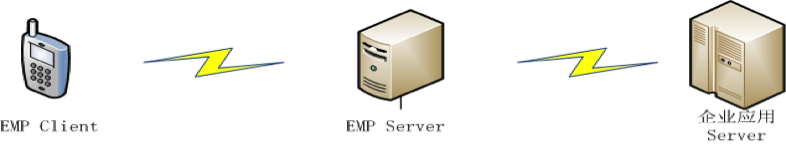

# EMP v5.2 技术白皮书
<!-- toc -->

# 概述

EMP旨在帮助企业将其业务拓展到移动渠道。为此，我们提供了一个开放、易用、综合的企业移动应用平台，来帮助企业对其移动应用进行开发、实施、管理和维护。EMP平台包含了一套跨移动终端的应用开发环境，一个支持集群部署的移动应用接入网关，一个企业私有应用商店，和集成了应用管理和数据分析的管理后台。基于EMP，企业可以做到：

- 快速的移动应用开发，支持主流终端，良好的用户体验
- 快速接入已有的企业服务，整合已有的业务功能
- 灵活的部署和扩展，动态的企业应用、服务和业务管理
- 统一的推送管理、用户行为数据分析和管理

## 开发

EMP涵盖了对iOS、Android、Windows Phone、PC（基于QT技术）平台的支持，EMP的客户端SDK和界面规范可以有效的促进代码在各平台以及企业应用之间的复用，从而降低企业的开发成本。基于EMP提供的开发环境（IDE）和工具集（SDK），企业可以有效的减少跨移动平台应用开发的工作量，缩短应用交付和上线的周期，并简化管理和维护工作。

## 接入

EMP Server（网关）作为企业移动应用的统一入口，帮助企业快速的集成和发布其后台服务。EMP提供了对于多种接口协议和数据格式的支持，通过在EMP Server上定义企业自有服务接口的适配方式，企业能够迅速的将已有的资源和服务呈现到其移动应用中。

## 运行

在完成应用开发和测试之后，通过EMP提供的工具集可以将应用打包发布到公共的应用商店（如AppStore和Google Play），或者企业的私有商店。这些应用在运行时通过EMP Server获取企业提供的不同形式的服务。EMP Server作为一个稳定的内容网关，支持高并发的用户访问和大量异构数据的解析和转换。除此之外，EMP 为Client和Server之间提供了不同种类的安全策略，包括基于TLS修改的自定义安全信道实现。

## 管理

当应用发布之后，企业可以通过EMP Console（管理后台）实时监控移动应用的接入情况，管理不同的移动应用可以获取到的后台服务，并通过管理后台的不同功能模块，实现1）对移动应用的更新；2）对后台服务的实时接入；3）对推送服务的使用；4）对移动应用使用和业务访问的统计数据获取和呈现；5）对企业私有商店中应用和用户的管理。

# 组件介绍

EMP平台包含：

- EMP Device Runtime Components（跨平台客户端组件）
- EMP Server（移动应用接入网关EWP）
- EMP Console（管理后台）
- EMP Studio（IDE及开发调试工具）

## EMP Device Runtime Components
### Native & Web

当智能终端用户成为企业的必争之地，移动渠道的建设对于企业来说日益重要，Native VS Web也随之成为移动应用开发技术选型的热门话题，两者在App体验和开发成本上的取舍对于企业来说，就像是鱼和熊掌，难以兼得。HTML5的出现给出了未来的方向，但HTML5自身的完善需要一个过程，不同浏览器和设备厂商对它的支持过程则更加漫长。

因此，EMP客户端组件从平台伊始就致力于Native和Web的结合，通过将一部分HTML和CSS子集映射到Native UI的实现，EMP客户端组件实现了一个跨平台的Web规范解析和渲染框架。在此基础上，我们引入了Lua作为脚本引擎来实现Lua API和设备本地语言API的绑定，并定义了Web规范以及Lua API的扩展的方式，使得设备本地的扩展最终能以Web规范的形式体现。从而让基于EMP的移动应用开发人员，可以最大程度的利用Native和Web所带来的好处。

我们在下面的章节介绍通过EMP的客户端组件可以实现的特性。

### HTML & Native UI

EMP客户端组件从标准HTML标签集合中选取了一部分适合在移动终端使用的HTML标签作为EMP的HTML标签子集，并使用不同平台上的Native UI控件来实现这个子集。通过EMP HTML引擎实现从HTML标签转换为Native UI控件：

与此同时，EMP客户端组件针对每一个HTML标签，从标准CSS规范中选取了针对该标签适合在移动终端使用的CSS样式子集。通过EMP CSS引擎让这些CSS样式可以应用到其所支持的HTML标签上。

从而，EMP形成了自有的HTML和CSS规范，它们符合标准的HTML和CSS规范，在各终端平台上拥有EMP为其定义的本地实现和展现。

通过上述的实现，我们可以获取到：

- Native UI的运行速度和展现效果
- 基于HTML和CSS语言的界面开发
- 基于EMP的定制扩展

### Lua AS Script

#### Why Lua

Lua是一个小巧的脚本语言， 其设计目的是为了嵌入应用程序中，从而为应用程序提供灵活的扩展和定制功能。

- 可扩展性

Lua使用ANSI C编写而成，几乎在所有操作系统和平台上都可以编译、运行。Lua脚本可以很容易的被C/C++代码调用，也可以反过来调用C/C++的函数，这使得Lua在嵌入和扩展应用程序的场景中得以被广泛应用。不仅仅作为扩展脚本，也可以作为普通的配置文件，代替XML等文件格式，使得程序更容易理解和维护。

- 轻量级

轻量级Lua语言的官方版本只包括一个精简的核心和最基本的库，一个完整的Lua解释器不过200K。在目前所有脚本语言中，Lua无疑是将小巧和快速结合的最完美的一个。

- 其他特性

同时支持面向过程编程和函数式编程（functional programming）；自动内存管理；只提供了一种通用类型的表（table），用它可以实现数组，哈希表，集合，对象；语言内置模式匹配；闭包(closure)；函数也可以看做一个值；提供多线程支持；通过闭包和table可以很方便地支持面向对象编程所需要的一些关键机制，比如数据抽象，虚函数，继承和重载等。

上述特点表明，在跨平台的移动终端上，Lua是作为嵌入式脚本的最佳选择。基于这些考虑，我们选择Lua作为我们默认的脚本引擎，嵌入到页面中的Lua脚本会被EMP客户端组件解析并执行，通过将Lua API和设备API以及EMP Native Lib API的绑定，开发人员可以通过编写Lua脚本实现本地逻辑，让应用使用者获得Native App的运行速度和体验。

#### Cross Platform Lua API　

EMP通过Lua提供统一的跨平台API，同时支持iOS、 Android、 Windows Phone、QT平台。通过这些Lua API的定义和实现，开发人员可以通过编写脚本逻辑操作页面元素中的HTML和CSS元素；也可以通过API调用访问设备的本地功能，例如重力感应、摄像头、通信录、音频/视频播放等等。

### 可扩展性

EMP客户端框架预留了UI控件和Lua API的扩展接口。通过这些接口，可方便扩展APP程序。在业务设计时，若基本控件无法满足业务展示的需要时，可以通过扩展接口来增加扩展控件或Lua API以满足业务需求，提供更为灵活的用户交互。

EMP客户端框架使用配置文件的方式扩展UI控件，扩展灵活、方便;在要扩展控件时，开发人员仅仅需要按照指定格式配置class.xml文件同时让扩展控件继承EMP提供的基控件（或者任一基础控件和扩展控件）即可，EMP解析引擎会按照配置文件中的映射关系进行解析和展示。扩展控件编写人员仅仅需要关心自定义控件的实现，而不必关心EMP的核心引擎。扩展示意图见：

EMP客户端框架同样预留了Lua的扩展接口，开发人员需要使用EMP所提供的注册接口先注册自己的Lua方法，然后再使用本地代码实现所注册Lua方法的功能。扩展示意图见：

### 数据和服务获取
#### 通讯&安全

EMP客户端和服务端之间支持HTTP、HTTPS和基于HTTP扩展的TLS 协议。　

EMP扩展的TLS协议是基于TLS v1.1修订，在HTTP报文的交互中建立安全通道，信道包含了身份认证、标识、抗抵赖、自主访问控制、强制访问控制、用户数据完整性保护、用户数据保密性保护、数据流控制、可信路径、密码支持、防重放、客户端篡改验证等安全功能。

通过自建立的信道，客户端和服务器之间的通讯可以避免：

- 因设备本地TLS实现规范不统一而导致的加密强度降低；
- 因标准TLS的开放性和开源实现导致的信道安全性降低；
- 因移动运营商WAP网关适配问题到导致的HTTPS信道不稳定。

与此同时，基于自定义的信道，可以做到因企业的需求而灵活扩展。

#### EMP服务获取和资源同步

EMP客户端为与EMP Server之间的通讯封装了一些列的Lua接口，使得界面开发人员无需关心底层的通讯实现，更无需关心企业后台的系统组成和业务逻辑，在移动应用的开发中根据业务需要选择调用本地Lua API即可获取到业务所需的数据和服务。

除此之外，EMP在客户端和服务端之间定义了资源同步的协议。根据该协议，服务端可以维护不同客户端平台和分辨率下最新的客户端资源，客户端在联网时可以将这些资源同步到本地，在后续的流程中使用。通过对该协议的实现，客户端可以实现离线业务并及时更新，而移动应用中的大量界面元素（如HTML、CSS和Lua）也可以通过该协议同步到客户端本地，从而有效的减少联网的次数和传输流量。

### 本地安全存储

EMP客户端提供了设备本地安全存储的实现，对于本地存储的数据可根据需要进行加密存储，从而达到保护用户数据和隐私的目的。本地数据密钥由设备特征码（比如IMEI号、生产厂商代码等）、平台名称、预置密钥等经过自定义的算法生成。通过在不同设备使用不同的密钥生成的算法和因子，进一步的降低了用户数据破解和泄露的风险。

EMP客户端同样为开发人员提供了统一的Lua API来获取本地数据安全存储的功能，使得开发人员无需关心各平台上的不同存储实现。

### 对HTML5的支持

EMP客户端扩展了系统的WebView组件和一部分JavaScript方法，可以很好的支持HTML5技术并可以使用设备特性。同时，EMP还提供了一部分JavaScript扩展库和标准的扩展方式，以便于扩展WebView组件中JavaScript的功能。

使用EMP客户端扩展的WebView和JS，我们可以做到：

- 快速接入和呈现基于HTML5开发的页面
- 允许在HTML页面中通过调用EMP JS API使用设备本地功能
- 扩展EMP JS API，使WebView组件可以获取更多设备能力

## EMP Server
### 数据和服务聚合

对于企业来说，开发出拥有良好用户体验的移动应用，不仅仅需要优秀的前端展现和交互设计，同样也需要不断丰富的后台服务作为支撑。而如何将企业散落在不同系统中的后台服务和数据整合起来，为移动终端用户提供优质的服务流程和体验，是企业在开发移动应用时需要面对的挑战。

EMP Server正是为了应对这样的挑战而生。为帮助企业实现服务和数据的聚合，EMP Server支持多种通讯协议，可以同时维持到多个企业后台服务的连接。通过合理的业务规则配置和开发，EMP Server将来自终端用户的请求转发到业务流程所需的企业后台服务接口，通过对多种类型数据格式的支持，EMP Server可以将不同服务后台的接口返回数据解析并作为业务流程中的动态数据嵌入到符合EMP界面规范的模板中形成报文，最终返回给移动设备前端去渲染并呈现。

通过EMP Server，企业可以根据业务需求将不同后台系统中服务和数据整合，形成符合移动渠道使用特点的业务流程，给运行在不同平台上的移动终端设备提供统一的服务获取接口和UI展现。

### Web Service Framework

EMP Server除了提供基本的企业后台接入和业务规则配置之外，还提供了Web Service开发的框架。

通常，我们把一个移动应用（Client App）所需的所有后台服务（Web Service）封装为EMP的一个后台应用（Server App）。通过对业务规则的配置，我们将移动应用上一个独立的业务功能封装为一个Channel，它通常包含了一个EMP Server上的Web Service接口，对企业后台接口的访问规则，对返回数据的解析规则，和一组符合EMP界面规范的模板文件。而一个完整的移动应用最终会被分解为一个个独立的Channel配置和模板文件开发。

除此之外，EMP Server还为后台App提供了更加自由的扩展方式，使其可以定义标准EMP Server接口之外任意形式的Web Service接口。

### 系统扩展性

对于移动互联网用户，后台服务的高可用性是影响其使用体验的关键因素之一。为能够同时处理来自成千上万的移动终端设备的并发访问，EMP Server选择基于面向并发的语言Erlang开发。

Erlang语言利用语言级别的微进程（Process）机制使得每个终端设备的请求都可以独立的被单个的Erlang Process处理而互不影响，这些Process的运行可以充分的利用到单台Server乃至集群中每个Server上的每一个CPU内核。Erlang语言内建的Process和分布式通讯机制使得基于PC Server集群构建一个高可用性、高扩展性、高吞吐量的服务聚合网关变得容易。

EMP Server正是充分的利用了Erlang语言的这些特点，在众多的移动设备和企业后台服务之间构建了一个能够适应不同级别企业需求的数据和服务的聚合网关。

### 消息推送

除了让用户主动的使用企业移动应用，企业可以通过EMP提供的统一推送接口给不同类型的设备推送消息，包括iOS、Android、Windows Phone平台上的设备。通过调用统一的消息推送接口，开发者无需关心设备的种类和推送的实现方式，就可以实现到目标设备的消息发送。

### 分布式开发和测试

通过企业私有商店，可以很容易实现企业应用的开发团队、QA团队和测试团队的异地配合，加快应用的开发、测试和试运行周期，有效提升应用测试设备和测试场景的覆盖率，以最终提升应用正式发布时的质量和体验。

### 企业私有应用分发

对于B2E场景中的移动应用，企业可以借助企业私有商店加快应用分发到员工设备上的速度，通过持续优化和版本迭代提升基于移动应用办公的效率。通过设备管理和权限管理，可以获取移动应用使用情况的概览，根据需要进行企业员工的权限控制。

## EMP Console

EMP 管理后台是一个基于Web UI界面提供的对EMP Server进行管理和控制的工具。通过EMP管理后台可以实现：

### 移动应用服务管理

EMP Console可以控制集群中任意EMP Server上APP（Web Service应用）的加载和停止，可以动态控制APP中Channel（移动应用中的业务功能）的加载和删除，可以动态控制在用户设备上某一菜单下的Channel集合。

并且，已发布的APP可以通过EMP Console在线升级，而不影响其他APP服务的使用。

### 服务状态监控

通过EMP Console，可以实时监控EMP Server的运行状态，包括：session数量、用户连接数量、服务器CPU和内存使用情况、OS进程状态等。

### 消息推送管理

EMP Console中包含对设备推送的管理界面，可以实时的触发对单一设备或者设备群的消息推送；也可以定义消息群发的任务，进行延时和定时的消息广播。

### 数据统计和可视化报表

EMP Console中包含了基于EMP Server获取到的用户访问数据的报表呈现。通过对EMP Server的配置，可以定义EMP Server的业务流程中需要统计的数据类型和统计方式，通过对这些数据的采集和汇总，形成可视化的结果报表。

在智能设备终端上，基于EMP Server的数据统计可以被EMP Statistic产品所替代。

EMP的数据统计按照数据来源可以分为基于EMP Server和基于EMP Client端，基于Server端的统计主要针对功能和网络受限的Feature Phone，这些设备已逐渐退出历史舞台。基于EMP Client端的数据采集和分析请参考EMP Statistic产品说明

## EMP IDE

### 应用开发和调试环境

EMP IDE作为开发EMP应用的集成开发环境，提供了一个基于Eclipse的插件，该插件提供了

- Erlang语言、EMP界面语言（包括HTML、CSS、Lua）和模板语言Clearsilver的开发环境
- 后台APP的工程向导，菜单和Channel的配置和可视化编辑，开发过程中的后台服务管理（代码编译和加载）。

### 代码模板

开发者可以通过工程创建向导按需生成APP应用的代码框架，可以为单个的Channel初始化其开发模板。此外，开发者还可以定制向导生成的应用模板结构和内容。

# 系统要求

## 生产环境

EMP生产环境主要指EMP server的环境，它可以运行在如下操作系统：

- AIX
- Red Hat Enterprise Linux（RHEL）
- SUSE Linux（SLES）
- Red Flag Linux

EMP server可使用如下数据库进行持久化存储：

- Mysql
- Oracle
- Sybase
- DB2
- Informix

EMP server运行时环境：

- Erlang/OTP （http://www.erlang.org/）

EMP server需要的Web Server：

- Yaws（http://hyber.org/）

## 开发环境

EMP开发环境主要包括了EMP Server、数据库和基于eclipse的EMP Studio（IDE及开发调试工具）。EMP Studio可安装在Windows操作系统上；EMP Server运行在Linux虚拟机中；如果需要数据持久化存储，那么需要安装如下任意数据库：

- Mysql
- Oracle
- Sybase
- DB2
- Informix

EMP server运行时环境：

- Erlang/OTP （http://www.erlang.org/）

EMP server需要的Web Server：

- Yaws（http://hyber.org/）

EMP server需要的C/C++编译器：

- gcc（GNU project C and C++ compiler）