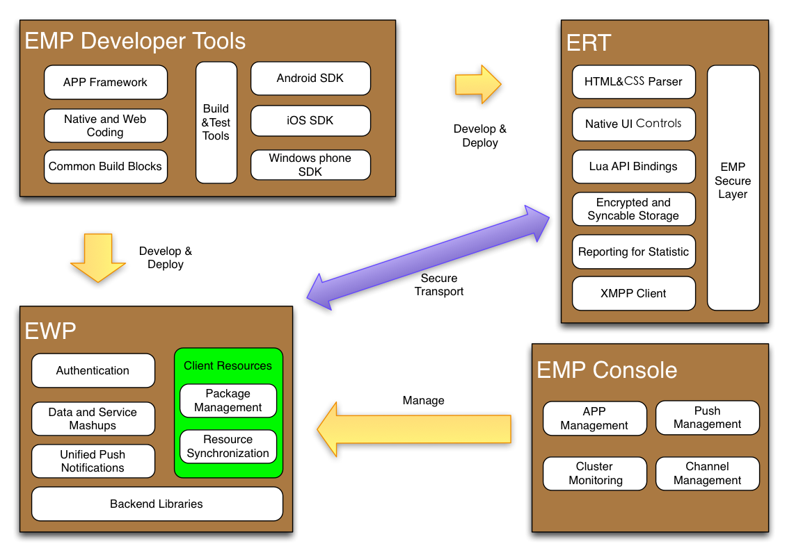
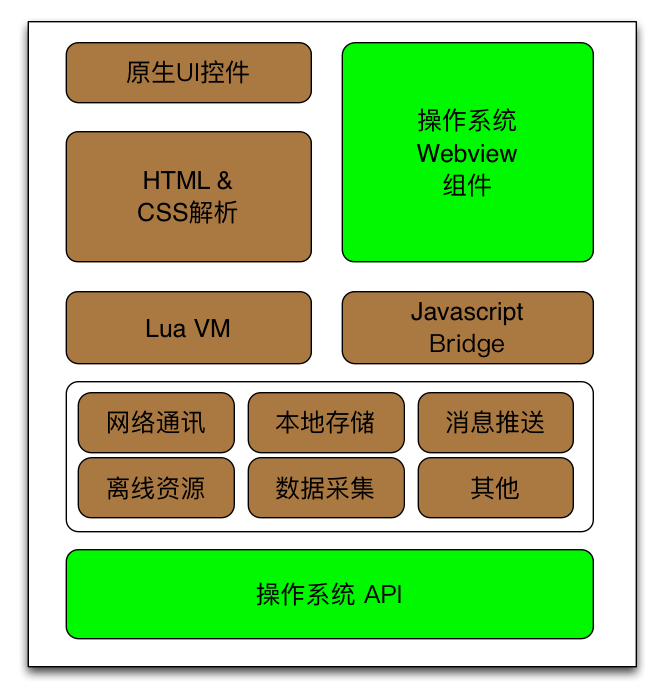
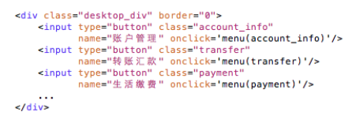
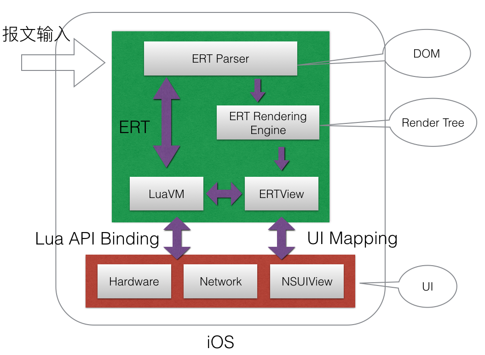
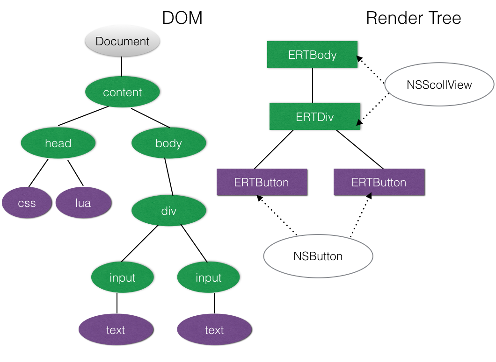
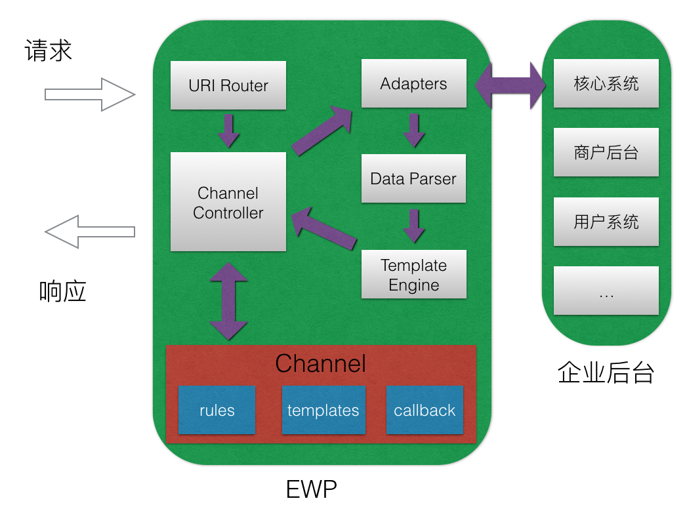
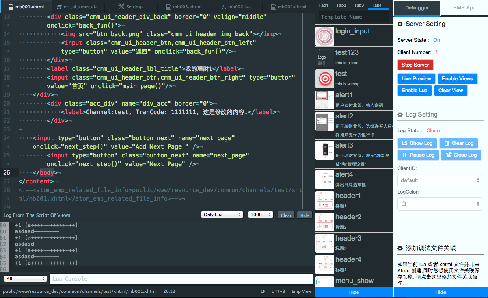
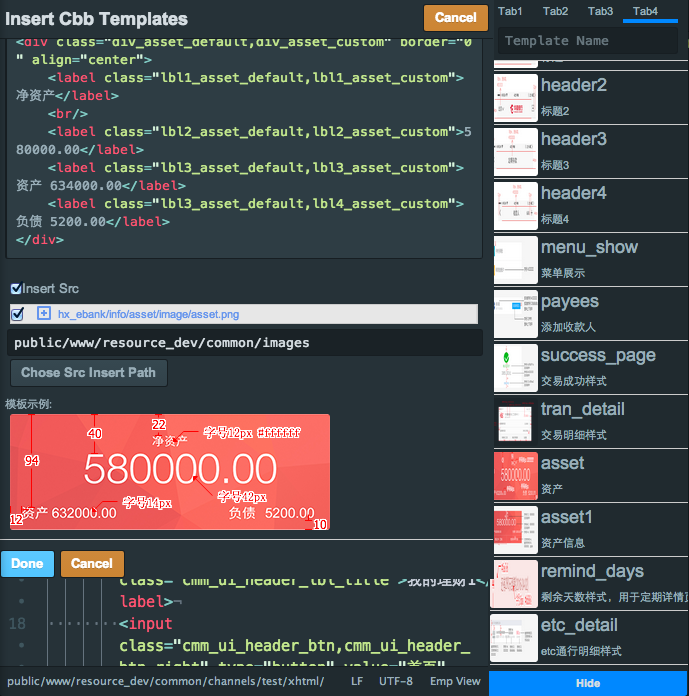

# EMP v5.3 技术白皮书
<!-- toc -->

# 概述

EMP（Enterprise Mobile Platform）旨在帮助企业构建统一的移动应用开发和运行平台。
它提供了一套开放且先进的软件系统，能帮助企业迅速完成其在移动渠道的业务拓展。
基于标准化的技术规范和工具集，EMP可以让企业在统一的平台上完成对移动应用的开发、测试、集成、管理和持续迭代。

## 开发

通过EMP提供的开发工具集，开发者遵循Web应用的开发规范（HTML、CSS、DOM）和开发流程进行移动应用开发和测试。
客户端应用基于EMP提供的跨平台应用运行环境（EMP Device Runtime，下简称ERT）运行，支持iOS、Android、Windows Phone和PC。
ERT提供的扩展机制让企业开发者可以根据需要定制其运行时环境，将更多的设备能力绑定到Web规范的实现上，
从而可以开发出和各平台原生应用一样丰富多彩、具有良好用户体验的移动应用。
与此同时，EMP开发工具集提供的组件封装和复用机制可以促进应用代码在单个企业应用内和不同企业应用间的复用，
从而有效的减少应用开发和测试的工作量，缩短应用交付和上线的周期，简化管理和维护工作。

## 集成

EMP提供了EWP（Erlang Based Web Service Platform)作为企业移动应用的接入网关，
帮助企业基于已有的IT架构和后台系统快速构建其移动应用。EWP内置了对于多种通讯协议和数据格式的支持，
让开发者可以很容易的对分布在不同企业后台系统中的服务和数据进行聚合（MashUp），并提供API给移动应用调用。
企业移动应用往往拥有数以千万计的用户群体，EWP及Erlang语言所提供的面向并发程序设计（Concurrency Oriented Programming）、
分布式和高容错等特性可以帮助企业快速构建一个高性能、高可用的移动应用接入网关。

## 运行&管理

在应用发布之后，用户通过在其智能终端上运行移动应用以获取企业服务。
移动应用将EWP作为统一接入网关，所有的请求通过EWP按照业务规则转发到不同的企业后台。
通过EWP和ERT提供的安全信道、离线存储、身份认证、数据聚合等机制，
让企业服务可以安全、快捷的呈现在移动设备之上。

在应用发布之后生命周期中，企业可以通过EMP Console对应用进行监控和管理，完成

- 对移动应用的内容和配置的动态更新；
- 对企业后台服务的动态接入；
- 对推送服务的使用；
- 对应用服务状态的监控；

## 持续迭代

在移动互联网时代，企业往往需要对移动应用进行频繁更新以满足市场不断变化的需求，适用不同
用户类型的喜好。为满足这一需要，EMP提供了如下特性：

- EMP应用基于B/S架构，企业可以通过对EWP上发布的应用服务更新来让移动端用户及时的获取
最新的企业服务，而无需频繁升级客户端应用；
- EMP提供的客户端控件库、公共UI库以及企业自定义组件库和帮助企业更快的完成迭代开发，并
获取一致的UI风格；
- EMP提供可选的数据采集模块让企业移动应用上的用户行为数据可以被安全的发送
到数据采集服务器，这些数据可以被导出到融易通Mobile Data Analytic Platform或者同类
产品中进行分析，最终得到移动应用的用户指标、业务指标和性能指标等分析结果。
这些结果可以作为企业持续优化迭代其移动应用的数据支撑，为其制定业务发展方向、优化策略、
营销策略提供决策辅助；

# 组件总览

EMP包含：

- 跨平台应用运行环境 ERT
- 应用接入网关 EWP
- 开发工者具集 EMP Developer Tools
- 管理后台 EMP Console

# 跨平台应用运行环境

ERT帮助企业开发者通过跨平台的Web开发规范来开发移动应用。为达到这一目的，企业开发者往往选择通过
基于操作系统内置浏览器的Web开发模式或者基于浏览器内核（操作系统Webview组件）的Hybrid开发模式。
比传统的Hybrid开发更进一步，ERT裁剪了适合移动应用开发的Web规范，通过系统原生API、Lua脚本语言
以及良好的可扩展设计来为企业开发者定制其所需的“浏览器内核”，使企业开发者可以摆脱内置浏览器
和HTML5规范的限制，掌控应用运行时环境，从而获取更好的跨平台一致性、应用开发效率和运行效果。

ERT支持的主要特性包括:

## 自主跨平台Web开发规范

通过裁剪标准HTML、CSS和DOM API等Web规范并实现，ERT让企业应用开发人员在使用相应Web规范
开发移动应用的同时，无需担心这些规范在不同操作系统和不同浏览器之间的兼容性。并且，由于ERT通过
操作系统原生UI来实现完成这些界面在移动终端上的展现，开发人员可以获取到和原生应用一致的展现效果。

以一段简单的HTML代码为例，它在ERT-iOS中的解析和渲染过程如下：

最终，HTML标签Div将会转化为iOS中的原生UI控件NSScrollView来渲染，而Input Button
则会转化为NSButton，它们和iOS原生开发所使用到的UI控件别无二致。

通过上述的跨平台规范实现，ERT有效的结合的原生开发和Web规范的优势，为企业开发者提供了
一个可裁剪、可扩展的移动应用运行时环境。并且，基于自主可控的实现，ERT可以很容易的实现对
下一代智能设备运行环境的支持，例如Apple Watch、Apple TV、Android Wear、Google Glass
等（这些环境往往不具备浏览器环境，因此依赖于浏览器或者WebView的开发模式无法奏效）。

## 可扩展的应用运行时

对于移动应用开发者来说，智能设备不断革新的硬件能力是UI及应用创新的基础动力，但是
Web标准发展和浏览器实现一直滞后于硬件的发展。从最早的多指触控，到近年来的指纹识别、
Force Touch等，这些导致UI产生革新的硬件特性从出现到被Web规范所采纳需要多年的时间。
而企业开发者往往需要第一时间在移动应用开发中使用这些设备能力，包括在一些应用场景中使用
外围设备的能力。因此，ERT在设计之初便充分考虑到企业对于应用运行时的定制化需求，
它所提供的定制场景主要包括以下两种：

1. 对于HTML标签、属性和DOM API的扩展。系统原生UI往往提供了比Web规范更加丰富的展现方式和交互
模式。通过ERT提供的HTML扩展方式，企业应用开发者可以将系统原生的UI控件封装为ERT的扩展标签来使用。
如通过`<switch id="xxx">yes</switch>`标签封装系统原生的Switch控件；通过脚本
`switch = document:getElementById("xxx"), state = switch:toggle()`来获取switch控件，
在应用运行时动态改变其状态并返回。
2. 对于设备API的扩展。ERT将Lua虚拟机作为各平台上的脚本运行环境，通过Lua提供的C语言绑定机制
将操作系统提供的API映射为可供应用开发者调用的Lua API。通过该扩展方式，开发者可以轻松的获取到
Touch ID、摄像头、通讯录等常见的设备能力；也可以在特殊的应用场景中定制开发一些API，例如对于
USB Key、NFC扫描的支持。

通过上述扩展方式，企业可以根据需要定制其移动应用运行时环境，让开发者通过扩展Web开发规范的方式
封装所需的移动设备硬件能力，并在应用开发时使用。这些扩展规范作为EMP基础规范的补充，最终形成企
业内部开发规范，在企业应用内和应用间复用，从而节省应用开发的成本。

## 应用安全

ERT提供了多种安全机制和加固手段用以保护应用的运行时环境。以下为一些主要的安全机制：　

安全机制     | 作用 | 概述
-----------|------|----------
基于HTTP的TLS协议实现 | 保护通讯安全  | 针对移动应用优化的TLS实现，在提高握手效率的同时，保证加密强度和信道稳定性
应用摘要校验 | 校验应用是否被篡改 | 在服务器端校验应用摘要，通过拒绝被篡改的应用访问减少恶意篡改导致的用户隐私泄露
本地存储加密 | 保护应用本地数据| 使用设备信息、预留秘钥等因子作为秘钥加密本地存储数据
安全输入键盘 | 保护关键信息| 对关键信息做内存数据偏移，并提供可选的一次一密加密机制
加密算法扩展 | 支持国密算法| 可选择使用SM2、SM3、SM4作为非对称加密、摘要运算和对称加密算法，进一步提高安全强度

除此之外，基于ERT的可扩展性，企业可以在需要的场景实施安全外设、安全沙箱等常见安全方案。

## 离线资源

ERT支持对离线资源的使用以加快应用的运行速度，并同时减少用户的网络开销。
在Web开发模式下，应用的UI界面往往包含大量静态元素，包括HTML、CSS、脚本和图片资源。
ERT支持在应用中预置这些资源，并在与EWP的交互过程中通过离线同步协议更新这些资源。
通过管理后台，可以为不同的操作系统、不同分辨率配置不同的资源包，同时可以配置
通过本地存储加密保护相应资源。

## 对HTML5的支持

ERT封装了各移动操作系统上的WebView组件来实现对于标准HTML规范的支持，开发者可以选择在UI界面中以
任意大小的窗口展示WebView组件。通过Webview提供的扩展机制，开发者可以通过Javascript调用原生代码。
ERT将离线资源、网络通讯和设备API等通过原生代码实现的功能库导出为Javascript API供开发者使用。

通过上述支持，企业开发者可以很容易通过ERT展现已经存在的Wap网站，或是复用Web站点的已有代码进行应用开发；
也可以选择使用标准HTML规范和相关技术来开发全新的移动应用UI界面，然后复用到其他Web渠道。

**在基于HTML的开发场景中，企业开发者应首先确定HTML应用支持的移动平台、操作系统和内置浏览器版本，
结合它们对HTML5的支持状况，有选择的使用HTML5、CSS3特性和开发框架，并根据需要进行适配。**

# 移动应用接入网关

EWP是一个基于Erlang开发的高可用、易扩展的内容网关。EWP提供了一系列的功能实现和机制封装，让企业可以
很容易的将现有IT架构下的后台服务整合为适合移动应用调用的网络API，并支持成千上万的移动设备进行并发访问。
以下为EWP的一些主要特性:

## 数据聚合

- EWP提供的Adapter封装可以让EWP很容易的连接到不同的企业后台服务，它支持的连接方式包括REST、SOAP、
SQL、LDAP等常见方式，同时也支持一些企业级的中间件，如IBM CICS。这些企业后台服务一旦被配置为Adapter，
就可以作为EWP以及移动应用的可用数据源；
- EWP支持对不同格式数据的处理，包括XML、JSON、iCal、ATOM、Image等，开发者可以选择将其直接返回
给移动端，也可以交给模板引擎加工后返回；
- EWP提供的Channel封装让企业开发者可以对移动应用上一个个独立、完整的业务功能进行抽象。结合开发者
工具，开发者可以通过简单的参数配置初始化这些独立的业务功能（每个功能定义为一个Channel），之后进行
分工开发，一个Channel通常包含一组前端UI界面、一组EWP接口调用以及将EWP接口映射为Adapter调用的规则。
EWP支持通过配置将Adapter数据源配置直接转化为EWP接口，也支持通过简单的Erlang开发将多个Adapter数据源
混合到同一个的EWP接口中返回，以便于开发者针对移动应用进行业务流程的优化。通过这种形式的抽象，
既便于开发者分工协作，同时也方便企业开发者在后续应用维护的过程中对单个业务功能进行管理；
- EWP对外提供多种通讯协议支持，包括HTTP、HTTPS、TCP等；针对ERT，EWP提供基于HTTP的TLS信道服务端实现，
以及离线资源同步协议的服务端实现，以加固移动应用的通讯安全并提高通讯效率；

一次EWP API调用的内部处理流程：

## 高可用、易扩展

- EWP支持集群部署，每个EWP节点相互独立且互为热备，通过增加节点可以提高系统整体吞吐量（Scale-out）；
- 基于Erlang提供的语言级process机制，EWP为每个HTTP请求创建一个独立的Erlang process来处理，
这些process在初始化时只消耗几百个字节的内存，使得单个EWP节点可以同时处理成千上万的并发请求；
- 每个请求的处理相互独立，即使其中一些process因为运行异常而中止，也不会影响其他请求的正常处理；
- EWP被设计为计算密集型（CPU-bound）服务，每个处理HTTP请求的Erlang process被Erlang VM
调度到不同的CPU Core上运行，使得EWP可以在不需要开发者调优的情况下充分利用服务器上的所有CPU资源，
并很容易做到向上扩展（Scale-up）；
- Erlang支持代码热部署，使得EWP在运行中的绝大部分情况下都不需要停机维护，而是动态更新；

## Web Service开发框架

除作为企业移动应用的内容网关，EWP同样可以作为企业扩展其Web Service的开发框架，
EWP提供了包括：

- 会话管理
- 身份认证
- 日志管理
- 模板语言
- 数据库驱动
- XML/JSON解析
- 网络通讯
- 图片处理

等Web Service开发常用的功能模块。

## 消息推送

基于EWP提供的消息推送模块，EWP对外提供统一的推送接口给不同类型的设备推送消息，
支持iOS、Android、Windows Phone平台。开发者可以通过调用这些接口来实现对单台
和多台设备进行消息推送，而无需关心设备的类型和操作系统。除此之外，在EMP Console中
还提供了管理界面来配置即时消息推送和定时推送任务。

# 开发者工具集

## 代码模板

开发者可以通过工程创建向导按需生成APP应用的代码框架，可以为单个的Channel初始化其开发模板。
此外，开发者还可以定制向导生成的应用模板结构和内容。

## 应用开发和调试环境

开发工具提供了基础的开发组件帮助页面开发人员开发和调试页面.包括如下组件功能:

- 代码着色 (提供页面代码的着色功能, 也支持 Erlang 等多种语言的着色)
- lua 代码自动补全 (能共补全 EMP Lua 库的 lua 函数)
- 页面调试组件 (页面内容上传及下载, 脚本和样式的上传及下载)
- Lua Console (显示页面内的lua 日志输出, 同时可以实时执行 Lua 语句, 查看 Lua 变量的状态)
- 离线资源打包 (提供类似管理平台的资源打包功能)
- 链接跳转 (提供页面内的链接文件跳转功能, 同时提供页面引用样式和 lua 的跳转)
- 帮助文档 (提供 Info Center 包括的一些基础文档)

## 公共组件

为了提高页面人员开发的效率及提高代码复用效率,开发工具提供了一系列的组件模板模式帮助开发人员.

### 元素化设计语言
我们期望在未来的开发中, 把所有页面开发元素化, 在项目开发的初期优先开发基础页面元素,
在完成基础页面元素的开发之后, 后续页面通过前期的基础页面元素去构建.(固化基础元素的样式,
  提供公共样式)以这样的流程来保证页面开发的效率和质量.
### 公共代码复用
我们通过在项目初期对基础元素和基础样式的定义,来减少在整个项目开发周期中的重复开发,
提高公共代码和样式的复用率.

### 项目组公共代码收集
以项目为单位的元素定义完成后, 可以提交到代码库中, 其他项目组可以通过下载代码的形式,
来学习不同项目组的代码,和元素定义方式.同时也可以复用之前项目已经定义过的基础元素.
以此方式來积累我们的开发经验和成果.

# EMP Console

EMP 管理后台是一个通过浏览器和Web界面提供的对EWP进行管理和控制的工具。通过EMP管理后台可以实现：

## 移动应用服务管理

EMP Console可以控制集群中任意EWP节点上应用服务的启动和停止，
可以动态控制应用服务上某一业务功能的加载和删除，也可以动态控制在用户设备上某一菜单下的业务功能集合。

并且，已发布的应用服务可以通过EMP Console在线升级，而不影响其他服务的使用。

## 服务状态监控

通过EMP Console，可以实时监控EWP的运行状态，
包括：session数量、用户连接数量、服务器CPU和内存使用情况、OS进程状态等。

## 消息推送管理

EMP Console中包含对设备推送的管理界面，可以实时的触发对单一设备或者设备群的消息推送；
也可以定义消息群发的任务，进行延时和定时的消息广播。

# 系统要求

## 生产环境

EMP生产环境主要指EWP的环境，它可以运行在如下操作系统：

- AIX
- Red Hat Enterprise Linux（RHEL）
- SUSE Linux（SLES）
- Red Flag Linux

EWP可使用如下数据库进行持久化存储：

- Mysql
- Oracle
- Sybase
- DB2
- Informix

EWP运行时环境：

- Erlang/OTP （http://www.erlang.org/）

EWP需要的Web Server：

- Yaws（http://hyber.org/）

## 开发环境

EMP开发环境主要包括了各移动平台模拟器、EWP、数据库、浏览器和EMP Devloper Tools。
EMP Devloper Tools可安装在Windows、Mac和Linux操作系统上，EWP可以运行在Linux、Mac上；
如果需要数据持久化存储，那么需要安装如下任意数据库：

- Mysql
- Oracle
- Sybase
- DB2
- Informix

EWP运行时环境：

- Erlang/OTP （http://www.erlang.org/）

EWP需要的Web Server：

- Yaws（http://hyber.org/）

EWP需要的C/C++编译器：

- GCC（GNU project C and C++ compiler）
