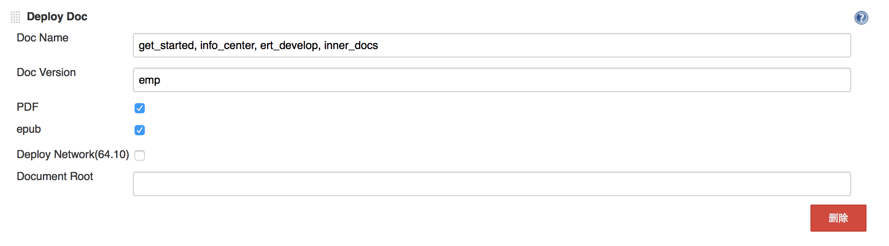

# Gitbook发布文档
##概要
markdown已经被大多数人接受且越来越流行，用它来编写和生成文档已经成为一种趋势。
我们采用[Gitbook](https://github.com/GitbookIO/gitbook)来生成文档。
通常我们使用[atom](https://atom.io)或者[mou](http://mouapp.com)来作为markdown的编辑器，
因为它们提供了良好的预览功能。
##目录结构
1. docs
存储所有的markdown形式的文档，docs下又分为不同的书目，包括:
   1. docs/get_started 为EMP产品的用户手册和开发指南
   2. docs/info_center 为EMP产品的参考手册（API及配置说明）
   3. docs/inner_docs  为产品内部开发规范，包含hg_guide，ci_guide和coding_convention等内容
2. theme
这里保存了生成站点所用的模板，默认的模板会引用一个在墙外的js资源，导致生成的页面打开速度和运行效果及其缓慢，所以对模板进行了修改。

##生成HTML流程
1. 首先，你需要通过nodejs的npm包管理工具安装gitbook：`npm install gitbook -g`；
2. 由于默认写的markdown文件是没有目录的，为了增加可读性，需要安装相关插件支持目录的生成。使用步骤如下:
  1. 安装`npm install gitbook-plugin-toc`
  2. 修改gitbook代码  
   由于gitbook生成标题ID的逻辑和gitbook-plugin-toc所使用的marked-toc生成锚点的逻辑不一致，
   导致生成的目录不能跳转，所以我们需要修改`lib/parse/renderer.js`文件，方法如下:  
   ```sh
   cd /usr/local/lib/node_modules/gitbook
   vi +150 lib/parse/renderer.js
   ```
   将150行中的`raw.toLowerCase().replace(/[^\w -]+/g,...`改为`raw.toLowerCase().replace(/ /g, '-').replace(/\./g,'')`
  3. 配置 book.json 以引用这个插件 `"plugins": ["toc"],`
  4. 在需要增加目录的markdown文件相应位置插入`<!-- toc -->`, 注意此行紧随一个标题，这两行之间一定**不要**有空行
  5. 再用gitbook生成的html页面就有目录了
2. 通过执行
```bash
gitbook build ./docs/get_started
gitbook build ./docs/info_center
...
```
生成的 `get_started/` 等图书目录包含了完整的HTML格式文档，可以通过本地浏览器打开`get_started/index.html`阅读
（首次需要联网，因为需要下载远程服务器上的脚本及样式）

##输出PDF
1. 输入为PDF文件，需要先使用NPM安装上gitbook pdf：
```
npm install gitbook-pdf -g
```
2. 在安装这个模块的时候，当下载一个名为phantomjs的包时，出现请求未能响应的情况，
可以点击[phantomjs](http://phantomjs.org/)下载自行安装。  
3. 生成PDF文件：
```
gitbook pdf ./图书目录
```
4. 如果你在图书目录内容，也可以这样做：
```
gitbook pdf .
```
生成完成后，当前目录会出现一个名为book.pdf的文件。
5. `gitbook-pdf`还支持生成`epub`格式文件，命令如下：
```
gitbook epub ./图书目录
```

##发布流程
目前整个发布流程基本实现了自动化  

1. 编写markdown并提交到hg repo.
2. 配置book.json，增加：`"download": "/get_started.zip"`配置生成Web页面上的下载链接（这个是自定义的配置）  
3. Jenkins自动执行脚本，生成静态站点并发布到Web Server. 这个过程可以设置为定时触发，或可由用户手动触发
```bash
gitbook build ./docs/get_started
rm -rf /Library/WebServer/Documents/emp/get_started
cp -R ./get_started /Library/WebServer/Documents/emp/get_started
gitbook build ./docs/info_center
rm -rf /Library/WebServer/Documents/emp/info_center
cp -R ./info_center /Library/WebServer/Documents/emp/info_center
```
4. 目前文档部署在内部服务器，请访问如下地址查看
  * http://192.168.64.165/emp/get_started/
  * http://192.168.64.165/emp/info_center/

##发布插件使用
Jenkins的Gitbook自动化发布插件：  

参数解释：
* Doc Name：需要发布的文档名称，和代码下的文件夹名称相同。
可以同时写多个文档名称使用`,`和空格区分开来。
* Doc Version：需要发布的文档版本，当前可选的版本有emp、emp5.2、
emp5.3等版本对应主干，5.2分支，5.3分支。
* PDF和epub:选中代表发布pdf和epub格式的文件。
* Deploy Network(64.10)：选中代表发布文档至64.10的外网环境，
为选中则发布至当前执行任务的本地机器。
* Document Root：当前默认的文档发布目录为`/Library/WebServer/Documents`，
当发布地址变更时需要输入目录。  

参数配置完成后，触发jenkins构建任务发布文档。
