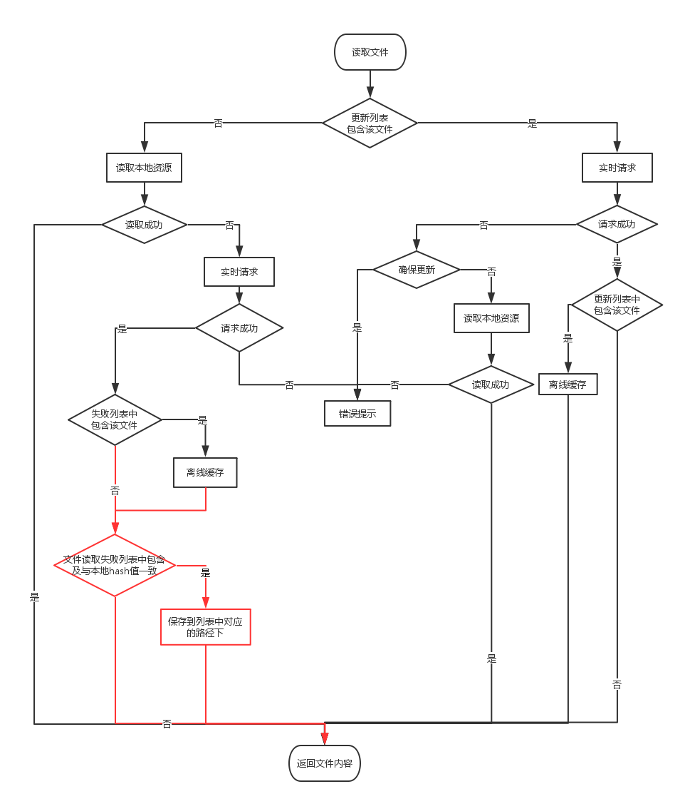

# 离线优化 客户端 - 补充设计文档
<!-- toc -->

## lua 接口变更

### 变更原因

1. 离线4版本之前，需要脚本先判断本地是否存在该文件，若不存在则请求服务器获取，若存在则再从本地读取文件。4版本开始，修改了资源的获取流程，可以直接读取，不需要做判断。所以去掉校验本地是否存在必选资源的lua 接口。
2. app 启动时会做必选资源的更新处理，及 本地校验lua 接口已去掉，所以与服务器的校验接口也去掉。

### 变更目的

去掉没有必要使用的接口，提高文件获取的效率。

### 变更

1. offline:checkOfflineFileWithLocal(filename, appName)
2. offline:checkOfflineFileWithServer(filename, appName)
3. offline:checkOfflineFileWithLocalH5(filename, appName)
4. offline:checkOfflineFileWithServerH5(filename, appName)
5. offline:checkOfflineFile(filename)

以上五个lua方法变更为:  只针对可选资源做判断，若为必选资源或不存在的资源返回false。

### 使用说明

1. 离线4版本开始，可以直接调用file:read() 接口读取文件
2. 升级到4版本的app， 需要注意脚本中用到的上述四个lua 接口（已不再支持对必选资源的校验）。

## 校验失败文件处理

* ***前提：***

本地离线资源读取的客户端处理方式为： 文件读取成功且与本地描述中的哈希值一致。

* ***问题：***

若文件读取成功，但与本地描述中的哈希值不一致（文件已损坏或被篡改）客户端应该怎么处理？

* ***处理方法：***

修改后的资源读取流程图如下：图中红色部分为新增处理

说明：

1. 对于哈希校验失败的文件，只删除文件内容，不删对应描述信息。

2. 客户端新建读取失败文件列表（EWP 和 H5分开），需要包含`本地存储路径`。

3. 后续实时请求成功，若读取失败列表中包含该文件且与本地描述中的哈希值一致时，把文件保存到对应的`本地存储路径`下。

4. 失败列表需要持久化存储（添加及删除一条记录时）。 

## 关于S值

离线4版本之前，若本地必选资源读取失败，会删除对应的S值；4版本则不再删除S值。

## 实时请求接口状态码

`/ota/rt_resource` 接口，如果服务器读不到请求的资源，返回状态码为404。

     

  Date     | Note | Modifier
-----------|------|----------
2016-3-5   | 离线资源V4 补充设计文档初稿 | liu.dongmei
2016-3-7   | 添加lua 接口变更的原因、目的及使用说明； 修改校验失败文件的具体处理方式| liu.dongmei